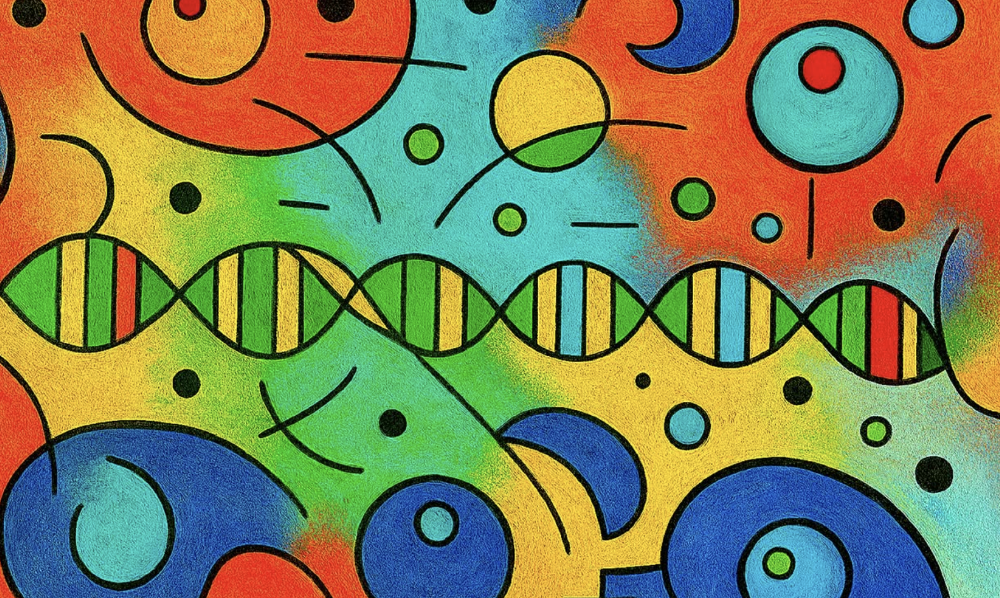

<small style="font-size: 0.7em; color: #595959;">Image by [Bob Harris](https://www.instagram.com/rorschachsflock?utm_source=ig_web_button_share_sheet&igsh=ZDNlZDc0MzIxNw==)</small>

## Goals of this class

Genomic data analysis is a pyramid. Consider an RNA-seq experiment: you receive reads from your sequencing machine, map them, and count how many fall within each gene. This **primary analysis** uses well-established tools and workflow systems, often requiring significant computational infrastructure. The output—count tables for RNA-seq, variant lists for variant calling, or peak coordinates for ChIP-seq—are intermediate datasets. They don't yet contain biological insights.

The **secondary analysis** extracts meaning from these intermediate data. It's typically done on a case-by-case basis using frameworks like Jupyter, RStudio, or Observable, since the approach depends on your experimental design. This is where programming, data management, and version control skills become critical. 

{width=50% fig-align="center"}

In this course we will try to learn key skills for climbing this pyramid. The course will be divided into the following sections:

1. **Foundations | Tools** - UNIX shell, Python for data manipulation, Python for visualization, version control with Git/GitHub, and responsible use of agentic AI tools.
2. **Foundations | Computational approaches** - algorithms for alignment, mapping, assembly, and composition analysis.  
3. **Application | Datatypes and analysis** - hands-on primary and secondary analyses in genome assembly, transcriptomics, variation, epigenetics, and community analysis.
4. **Application | Class projects** - class will be divided into groups with each group given a research project.

## Lectures

: Course schedule {#tbl-schedule}

| # | Date | Topic |
|---|------|:------|
| 1 | Jan 13 | [Getting Started with GitHub](lectures/lecture1.qmd) |
| 2 | Jan 15 | [Introduction to Bash](lectures/lecture2.qmd) |
| 3 | Jan 20 | [Py1: Data analysis ecosystem - Crunch, load, visualize](lectures/lecture3.ipynb) |
| 4 | Jan 22 | [Py2: Simple sequence manipulation](lectures/lecture4.ipynb) |
| 5 | Jan 27 | [Py3: Parsing FASTA](lectures/lecture5.ipynb) |
| 6 | Jan 29 | [Py4: FASTQ and Quality Scores](lectures/lecture6.ipynb) |
| 7 | Feb 3 | [Py5: Data Manipulation with Pandas](lectures/lecture7.ipynb) |
| 8 | Feb 5 | [Py6: Building graphs with Altair](lectures/lecture8.ipynb) |
| 9 | Feb 10 | [Git and GitHub](lectures/lecture9.qmd) |
| 10 | Feb 12 | [Publishing Your CV with GitHub Pages](lectures/lecture10.qmd) |
| 11 | Feb 17 | [Building a Website with Claude Code](lectures/lecture11.qmd) |
| 12 | Feb 19 | [Responsible Use of Coding Agents](lectures/lecture12.qmd) |
| 13 | Feb 24 | [Sequence Alignment](lectures/lecture13.ipynb) |
| 14 | Feb 26 | [Finding Sequence Matches Quickly](lectures/lecture14.qmd) |
| 15 | Mar 3 | [K-mers, Minimizers, and Minimap2](lectures/lecture15.qmd) |
| 16 | Mar 5 | - |
| - | - | Spring break |
| 17 | Mar 17 | [DNA Sequencing Technologies](lectures/lecture17.qmd) |
| 18 | Mar 19 | - |
| 19 | Mar 24 | [Variant Calling in Haploid Systems](lectures/lecture19.qmd) |
| 20 | Mar 26 | [NGS Data Logistics](lectures/lecture20.qmd) |
| 21 | Mar 31 | [Interval Operations for Genomic Coordinates](lectures/lecture21.qmd) |
| 22 | Apr 2 | [Genome Assembly of MRSA Isolates](lectures/lecture22.qmd) |
| 23 | Apr 7 | - |
| 24 | Apr 9 | - |
| 25 | Apr 14 | - |
| 26 | Apr 16 | - |
| 27 | Apr 21 | - |
| 28 | Apr 23 | - |
| 29 | Apr 28 | - |
| 30 | Apr 30 | - |

## Grading

| Component | Weight |
|-----------|--------|
| Thursday Quizzes | 10% |
| Section Exams (3 × 16.7%) | 50% |
| Final Project | 40% |

**Thursday Quizzes** — Short weekly quizzes covering material from the previous week's lectures. These are designed to ensure that you do read the material that is given as homework.

**Section Exams** — Three take-home exams, one after each major section: (1) Tools, (2) Computational approaches, (3) Datatypes and analysis.

**Final Project** — Group research project applying course concepts to a real biological dataset.

## Academic integrity

Academic integrity is the pursuit of scholarly activity in an open, honest, and responsible manner. All students should act with personal integrity, respect other students' dignity, rights, and property, and help create and maintain an environment in which all can succeed through the fruits of their efforts (see [Penn State Policy G-9](https://undergrad.psu.edu/aappm/G-9-academic-integrity.html)).

Dishonest behavior will not be tolerated. Students facing allegations of academic misconduct may not drop/withdraw from the affected course unless they are cleared of wrongdoing.

**Use of AI Tools**: Students may use generative AI tools (such as ChatGPT, Claude, GitHub Copilot) for learning and exploring concepts. However, all submitted work must represent your own understanding. If you use AI assistance, you must be able to explain your code and reasoning.

### Educational Equity

Penn State takes great pride in fostering a diverse and inclusive environment for students, faculty, and staff. Discrimination or harassment against any person because of age, ancestry, color, disability, gender identity, national origin, race, religious belief, sex, sexual orientation, or veteran status is not tolerated.

Report incidents of bias at [https://equity.psu.edu/report-bias](https://equity.psu.edu/report-bias).

### Disability Accommodations

Penn State welcomes students with disabilities into the University's educational programs. If you have a disability-related need for reasonable academic adjustments, contact [Student Disability Resources](https://equity.psu.edu/student-disability-resources) at your campus.

### Counseling and Mental Health

Students facing personal or academic stressors may benefit from counseling or other support. Contact [Counseling and Psychological Services (CAPS)](https://studentaffairs.psu.edu/caps) or the Penn State Crisis Line at **877-229-6400** (24/7).

---

*This page complies with [Penn State accessibility requirements](https://accessibility.psu.edu/guidelines/wcaglist/).*
