In this lectures I will give overview of the course: what we will cover and what we will learn. This lecture will also guide you through setting up GitHub and GitHub Codespaces. We'll use Codespaces as our development environment - it works on **any computer** (Chromebook, Windows, Mac) with just a web browser.

::: {.callout-tip}
## Get Gemini
We will use agentic AI extensively. Get [Gemini for Stundets](https://gemini.google/students/) now. 
:::

# Why Version Control?

Version control systems track changes to your files over time. This allows you to:

- **Revert** to previous versions if something goes wrong
- **Collaborate** with others without overwriting each other's work
- **Track** who made what changes and when
- **Backup** your work to the cloud automatically

Git is the most popular version control system, and GitHub is a cloud platform for hosting Git repositories.

---

# Section 1: Create a GitHub Account

## Step 1: Sign Up

1. Go to [github.com](https://github.com)
2. Click **Sign up**
3. Enter your email address (use your **PSU email** for educational benefits)
4. Create a password
5. Choose a username (this will be visible publicly)
6. Complete the verification puzzle
7. Click **Create account**

::: {.callout-tip}
## Educational Benefits
Using your `.edu` email gives you access to [GitHub Education](https://education.github.com/), which includes free GitHub Pro features, free access to various developer tools, and GitHub Copilot.
:::

## Step 2: Verify Your Email

1. Check your email inbox for a verification email from GitHub
2. Click the verification link
3. You now have a GitHub account!

---

# Section 2: Create Your First Repository

A **repository** (or "repo") is a folder that Git tracks. Let's create one:

1. Go to [github.com](https://github.com) and log in
2. Click the **+** icon in the top right → **New repository**
3. Enter a repository name: `my-first-repo`
4. Add a description (optional)
5. Select **Public**
6. Check **Add a README file**
7. Click **Create repository**

You now have a repository on GitHub!

---

# Section 3: Open a Codespace

GitHub Codespaces gives you a complete development environment in your browser. No software installation needed!

## Step 1: Open Codespace

1. Go to your new repository on GitHub
2. Click the green **Code** button
3. Select the **Codespaces** tab
4. Click **Create codespace on main**

Wait about 30 seconds for your Codespace to start. You'll see VS Code running in your browser!

## Step 2: Explore the Interface

Your Codespace has:

- **File Explorer** (left sidebar) - browse and create files
- **Editor** (center) - write and edit code
- **Terminal** (bottom) - run commands

## Step 3: Open the Terminal

If the terminal isn't visible:

1. Click **Terminal** in the menu bar
2. Select **New Terminal**

Or press `` Ctrl+` `` (backtick)

---

# Section 4: Configure Git

Git needs to know who you are. In the terminal, run:

```bash
git config --global user.name "Your Name"
git config --global user.email "your.email@psu.edu"
```

Replace with your actual name and PSU email.

Verify it worked:

```bash
git config --list
```

::: {.callout-note}
In Codespaces, Git is already installed and connected to your GitHub account. No SSH setup needed!
:::

---

# Section 5: Basic Git Workflow

The basic Git workflow follows this pattern:

```
Edit files → Stage changes → Commit → Push
```

## Make a Change

1. Click on `README.md` in the file explorer
2. Add some text, like: "This is my first repository!"
3. Save the file (Ctrl+S or Cmd+S)

## Check Status

In the terminal, see what changed:

```bash
git status
```

You'll see `README.md` listed as modified.

## Stage Changes

Add the file to be committed:

```bash
git add README.md
```

Or add all changes:

```bash
git add .
```

## Commit Changes

Save your changes with a message:

```bash
git commit -m "Update README with description"
```

::: {.callout-tip}
## Writing Good Commit Messages

- Use present tense: "Add feature" not "Added feature"
- Be specific: "Fix login button color" not "Fix bug"
- Keep it short (50 characters or less)
:::

## Push to GitHub

Upload your commit to GitHub:

```bash
git push
```

Go to your repository on GitHub and refresh - you'll see your changes!

## Pull from GitHub

If changes were made elsewhere, download them:

```bash
git pull
```

---

# Summary

You've learned:

| Command | Description |
|---------|-------------|
| `git config` | Set up your identity |
| `git status` | Check what's changed |
| `git add` | Stage changes |
| `git commit` | Save changes |
| `git push` | Upload to GitHub |
| `git pull` | Download from GitHub |

## Key Points

- GitHub Codespaces works on any computer with a browser
- No software installation needed - everything runs in the cloud
- The basic workflow is: edit → stage → commit → push
- Good commit messages help you and others understand changes

## Next Steps

- Complete the [GitHub Hello World](https://docs.github.com/en/get-started/quickstart/hello-world) tutorial
- Learn about [Pull Requests](https://docs.github.com/en/pull-requests) for collaboration

---

# In-Class Test: Foundations

::: {.callout-important}
## Instructions
Select your answer for each question. Your answers are saved automatically in your browser. When finished, click "Submit Answers" to generate your submission code.
:::

<style>
.quiz-question {
  margin-bottom: 2rem;
  padding: 1rem;
  border: 1px solid #e0e0e0;
  border-radius: 8px;
}
.quiz-question img {
  max-width: 100%;
  margin-bottom: 1rem;
}
.quiz-options {
  display: flex;
  flex-direction: column;
  gap: 0.5rem;
}
.quiz-options label {
  display: flex;
  align-items: center;
  gap: 0.5rem;
  padding: 0.5rem;
  border-radius: 4px;
  cursor: pointer;
}
.quiz-options label:hover {
  background-color: #f5f5f5;
}
.quiz-options label.correct-answer {
  background-color: #d4edda;
  border: 2px solid #28a745;
  font-weight: bold;
}
.quiz-options input[type="radio"] {
  width: 1.2rem;
  height: 1.2rem;
}
.submit-section {
  margin-top: 2rem;
  padding: 1.5rem;
  background-color: #f8f9fa;
  border-radius: 8px;
  text-align: center;
}
#submitBtn {
  padding: 1rem 2rem;
  font-size: 1.1rem;
  background-color: #0d6efd;
  color: white;
  border: none;
  border-radius: 6px;
  cursor: pointer;
}
#submitBtn:hover {
  background-color: #0b5ed7;
}
#resultBox {
  margin-top: 1rem;
  padding: 1rem;
  background-color: white;
  border: 2px solid #198754;
  border-radius: 6px;
  display: none;
}
#submissionCode {
  font-family: monospace;
  font-size: 0.9rem;
  word-break: break-all;
  background-color: #f8f9fa;
  padding: 1rem;
  border-radius: 4px;
  margin: 1rem 0;
}
#studentName {
  padding: 0.5rem;
  font-size: 1rem;
  width: 300px;
  margin-bottom: 1rem;
  border: 1px solid #ccc;
  border-radius: 4px;
}
</style>

<div id="quiz-container">

<div class="quiz-question">
<h3>Python Questions</h3>
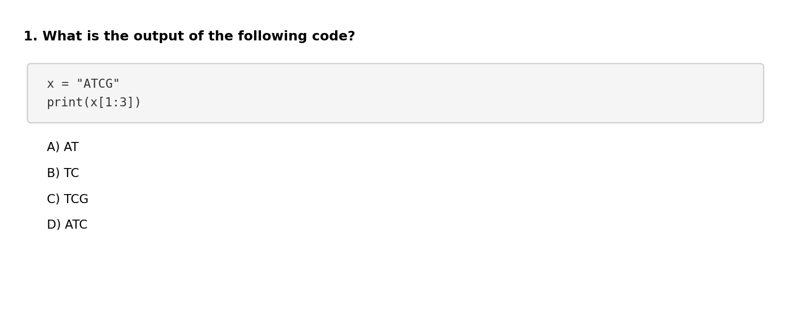
<div class="quiz-options">
<label><input type="radio" name="q1" value="A"> A</label>
<label class="correct-answer"><input type="radio" name="q1" value="B"> B ✓</label>
<label><input type="radio" name="q1" value="C"> C</label>
<label><input type="radio" name="q1" value="D"> D</label>
</div>
</div>

<div class="quiz-question">
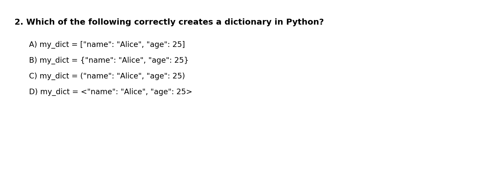
<div class="quiz-options">
<label><input type="radio" name="q2" value="A"> A</label>
<label class="correct-answer"><input type="radio" name="q2" value="B"> B ✓</label>
<label><input type="radio" name="q2" value="C"> C</label>
<label><input type="radio" name="q2" value="D"> D</label>
</div>
</div>

<div class="quiz-question">
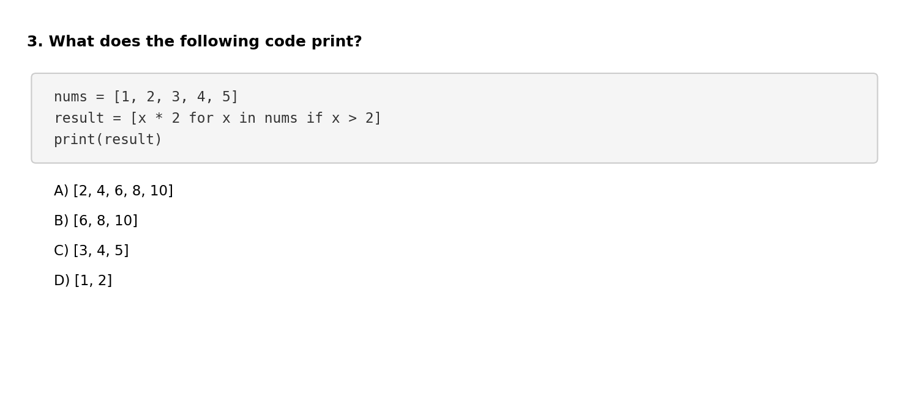
<div class="quiz-options">
<label><input type="radio" name="q3" value="A"> A</label>
<label class="correct-answer"><input type="radio" name="q3" value="B"> B ✓</label>
<label><input type="radio" name="q3" value="C"> C</label>
<label><input type="radio" name="q3" value="D"> D</label>
</div>
</div>

<div class="quiz-question">
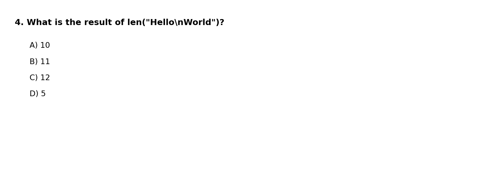
<div class="quiz-options">
<label><input type="radio" name="q4" value="A"> A</label>
<label><input type="radio" name="q4" value="B"> B</label>
<label class="correct-answer"><input type="radio" name="q4" value="C"> C ✓</label>
<label><input type="radio" name="q4" value="D"> D</label>
</div>
</div>

<div class="quiz-question">
<h3>Bash Questions</h3>
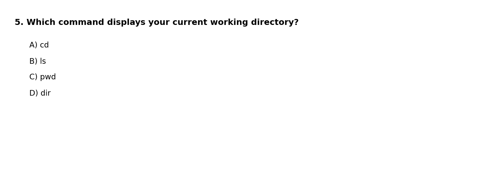
<div class="quiz-options">
<label><input type="radio" name="q5" value="A"> A</label>
<label><input type="radio" name="q5" value="B"> B</label>
<label class="correct-answer"><input type="radio" name="q5" value="C"> C ✓</label>
<label><input type="radio" name="q5" value="D"> D</label>
</div>
</div>

<div class="quiz-question">
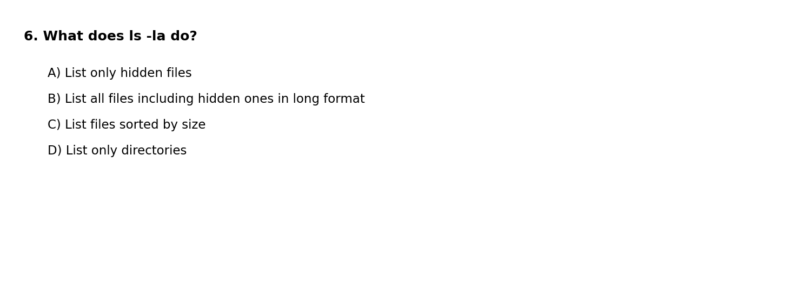
<div class="quiz-options">
<label><input type="radio" name="q6" value="A"> A</label>
<label class="correct-answer"><input type="radio" name="q6" value="B"> B ✓</label>
<label><input type="radio" name="q6" value="C"> C</label>
<label><input type="radio" name="q6" value="D"> D</label>
</div>
</div>

<div class="quiz-question">
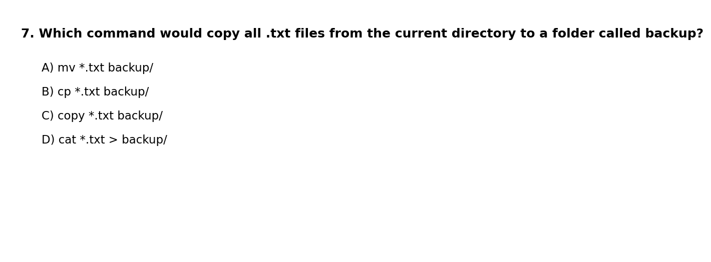
<div class="quiz-options">
<label><input type="radio" name="q7" value="A"> A</label>
<label class="correct-answer"><input type="radio" name="q7" value="B"> B ✓</label>
<label><input type="radio" name="q7" value="C"> C</label>
<label><input type="radio" name="q7" value="D"> D</label>
</div>
</div>

<div class="quiz-question">
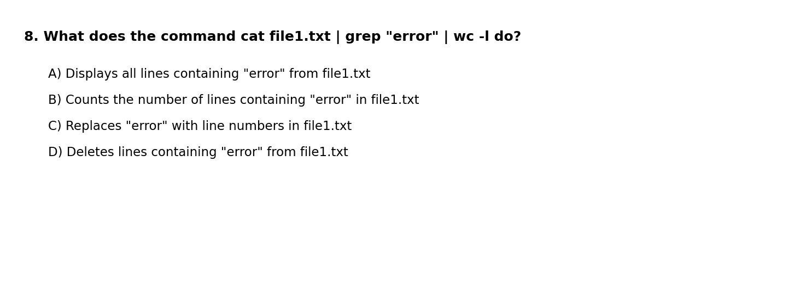
<div class="quiz-options">
<label><input type="radio" name="q8" value="A"> A</label>
<label class="correct-answer"><input type="radio" name="q8" value="B"> B ✓</label>
<label><input type="radio" name="q8" value="C"> C</label>
<label><input type="radio" name="q8" value="D"> D</label>
</div>
</div>

<div class="quiz-question">
<h3>Git Questions</h3>
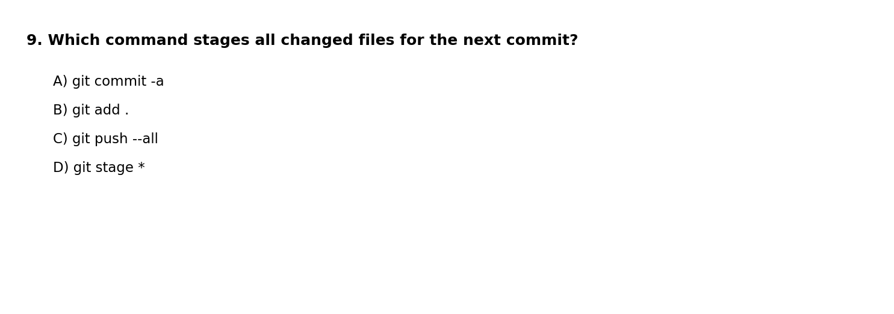
<div class="quiz-options">
<label><input type="radio" name="q9" value="A"> A</label>
<label class="correct-answer"><input type="radio" name="q9" value="B"> B ✓</label>
<label><input type="radio" name="q9" value="C"> C</label>
<label><input type="radio" name="q9" value="D"> D</label>
</div>
</div>

<div class="quiz-question">
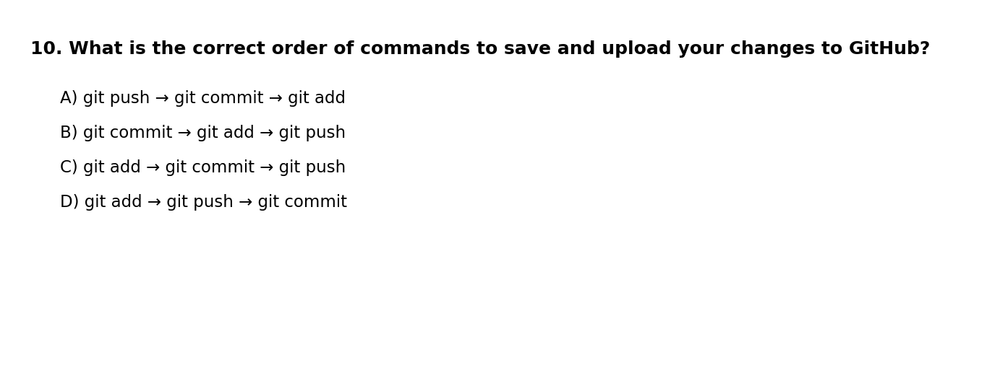
<div class="quiz-options">
<label><input type="radio" name="q10" value="A"> A</label>
<label><input type="radio" name="q10" value="B"> B</label>
<label class="correct-answer"><input type="radio" name="q10" value="C"> C ✓</label>
<label><input type="radio" name="q10" value="D"> D</label>
</div>
</div>

<div class="quiz-question">
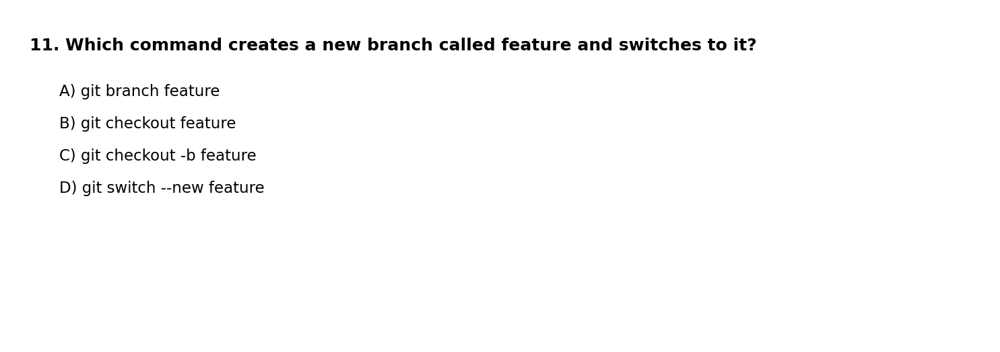
<div class="quiz-options">
<label><input type="radio" name="q11" value="A"> A</label>
<label><input type="radio" name="q11" value="B"> B</label>
<label class="correct-answer"><input type="radio" name="q11" value="C"> C ✓</label>
<label><input type="radio" name="q11" value="D"> D</label>
</div>
</div>

<div class="quiz-question">
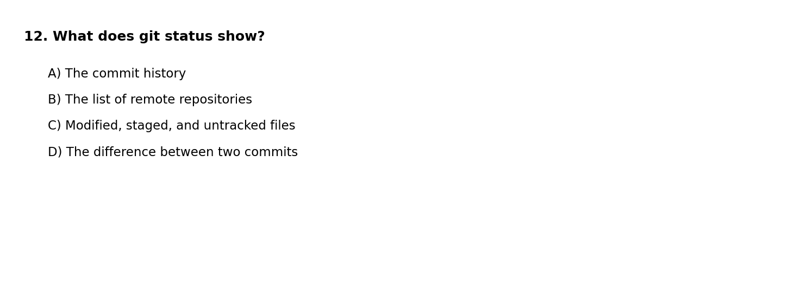
<div class="quiz-options">
<label><input type="radio" name="q12" value="A"> A</label>
<label><input type="radio" name="q12" value="B"> B</label>
<label class="correct-answer"><input type="radio" name="q12" value="C"> C ✓</label>
<label><input type="radio" name="q12" value="D"> D</label>
</div>
</div>

<div class="quiz-question">
<h3>Agentic CLI Questions</h3>
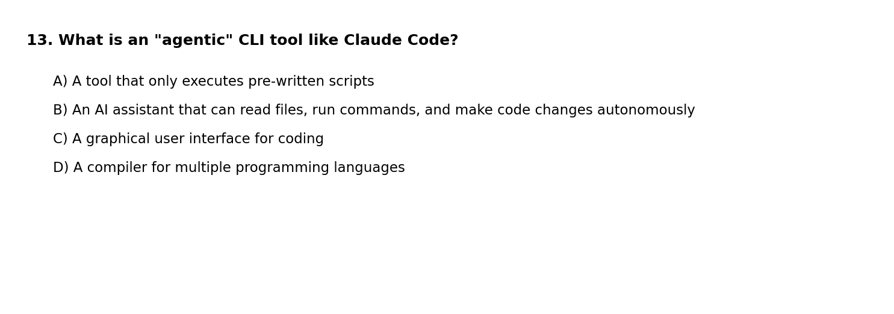
<div class="quiz-options">
<label><input type="radio" name="q13" value="A"> A</label>
<label class="correct-answer"><input type="radio" name="q13" value="B"> B ✓</label>
<label><input type="radio" name="q13" value="C"> C</label>
<label><input type="radio" name="q13" value="D"> D</label>
</div>
</div>

<div class="quiz-question">
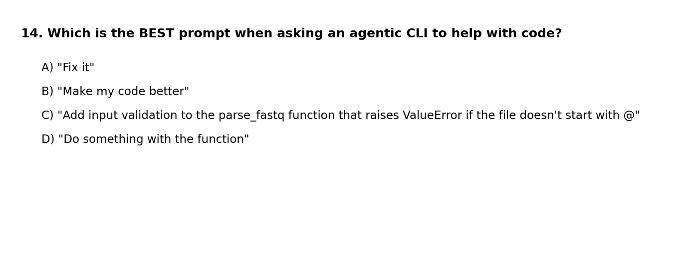
<div class="quiz-options">
<label><input type="radio" name="q14" value="A"> A</label>
<label><input type="radio" name="q14" value="B"> B</label>
<label class="correct-answer"><input type="radio" name="q14" value="C"> C ✓</label>
<label><input type="radio" name="q14" value="D"> D</label>
</div>
</div>

<div class="quiz-question">
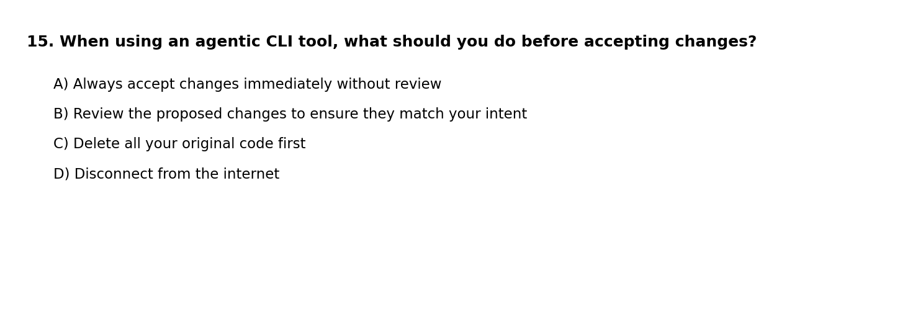
<div class="quiz-options">
<label><input type="radio" name="q15" value="A"> A</label>
<label class="correct-answer"><input type="radio" name="q15" value="B"> B ✓</label>
<label><input type="radio" name="q15" value="C"> C</label>
<label><input type="radio" name="q15" value="D"> D</label>
</div>
</div>

</div>

<div class="submit-section">
<h3>Submit Your Answers</h3>
<p>Enter your student ID and click Submit to generate your submission code.</p>
<input type="text" id="studentName" placeholder="Your student ID">
<br>
<button id="submitBtn" onclick="submitQuiz()">Submit Answers</button>

<div id="resultBox">
<p><strong>Copy this code and email it to your instructor at <a href="mailto:aun1@psu.edu">aun1@psu.edu</a>:</strong></p>
<div id="submissionCode"></div>
<button onclick="copyCode()">Copy to Clipboard</button>
</div>
</div>

<script>
// Save answers to localStorage as user selects them
document.querySelectorAll('input[type="radio"]').forEach(radio => {
  radio.addEventListener('change', function() {
    localStorage.setItem('quiz_' + this.name, this.value);
  });
});

// Restore saved answers on page load
window.addEventListener('load', function() {
  for (let i = 1; i <= 15; i++) {
    const saved = localStorage.getItem('quiz_q' + i);
    if (saved) {
      const radio = document.querySelector(`input[name="q${i}"][value="${saved}"]`);
      if (radio) radio.checked = true;
    }
  }
  const savedName = localStorage.getItem('quiz_studentName');
  if (savedName) document.getElementById('studentName').value = savedName;
});

// Save name as user types
document.getElementById('studentName').addEventListener('input', function() {
  localStorage.setItem('quiz_studentName', this.value);
});

function submitQuiz() {
  const name = document.getElementById('studentName').value.trim();
  if (!name) {
    alert('Please enter your student ID');
    return;
  }

  let answers = [];
  let unanswered = [];

  for (let i = 1; i <= 15; i++) {
    const selected = document.querySelector(`input[name="q${i}"]:checked`);
    if (selected) {
      answers.push(selected.value);
    } else {
      answers.push('-');
      unanswered.push(i);
    }
  }

  if (unanswered.length > 0) {
    if (!confirm(`You have not answered question(s): ${unanswered.join(', ')}. Submit anyway?`)) {
      return;
    }
  }

  // Create submission code: name|timestamp|answers
  const timestamp = new Date().toISOString();
  const code = btoa(JSON.stringify({
    studentId: name,
    time: timestamp,
    answers: answers.join('')
  }));

  document.getElementById('submissionCode').textContent = code;
  document.getElementById('resultBox').style.display = 'block';
}

function copyCode() {
  const code = document.getElementById('submissionCode').textContent;
  navigator.clipboard.writeText(code).then(() => {
    alert('Code copied to clipboard!');
  });
}
</script>

---

## Test Results Summary

```{ojs}
//| echo: false
data = [
  {score: "0-3", count: 0},
  {score: "4-6", count: 5},
  {score: "7-9", count: 5},
  {score: "10-12", count: 4},
  {score: "13-15", count: 1}
]

Plot.plot({
  marks: [
    Plot.barY(data, {x: "score", y: "count", fill: "#4a90d9"}),
    Plot.ruleY([0])
  ],
  x: {label: "Score Range"},
  y: {label: "Number of Students"},
  title: "Test 1 Score Distribution (n=15)",
  width: 500,
  height: 300
})
```

**Summary Statistics:**

- Students: 15
- Average: 8.1/15 (54.2%)
- Median: 8/15
- Range: 5-13/15

**Per-Question Analysis:**

| Question | Correct | Incorrect | % Correct |
|:--------:|:-------:|:---------:|:---------:|
| 1 | 3 | 12 | 20% |
| 2 | 9 | 6 | 60% |
| 3 | 13 | 2 | 87% |
| 4 | 5 | 10 | 33% |
| 5 | 5 | 10 | 33% |
| 6 | 10 | 5 | 67% |
| 7 | 12 | 3 | 80% |
| 8 | 3 | 12 | 20% |
| 9 | 4 | 11 | 27% |
| 10 | 6 | 9 | 40% |
| 11 | 6 | 9 | 40% |
| 12 | 9 | 6 | 60% |
| 13 | 12 | 3 | 80% |
| 14 | 11 | 4 | 73% |
| 15 | 14 | 1 | 93% |

**Analysis by Topic:**

Students performed strongest on **Agentic CLI** concepts (Q13-15, avg 82%), with excellent understanding of reviewing changes before accepting them (Q15, 93%) and writing good prompts (Q14, 73%). **Python** questions (Q1-4, avg 50%) showed solid results on list comprehensions (Q3, 87%) and dictionary syntax (Q2, 60%), though string slicing (Q1, 20%) needs review. **Bash** performance (Q5-8, avg 50%) was mixed—students understood file copying (Q7, 80%) and `ls -la` (Q6, 67%), but pipe commands (Q8, 20%) need reinforcement. **Git** questions (Q9-12, avg 42%) were the weakest area, with students grasping `git status` (Q12, 60%) but struggling with `git add .` (Q9, 27%) and the add-commit-push workflow (Q10, 40%).
