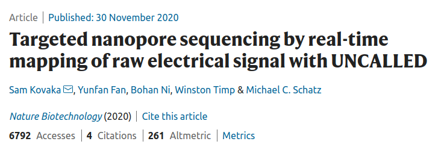
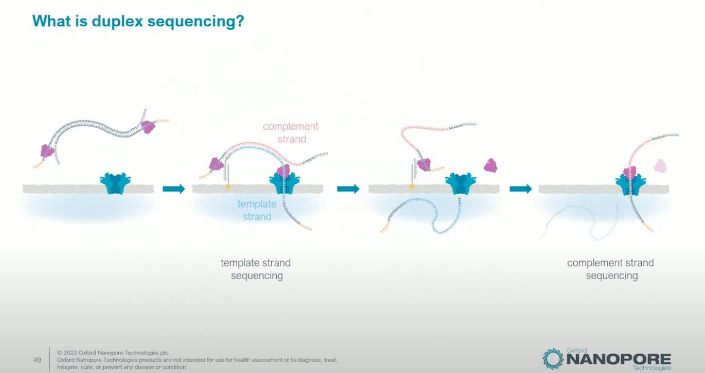

## Learning Objectives

By the end of this lecture, you will be able to:

- Explain the principle of sequencing-by-synthesis and how it differs from sequencing-by-ligation
- Compare historical sequencing platforms (454, SOLiD, Ion Torrent) and explain why they were displaced
- Describe Illumina's dye chemistry evolution from 4-channel to 2-channel to 1-channel imaging
- Explain Element Biosciences' avidite chemistry and why decoupling detection from incorporation matters
- Describe PacBio's zero-mode waveguides and how circular consensus sequencing produces HiFi reads
- Explain nanopore sequencing, direct RNA sequencing, and adaptive sampling
- Choose an appropriate sequencing platform given a specific experimental goal

---

## 1. Introduction: The Sequencing Revolution

DNA sequencing has undergone extraordinary transformations since Frederick Sanger's chain-termination method in 1977. That original approach -- using dideoxynucleotides to terminate growing DNA chains at random positions -- dominated for nearly three decades and was the workhorse behind the Human Genome Project (completed 2003). The human genome cost approximately $2.7 billion to sequence using Sanger technology.

The transition from Sanger to **next-generation sequencing (NGS)** began in 2005 and triggered a cost reduction that outpaced [Moore's Law](https://en.wikipedia.org/wiki/Moore%27s_law) by orders of magnitude. We now routinely sequence a human genome for under $200 in a matter of hours.

### Generations of Sequencing

| Generation | Era | Key Feature | Examples |
|:----------:|-----|-------------|---------|
| 1st | 1977-2004 | Chain termination | Sanger (ABI 3730) |
| 2nd | 2005-present | Massively parallel short reads | 454, Illumina, SOLiD, Ion Torrent, Element |
| 3rd | 2011-present | Single-molecule, long reads | PacBio, Oxford Nanopore |

:::{.callout-note}
## The Common Thread
Nearly all modern sequencing platforms share the **sequencing-by-synthesis** (SBS) principle: watch a DNA polymerase incorporate nucleotides one at a time and detect which base was added at each step. The platforms differ in *how* they detect incorporation -- light, pH change, electrical current, or fluorescence duration. (SOLiD is a notable exception, using oligonucleotide **ligation** rather than polymerase activity.)
:::

---

## 2. Historical Technologies

Three platforms dominated the early NGS era. All have been largely superseded, but understanding them illuminates the design trade-offs that shaped current technology.

### 2.1 454 Pyrosequencing

454 Life Sciences launched the first commercial NGS platform in 2005 ([Margulies et al. 2005, *Nature* 437:376-380](https://doi.org/10.1038/nature03959)). Roche acquired the company in 2007 and discontinued the platform in 2013.

**How it worked:**

1. Fragment DNA and ligate adapters
2. Capture single fragments on beads via emulsion PCR -- each bead carries ~10 million copies of one fragment
3. Deposit beads into **picotiter plate wells** (one bead per well)
4. Flow nucleotides sequentially (T, then A, then G, then C, repeat)
5. When a nucleotide is incorporated, **pyrophosphate (PPi)** is released
6. PPi is converted to ATP by sulfurylase; ATP drives **luciferase** to produce a flash of light
7. A CCD camera captures the light; signal intensity is proportional to the number of bases incorporated

**Key characteristics:**

- Read length: up to ~1000 bp (longest of any NGS platform at the time)
- Throughput: ~700 Mb per run
- Main error type: **homopolymer insertion/deletions** -- runs of identical bases (e.g., AAAA) produce a single light pulse whose intensity must be quantified, and intensity estimation degrades for runs >6 bp
- Run time: ~10 hours

```{=html}

<div id="viz-pyro" style="max-width:800px; margin:2em auto; font-family: Arial, sans-serif;">
<h4 style="text-align:center; color:#333;">454 Pyrosequencing Animation</h4>
<p style="text-align:center; color:#666; font-size:0.9em;">Watch nucleotides flow over a well. When the correct nucleotide is incorporated, pyrophosphate triggers a light flash.</p>
<div style="text-align:center; margin-bottom:10px;">
  <label style="font-size:0.85em; font-weight:bold;">Template strand: </label>
  <input id="pyro-template" type="text" value="TACGGATC" maxlength="12" style="padding:4px 8px; font-family:monospace; width:140px; text-transform:uppercase; border:1px solid #ccc; border-radius:4px;" />
  <button id="pyro-start" style="padding:6px 16px; background:#4CAF50; color:white; border:none; border-radius:4px; cursor:pointer; margin-left:8px;">Start</button>
  <button id="pyro-reset" style="padding:6px 16px; background:#9E9E9E; color:white; border:none; border-radius:4px; cursor:pointer; margin-left:4px;">Reset</button>
</div>
<canvas id="pyro-canvas" width="760" height="400" style="width:100%; border:1px solid #eee; border-radius:8px; background:#1a1a2e;"></canvas>
<div id="pyro-flowgram" style="margin-top:10px; padding:10px; background:#f5f5f5; border-radius:4px; font-family:monospace; font-size:0.85em; min-height:24px;"></div>
</div>

<script>
(function() {
  var canvas = document.getElementById('pyro-canvas');
  var ctx = canvas.getContext('2d');
  var W = canvas.width, H = canvas.height;
  var flowOrder = ['T','A','G','C'];
  var compMap = {A:'T', T:'A', G:'C', C:'G'};
  var baseColors = {T:'#e74c3c', A:'#2ecc71', G:'#f39c12', C:'#3498db'};
  var template, synthStrand, flowIdx, baseIdx, animState, animFrame, flashAlpha, signals;
  var particleY, particleAlpha, showParticle;

  function reset() {
    template = document.getElementById('pyro-template').value.toUpperCase().replace(/[^ACGT]/g,'');
    if(template.length===0) template='TACGGATC';
    synthStrand = '';
    flowIdx = 0; baseIdx = 0;
    animState = 'idle';
    flashAlpha = 0;
    signals = [];
    showParticle = false;
    particleY = 0; particleAlpha = 0;
    draw();
    document.getElementById('pyro-flowgram').innerHTML = '<b>Flowgram:</b> (press Start)';
  }

  function draw() {
    ctx.clearRect(0,0,W,H);
    // Well
    ctx.fillStyle = '#16213e';
    ctx.fillRect(0,0,W,H);
    // Draw well structure
    var wellX = 120, wellW = 200, wellTop = 80, wellBot = 300;
    ctx.fillStyle = '#0f3460';
    ctx.beginPath();
    ctx.moveTo(wellX, wellTop);
    ctx.lineTo(wellX, wellBot);
    ctx.lineTo(wellX+wellW, wellBot);
    ctx.lineTo(wellX+wellW, wellTop);
    ctx.closePath();
    ctx.fill();
    ctx.strokeStyle = '#e94560';
    ctx.lineWidth = 2;
    ctx.stroke();

    // Bead at bottom
    ctx.beginPath();
    ctx.arc(wellX+wellW/2, wellBot-30, 25, 0, Math.PI*2);
    ctx.fillStyle = '#533483';
    ctx.fill();
    ctx.strokeStyle = '#9b59b6';
    ctx.lineWidth = 1.5;
    ctx.stroke();
    ctx.fillStyle = '#fff';
    ctx.font = '10px Arial';
    ctx.textAlign = 'center';
    ctx.fillText('bead', wellX+wellW/2, wellBot-27);

    // Template on bead
    ctx.font = '12px monospace';
    ctx.fillStyle = '#ccc';
    ctx.textAlign = 'left';
    ctx.fillText("3'-" + template + "-5'", wellX+20, wellBot-5);

    // Synthesized strand
    if(synthStrand.length > 0) {
      ctx.fillStyle = '#2ecc71';
      ctx.fillText("5'-" + synthStrand, wellX+20, wellBot-55);
    }

    // Current flowing nucleotide label
    if(flowIdx < flowOrder.length * Math.ceil(template.length)) {
      var curNuc = flowOrder[flowIdx % 4];
      ctx.font = 'bold 16px Arial';
      ctx.fillStyle = baseColors[curNuc];
      ctx.textAlign = 'center';
      ctx.fillText('Flowing: ' + curNuc, wellX+wellW/2, wellTop-10);

      // Particle falling
      if(showParticle) {
        ctx.globalAlpha = particleAlpha;
        ctx.beginPath();
        ctx.arc(wellX+wellW/2, wellTop + particleY, 8, 0, Math.PI*2);
        ctx.fillStyle = baseColors[curNuc];
        ctx.fill();
        ctx.font = 'bold 11px monospace';
        ctx.fillStyle = '#fff';
        ctx.fillText(curNuc, wellX+wellW/2, wellTop + particleY + 4);
        ctx.globalAlpha = 1;
      }
    }

    // Flash effect
    if(flashAlpha > 0) {
      ctx.globalAlpha = flashAlpha;
      ctx.fillStyle = '#ffeb3b';
      ctx.beginPath();
      ctx.arc(wellX+wellW/2, wellBot-80, 40 + flashAlpha*20, 0, Math.PI*2);
      ctx.fill();
      ctx.font = 'bold 14px Arial';
      ctx.fillStyle = '#000';
      ctx.textAlign = 'center';
      ctx.fillText('LIGHT!', wellX+wellW/2, wellBot-76);
      ctx.globalAlpha = 1;
    }

    // Flowgram chart on right
    var chartX = 400, chartY = 40, chartW = 340, chartH = 300;
    ctx.fillStyle = '#0d1b2a';
    ctx.fillRect(chartX, chartY, chartW, chartH);
    ctx.strokeStyle = '#1b2838';
    ctx.strokeRect(chartX, chartY, chartW, chartH);
    ctx.fillStyle = '#aaa';
    ctx.font = '12px Arial';
    ctx.textAlign = 'center';
    ctx.fillText('Flowgram (Signal Intensity)', chartX+chartW/2, chartY-5);

    // Axes
    ctx.strokeStyle = '#555';
    ctx.lineWidth = 1;
    ctx.beginPath();
    ctx.moveTo(chartX+30, chartY+chartH-25);
    ctx.lineTo(chartX+chartW-10, chartY+chartH-25);
    ctx.moveTo(chartX+30, chartY+chartH-25);
    ctx.lineTo(chartX+30, chartY+10);
    ctx.stroke();
    ctx.fillStyle = '#888';
    ctx.font = '10px Arial';
    ctx.textAlign = 'center';
    ctx.fillText('Flow cycle', chartX+chartW/2, chartY+chartH-5);
    ctx.save();
    ctx.translate(chartX+12, chartY+chartH/2);
    ctx.rotate(-Math.PI/2);
    ctx.fillText('Intensity', 0, 0);
    ctx.restore();

    // Draw bars
    if(signals.length > 0) {
      var maxSig = 4;
      var barW = Math.min(20, (chartW-50)/signals.length - 2);
      var plotH = chartH - 45;
      for(var i=0; i<signals.length; i++) {
        var sig = signals[i];
        var bh = (sig.val/maxSig)*plotH;
        var bx = chartX + 35 + i*(barW+2);
        ctx.fillStyle = baseColors[sig.nuc];
        ctx.fillRect(bx, chartY+chartH-25-bh, barW, bh);
        ctx.fillStyle = '#aaa';
        ctx.font = '9px monospace';
        ctx.textAlign = 'center';
        ctx.fillText(sig.nuc, bx+barW/2, chartY+chartH-14);
        if(sig.val > 0) {
          ctx.fillText(sig.val, bx+barW/2, chartY+chartH-28-bh);
        }
      }
    }

    // Legend
    ctx.font = '11px Arial';
    ctx.textAlign = 'left';
    ctx.fillStyle = '#ccc';
    ctx.fillText('Enzymes: sulfurylase + luciferase', 10, H-10);
  }

  function stepFlow() {
    if(baseIdx >= template.length) {
      animState = 'done';
      document.getElementById('pyro-flowgram').innerHTML = '<b>Flowgram:</b> Sequencing complete! Read: ' + synthStrand;
      draw();
      return;
    }
    var curNuc = flowOrder[flowIdx % 4];
    var expectedBase = compMap[template[baseIdx]];
    // Count how many consecutive bases match
    var incCount = 0;
    var tmpIdx = baseIdx;
    while(tmpIdx < template.length && compMap[template[tmpIdx]] === curNuc) {
      incCount++;
      tmpIdx++;
    }

    showParticle = true;
    particleY = 0;
    particleAlpha = 1;
    var targetY = 180;
    var dropFrames = 30;
    var frame = 0;

    function animateDrop() {
      frame++;
      particleY = (frame/dropFrames)*targetY;
      if(frame >= dropFrames) {
        showParticle = false;
        if(incCount > 0) {
          for(var i=0; i<incCount; i++) synthStrand += curNuc;
          baseIdx += incCount;
          flashAlpha = 1;
          signals.push({nuc:curNuc, val:incCount});
          animateFlash();
        } else {
          signals.push({nuc:curNuc, val:0});
          flowIdx++;
          draw();
          updateFlowgram();
          setTimeout(stepFlow, 600);
        }
        return;
      }
      draw();
      requestAnimationFrame(animateDrop);
    }

    function animateFlash() {
      flashAlpha -= 0.03;
      if(flashAlpha <= 0) {
        flashAlpha = 0;
        flowIdx++;
        draw();
        updateFlowgram();
        setTimeout(stepFlow, 600);
        return;
      }
      draw();
      requestAnimationFrame(animateFlash);
    }
    animateDrop();
  }

  function updateFlowgram() {
    var html = '<b>Flowgram:</b> ';
    signals.forEach(function(s) {
      var c = s.val > 0 ? baseColors[s.nuc] : '#999';
      html += '<span style="color:'+c+';font-weight:'+(s.val>0?'bold':'normal')+';">'+s.nuc+'='+s.val+' </span>';
    });
    html += ' | <b>Read so far:</b> ' + synthStrand;
    document.getElementById('pyro-flowgram').innerHTML = html;
  }

  document.getElementById('pyro-start').addEventListener('click', function() {
    reset();
    animState = 'running';
    setTimeout(stepFlow, 500);
  });
  document.getElementById('pyro-reset').addEventListener('click', reset);
  reset();
})();
</script>
```

### 2.2 SOLiD (Sequencing by Oligonucleotide Ligation and Detection)

Applied Biosystems launched SOLiD in 2007, building on work by [Shendure et al. 2005, *Science* 309:1728-1732](https://doi.org/10.1126/science.1117389).

**How it worked:**

1. DNA fragments amplified on beads via emulsion PCR (similar to 454)
2. Beads deposited on a glass slide
3. Sequencing proceeds by **ligation**, not polymerase synthesis
4. Short fluorescently-labeled **di-base probes** (8-mers) hybridize to the template adjacent to a primer
5. DNA ligase joins probe to the primer
6. Fluorophore is imaged, then cleaved
7. Process repeats with offset primers -- each base is interrogated **twice** from different ligation rounds

**Two-base encoding (color space):**

Each fluorescent label encodes a *dinucleotide*, not a single base. The read is recorded as a series of colors (0, 1, 2, 3) rather than bases. Decoding requires knowing the first base, and a single error propagates through the entire read. However, true SNPs change only one color, while sequencing errors change two consecutive colors -- enabling powerful error correction.

**Key characteristics:**

- Read length: ~75 bp (short)
- Accuracy: very high (~99.94%) after color-space error correction
- Throughput: up to 30 Gb per run
- Main limitation: short reads, complex analysis pipeline, slow adoption

### 2.3 Ion Torrent

Life Technologies (now Thermo Fisher) launched Ion Torrent in 2010 ([Rothberg et al. 2011, *Nature* 475:348-352](https://doi.org/10.1038/nature10242)). This was the first **post-light** sequencing technology.

**How it worked:**

1. DNA fragments on beads via emulsion PCR, loaded into microwells on a semiconductor chip
2. Nucleotides flowed sequentially (like 454)
3. When a nucleotide is incorporated, a **hydrogen ion (H+)** is released, lowering the pH
4. An **ISFET** (ion-sensitive field-effect transistor) sensor beneath each well detects the pH change
5. No optics, no cameras -- purely **electronic detection** on a standard CMOS chip

**Key characteristics:**

- Read length: up to 400 bp (Ion S5)
- Run time: 2-4 hours (fastest of early NGS)
- Main error: **homopolymer indels** (same problem as 454 -- voltage proportional to number of incorporations)
- Still used in **clinical settings** (Ion GeneStudio S5) for targeted panels

:::{.callout-important}
## Why Homopolymers Are Hard
Both 454 and Ion Torrent measure the *magnitude* of a signal (light intensity or voltage) to determine how many identical bases were incorporated in a single flow. Distinguishing 5 incorporations from 6 is inherently imprecise because signal scales sub-linearly and noise increases. Illumina avoids this entirely by incorporating **one base at a time** using reversible terminators.
:::

### Comparison of Historical Platforms

| Feature | 454 | SOLiD | Ion Torrent |
|---------|-----|-------|-------------|
| Year launched | 2005 | 2007 | 2010 |
| Detection method | Light (pyrosequencing) | Fluorescence (ligation) | pH (semiconductor) |
| Read length | ~1000 bp | ~75 bp | ~400 bp |
| Max throughput/run | ~700 Mb | ~30 Gb | ~50 Gb |
| Primary error type | Homopolymer indels | Substitutions | Homopolymer indels |
| Status | Discontinued 2013 | Discontinued ~2015 | Still sold (clinical) |

---

## 3. Illumina

Illumina has dominated sequencing since approximately 2010, commanding >80% of the global sequencing market at its peak. The company's technology traces back to Solexa (founded 1998, acquired by Illumina 2007) and the foundational paper by [Bentley et al. 2008, *Nature* 456:53-59](https://doi.org/10.1038/nature07517).

### Core Principle: Bridge Amplification + Reversible Terminators

**Library preparation and cluster generation:**

1. Fragment DNA and ligate adapters containing P5 and P7 sequences
2. Denature and load single-stranded fragments onto a **flow cell** coated with complementary oligos
3. Each fragment hybridizes to a surface oligo and is copied by a polymerase
4. The original template is washed away; the copied strand bends over and hybridizes to an adjacent oligo -- forming a **bridge**
5. Bridge amplification repeats ~35 cycles, creating a **clonal cluster** of ~1,000 identical copies
6. Forward strands are cleaved (or reverse strands, depending on read); single-stranded clusters remain

**Sequencing by synthesis:**

1. A sequencing primer hybridizes to the adapter
2. All four nucleotides are added simultaneously -- each carries:
   - A **fluorescent dye** (color identifies the base)
   - A **3'-O-azidomethyl blocking group** (prevents further incorporation)
3. After one nucleotide incorporates, excess is washed away
4. The flow cell is **imaged** to capture fluorescence from every cluster
5. Both the dye and the 3'-block are **chemically cleaved**
6. The cycle repeats

This ensures **exactly one base per cycle** -- no homopolymer ambiguity.

### 3.1 Four-Channel Chemistry (4-dye)

The original Illumina chemistry used on HiSeq, MiSeq, and GA platforms.

- 4 distinct fluorescent dyes, one per base
- 4 images per cycle (one filter per dye)
- Each base has a unique emission wavelength

### 3.2 Two-Channel Chemistry (2-dye)

Introduced on NextSeq and NovaSeq 6000 to reduce imaging time.

- Only **2 dyes** are used
- A = Red + Green (both channels bright)
- C = Red only
- T = Green only
- G = No dye ("dark" -- unlabeled)
- 2 images per cycle instead of 4

```{=html}

<div id="viz-illumina" style="max-width:900px; margin:2em auto; font-family: Arial, sans-serif;">
<h4 style="text-align:center; color:#333;">Illumina Dye Chemistry Comparison</h4>
<p style="text-align:center; color:#666; font-size:0.9em;">Compare how the same cluster appears under 4-channel, 2-channel, and 1-channel imaging. Click a base to see its signature.</p>
<div style="text-align:center; margin-bottom:15px;">
  <button class="ilm-base-btn" data-base="A" style="padding:8px 20px; background:#4CAF50; color:white; border:none; border-radius:4px; cursor:pointer; margin:2px; font-weight:bold; font-size:1em;">A</button>
  <button class="ilm-base-btn" data-base="C" style="padding:8px 20px; background:#2196F3; color:white; border:none; border-radius:4px; cursor:pointer; margin:2px; font-weight:bold; font-size:1em;">C</button>
  <button class="ilm-base-btn" data-base="G" style="padding:8px 20px; background:#FF9800; color:white; border:none; border-radius:4px; cursor:pointer; margin:2px; font-weight:bold; font-size:1em;">G</button>
  <button class="ilm-base-btn" data-base="T" style="padding:8px 20px; background:#e74c3c; color:white; border:none; border-radius:4px; cursor:pointer; margin:2px; font-weight:bold; font-size:1em;">T</button>
</div>
<canvas id="ilm-canvas" width="860" height="420" style="width:100%; border:1px solid #ddd; border-radius:8px; background:#fff;"></canvas>
<div id="ilm-info" style="margin-top:10px; padding:10px; background:#f0f4ff; border-radius:4px; font-size:0.9em;"></div>
</div>

<script>
(function() {
  var canvas = document.getElementById('ilm-canvas');
  var ctx = canvas.getContext('2d');
  var W = canvas.width, H = canvas.height;
  var selectedBase = 'A';

  // Chemistry definitions
  // 4-channel: each base = unique channel
  // 2-channel: A=red+green, C=red, T=green, G=dark
  // 1-channel: 2 chemistry steps. T=bright+bright, A=bright+dark, C=dark+bright, G=dark+dark
  var schemes = {
    '4-channel': {
      label: '4-Channel (HiSeq, MiSeq)',
      images: ['Filter 1 (Blue)','Filter 2 (Green)','Filter 3 (Yellow)','Filter 4 (Red)'],
      colors: ['#2196F3','#4CAF50','#FFC107','#e74c3c'],
      pattern: {
        A: [0,1,0,0],
        C: [1,0,0,0],
        G: [0,0,1,0],
        T: [0,0,0,1]
      }
    },
    '2-channel': {
      label: '2-Channel (NextSeq, NovaSeq 6000)',
      images: ['Red Channel','Green Channel'],
      colors: ['#e74c3c','#4CAF50'],
      pattern: {
        A: [1,1],
        C: [1,0],
        T: [0,1],
        G: [0,0]
      }
    },
    '1-channel': {
      label: '1-Channel (iSeq 100)',
      images: ['Step 1 Image','Step 2 Image'],
      colors: ['#7E57C2','#7E57C2'],
      pattern: {
        A: [1,0],
        C: [0,1],
        T: [1,1],
        G: [0,0]
      }
    }
  };

  function draw() {
    ctx.clearRect(0,0,W,H);
    var schemeKeys = ['4-channel','2-channel','1-channel'];
    var colW = W / 3;

    schemeKeys.forEach(function(key, si) {
      var s = schemes[key];
      var x0 = si * colW;
      // Header
      ctx.fillStyle = '#333';
      ctx.font = 'bold 13px Arial';
      ctx.textAlign = 'center';
      ctx.fillText(s.label, x0 + colW/2, 22);

      var pat = s.pattern[selectedBase];
      var nimages = s.images.length;
      var imgSize = 70;
      var gap = 12;
      var totalW = nimages * imgSize + (nimages-1) * gap;
      var startX = x0 + (colW - totalW) / 2;
      var startY = 50;

      for(var i = 0; i < nimages; i++) {
        var ix = startX + i * (imgSize + gap);
        // Image label
        ctx.fillStyle = '#666';
        ctx.font = '10px Arial';
        ctx.textAlign = 'center';
        ctx.fillText(s.images[i], ix + imgSize/2, startY - 4);

        // Image background
        ctx.fillStyle = '#111';
        ctx.fillRect(ix, startY, imgSize, imgSize);

        // Draw cluster dots (4x4 grid of "clusters")
        for(var row = 0; row < 4; row++) {
          for(var col = 0; col < 4; col++) {
            var cx = ix + 12 + col * 16;
            var cy = startY + 12 + row * 16;
            if(pat[i] > 0) {
              // Bright cluster
              ctx.beginPath();
              ctx.arc(cx, cy, 5, 0, Math.PI*2);
              var grd = ctx.createRadialGradient(cx, cy, 1, cx, cy, 6);
              grd.addColorStop(0, '#fff');
              grd.addColorStop(0.5, s.colors[i]);
              grd.addColorStop(1, 'rgba(0,0,0,0)');
              ctx.fillStyle = grd;
              ctx.fill();
            } else {
              // Dark cluster
              ctx.beginPath();
              ctx.arc(cx, cy, 3, 0, Math.PI*2);
              ctx.fillStyle = '#333';
              ctx.fill();
            }
          }
        }
        ctx.strokeStyle = '#444';
        ctx.lineWidth = 1;
        ctx.strokeRect(ix, startY, imgSize, imgSize);
      }

      // Signal readout below
      var readoutY = startY + imgSize + 20;
      ctx.fillStyle = '#333';
      ctx.font = '12px Arial';
      ctx.textAlign = 'center';
      var sigStr = 'Signal: [' + pat.join(', ') + ']';
      ctx.fillText(sigStr, x0 + colW/2, readoutY);

      // Decode table
      var tableY = readoutY + 25;
      ctx.font = '11px monospace';
      ctx.textAlign = 'left';
      var bases = ['A','C','G','T'];
      var bcolors = {A:'#4CAF50', C:'#2196F3', G:'#FF9800', T:'#e74c3c'};
      var tx = x0 + 20;
      ctx.fillStyle = '#555';
      ctx.fillText('Encoding:', tx, tableY);
      bases.forEach(function(b, bi) {
        var ty = tableY + 18 + bi*18;
        var isSelected = (b === selectedBase);
        if(isSelected) {
          ctx.fillStyle = '#ffffcc';
          ctx.fillRect(tx-4, ty-12, colW-40, 16);
        }
        ctx.fillStyle = bcolors[b];
        ctx.font = (isSelected ? 'bold ' : '') + '11px monospace';
        ctx.fillText(b + ' = [' + s.pattern[b].join(',') + ']', tx, ty);
      });

      // Separator
      if(si < 2) {
        ctx.strokeStyle = '#ddd';
        ctx.lineWidth = 1;
        ctx.beginPath();
        ctx.moveTo(x0+colW, 10);
        ctx.lineTo(x0+colW, H-10);
        ctx.stroke();
      }
    });

    // Bottom info
    ctx.fillStyle = '#333';
    ctx.font = 'bold 14px Arial';
    ctx.textAlign = 'center';
    ctx.fillText('Selected base: ' + selectedBase, W/2, H-20);
  }

  var info = document.getElementById('ilm-info');
  var infoText = {
    A: '<b>Adenine (A):</b> 4-ch: unique green filter. 2-ch: lights up both red and green channels. 1-ch: bright in step 1, dark in step 2.',
    C: '<b>Cytosine (C):</b> 4-ch: unique blue filter. 2-ch: red channel only. 1-ch: dark in step 1, bright in step 2.',
    G: '<b>Guanine (G):</b> 4-ch: unique yellow filter. 2-ch: no signal (dark) — identified by exclusion. 1-ch: dark in both steps.',
    T: '<b>Thymine (T):</b> 4-ch: unique red filter. 2-ch: green channel only. 1-ch: bright in both steps.'
  };

  document.querySelectorAll('.ilm-base-btn').forEach(function(btn) {
    btn.addEventListener('click', function() {
      selectedBase = this.getAttribute('data-base');
      info.innerHTML = infoText[selectedBase];
      draw();
    });
  });

  info.innerHTML = infoText['A'];
  draw();
})();
</script>
```

### 3.3 One-Channel Chemistry (1-dye)

Used on the iSeq 100 with an integrated CMOS sensor:

- Only **1 dye**, but **2 chemistry steps** per cycle
- **Step 1:** A and T are labeled; image taken
- **Step 2:** Chemically modify so only C and T are labeled; image taken
- T = bright in both images; A = bright in step 1 only; C = bright in step 2 only; G = dark in both
- Extremely compact instrument (benchtop, ~$20k list price)

### 3.4 XLEAP-SBS Chemistry

Illumina's latest chemistry, deployed on NovaSeq X/X Plus and NextSeq 1000/2000:

- Redesigned polymerase and dye-linker system
- 2x faster incorporation kinetics
- ~50% lower error rate than previous chemistry
- Reduced phasing/pre-phasing artifacts
- 2-channel imaging, but with **different base-color assignments** than standard 2-channel: C is now the dual-color base (both channels), A is single-channel (blue only), T = green only, G = dark. This change affects index color-balancing requirements

:::{.callout-note}
## What Is Phasing?
Over many cycles, some DNA strands in a cluster fall behind (incomplete extension = **phasing**) or jump ahead (incorporation without blocking = **pre-phasing**). This makes clusters progressively out of sync, degrading quality scores toward the end of the read. XLEAP's improved blocking chemistry reduces both effects.
:::

### Current Illumina Platforms

| Platform | Chemistry | Max Output | Max Read Length | Key Use Case |
|----------|-----------|------------|-----------------|-------------|
| MiSeq | 4-channel | 15 Gb | 2 x 300 bp | Amplicons, small genomes |
| NextSeq 2000 | 2-channel (XLEAP) | 360 Gb (P3, 2x150) | 2 x 300 bp (P1/P2, up to 240 Gb) | Mid-throughput, flexible |
| NovaSeq X Plus | 2-channel (XLEAP) | 16 Tb | 2 x 150 bp | Production-scale WGS |

---

## 4. Element Biosciences

Element Biosciences (founded 2017, San Diego) introduced a fundamentally different approach to short-read sequencing with the AVITI system (launched 2022). The key innovation is described in [Arslan et al. 2024, *Nature Biotechnology* 42:132-138](https://doi.org/10.1038/s41587-023-01750-7).

### Sequencing by Binding (SBB) / Avidite Chemistry

The central insight: **decouple detection from incorporation**.

In Illumina's approach, the fluorescent dye is covalently attached to the nucleotide that gets incorporated. Even after cleaving the dye, a molecular "scar" remains on the growing strand. These scars accumulate over cycles and can interfere with polymerase activity and base calling.

Element's approach uses a two-step process:

1. **Detection step:** A multivalent construct called an **avidite** -- consisting of a fluorescently-labeled **streptavidin** core connected via flexible linkers to multiple identical nucleotides -- binds cooperatively (by avidity) to polymerase-template complexes across the polony. The avidite identifies the next correct base through polymerase selectivity. The cluster is imaged.
2. **Incorporation step:** The avidite is washed away (it was never covalently incorporated). Then, an **unlabeled 3'-blocked nucleotide** is added and incorporated by the polymerase. The block is removed for the next cycle.

![**Avidite sequencing cycle.** (**a**) Six-step cycle: avidites bind to polonies, unbound avidites are washed away, base identity is detected by fluorescence imaging, avidites are removed, a reversibly terminated nucleotide is incorporated, and the 3' block is removed. (**b**) A single avidite interacts with multiple polymerase-template copies within one polony via multivalent binding (avidity). (**c**) Many avidites specifically bind to polonies across the flow cell surface. From [Arslan et al. 2024](https://doi.org/10.1038/s41587-023-01750-7), Fig. 1.](../images/arslan2024_fig1_avidite.png){width=100%}

:::{.callout-important}
## Why This Matters
Because the incorporated nucleotide never carried a dye, there is **no scarring**. The DNA strand being synthesized contains only natural nucleotides with a removable 3' block. This contributes to Element's very high quality scores -- most bases achieve Q40+ (99.99% accuracy).
:::

, Fig. 3.](../images/element_snr_fig3.png){width=90%}

, Fig. 5.](../images/element_homopolymer_fig5.png){width=90%}

### Additional Innovations

- **Rolling Circle Amplification (RCA)** instead of bridge PCR: Generates polony clusters from circular DNA templates. This eliminates PCR-induced errors, optical duplicates, and index hopping.
- **Two independent flow cells** per AVITI run, each producing ~1 billion read pairs
- **No index hopping:** Because RCA does not involve free adapter-ligated fragments in solution, cross-contamination between indexed samples is essentially zero

### AVITI Specifications

| Feature | AVITI 24x24 |
|---------|-------------|
| Read pairs per flow cell | ~1 billion |
| Max output per flow cell | 300 Gb |
| Read length | 2 x 150 bp (2 x 300 bp available) |
| Quality | >90% bases Q30; Q40+ with Cloudbreak UltraQ chemistry |
| Run time | ~24-48 hr |
| List price | ~$289,000 |

In late 2024, Element launched the **AVITI24**, an upgraded platform delivering up to 1.5 billion reads per flow cell, multiomics capability (co-detection of RNA, protein, and morphology alongside sequencing), and Cloudbreak UltraQ kits achieving >70% of bases at Q50. List price: $424,000 ($150,000 as an upgrade from the original AVITI).

---

## 5. PacBio

Pacific Biosciences (founded 2004) pioneered **single-molecule real-time (SMRT) sequencing**, first described in [Eid et al. 2009, *Science* 323:133-138](https://doi.org/10.1126/science.1162986). The enabling technology -- the zero-mode waveguide -- was developed by [Levene et al. 2003, *Science* 299:682-686](https://doi.org/10.1126/science.1079700).

### Zero-Mode Waveguides (ZMWs)

A ZMW is a cylindrical hole approximately **70 nm in diameter** drilled through a ~100 nm metal film (aluminum) deposited on a glass substrate. The diameter is smaller than the wavelength of the excitation light (~500-600 nm), creating a condition where light cannot propagate through the hole. Instead, an **evanescent field** illuminates only the bottom ~30 nm of the well.

, Fig. 1.](../images/pacbio_zmw_levene2003.png){width=70%}

**How sequencing works:**

1. A single DNA polymerase molecule is attached to the bottom of each ZMW
2. The template DNA (with SMRTbell adapters) is loaded and binds to the polymerase
3. Fluorescently labeled dNTPs (each base has a different color dye attached to the **phosphate chain**, not the base) diffuse freely in solution
4. When a dNTP enters the ZMW and is **incorporated**, the polymerase holds it in the detection zone for **milliseconds** -- long enough to capture the fluorescent signal
5. Incorporation cleaves the phosphodiester bond, releasing the dye-labeled pyrophosphate
6. The polymerase advances to the next position
7. All of this is captured as a continuous **movie** of fluorescence pulses

, Fig. 1.](../images/pacbio_realtime_eid2009.png){width=90%}

```{=html}

<div id="viz-zmw" style="max-width:800px; margin:2em auto; font-family: Arial, sans-serif;">
<h4 style="text-align:center; color:#333;">Zero-Mode Waveguide (ZMW) Sequencing</h4>
<p style="text-align:center; color:#666; font-size:0.9em;">A single polymerase at the bottom of the ZMW incorporates fluorescent nucleotides. The dye is on the phosphate group — released after incorporation.</p>
<div style="text-align:center; margin-bottom:10px;">
  <button id="zmw-start" style="padding:8px 18px; background:#4CAF50; color:white; border:none; border-radius:4px; cursor:pointer;">Start Sequencing</button>
  <button id="zmw-reset" style="padding:8px 18px; background:#9E9E9E; color:white; border:none; border-radius:4px; cursor:pointer; margin-left:4px;">Reset</button>
</div>
<canvas id="zmw-canvas" width="780" height="450" style="width:100%; border:1px solid #eee; border-radius:8px; background:#0a0a1a;"></canvas>
<div id="zmw-read" style="margin-top:8px; padding:8px; background:#f5f5f5; border-radius:4px; font-family:monospace; font-size:0.9em;">Sequence: (press Start)</div>
</div>

<script>
(function() {
  var canvas = document.getElementById('zmw-canvas');
  var ctx = canvas.getContext('2d');
  var W = canvas.width, H = canvas.height;
  var baseColors = {A:'#2ecc71', C:'#3498db', G:'#f39c12', T:'#e74c3c'};
  var template = 'GATTACACGATCGGTA';
  var compMap = {A:'T', T:'A', G:'C', C:'G'};
  var readSeq = '';
  var currentBase = 0;
  var animRunning = false;
  var pulses = []; // for trace
  var particles = []; // free-floating dNTPs
  var incNuc = null; // currently incorporating nucleotide
  var incFrame = 0;
  var phaseTime = 0;

  function reset() {
    readSeq = '';
    currentBase = 0;
    pulses = [];
    particles = [];
    incNuc = null;
    incFrame = 0;
    animRunning = false;
    phaseTime = 0;
    // Generate random floating particles
    for(var i=0;i<20;i++){
      particles.push({
        x: 100+Math.random()*200,
        y: Math.random()*200,
        base: ['A','C','G','T'][Math.floor(Math.random()*4)],
        vx: (Math.random()-0.5)*1.5,
        vy: (Math.random()-0.5)*1.5,
        r: 4+Math.random()*3
      });
    }
    drawStatic();
    document.getElementById('zmw-read').innerHTML = 'Sequence: (press Start)';
  }

  function drawStatic() {
    ctx.clearRect(0,0,W,H);
    // ZMW cross-section
    var zmwX = 50, zmwW = 300, zmwTop = 30, zmwBot = 340;
    var zmwCenterX = zmwX + zmwW/2;

    // Metal film
    ctx.fillStyle = '#555';
    ctx.fillRect(zmwX, 120, zmwW, 30);
    // Hole in metal (the waveguide)
    ctx.fillStyle = '#0a0a1a';
    ctx.fillRect(zmwCenterX-35, 120, 70, 30);
    // Glass substrate
    ctx.fillStyle = 'rgba(100,149,237,0.15)';
    ctx.fillRect(zmwX, 150, zmwW, 190);
    // Well walls extending down
    ctx.fillStyle = '#555';
    ctx.fillRect(zmwCenterX-40, 120, 5, 180);
    ctx.fillRect(zmwCenterX+35, 120, 5, 180);

    // Evanescent field glow
    var grd = ctx.createRadialGradient(zmwCenterX, 290, 5, zmwCenterX, 290, 50);
    grd.addColorStop(0, 'rgba(0,200,100,0.3)');
    grd.addColorStop(1, 'rgba(0,200,100,0)');
    ctx.fillStyle = grd;
    ctx.fillRect(zmwCenterX-45, 250, 90, 50);

    // Excitation light arrow from below
    ctx.strokeStyle = 'rgba(0,255,100,0.4)';
    ctx.lineWidth = 2;
    ctx.setLineDash([4,4]);
    ctx.beginPath();
    ctx.moveTo(zmwCenterX, zmwBot+10);
    ctx.lineTo(zmwCenterX, 280);
    ctx.stroke();
    ctx.setLineDash([]);
    ctx.fillStyle = 'rgba(0,255,100,0.5)';
    ctx.font = '10px Arial';
    ctx.textAlign = 'center';
    ctx.fillText('excitation light', zmwCenterX, zmwBot+25);

    // Polymerase
    ctx.beginPath();
    ctx.arc(zmwCenterX, 285, 12, 0, Math.PI*2);
    ctx.fillStyle = '#9b59b6';
    ctx.fill();
    ctx.strokeStyle = '#c39bd3';
    ctx.lineWidth = 1.5;
    ctx.stroke();
    ctx.fillStyle = '#fff';
    ctx.font = '8px Arial';
    ctx.textAlign = 'center';
    ctx.fillText('pol', zmwCenterX, 288);

    // Labels
    ctx.fillStyle = '#aaa';
    ctx.font = '11px Arial';
    ctx.textAlign = 'left';
    ctx.fillText('Metal film (~100nm Al)', zmwX+zmwW+10, 140);
    ctx.fillText('ZMW (~70nm diameter)', zmwX+zmwW+10, 165);
    ctx.fillText('Glass substrate', zmwX+zmwW+10, 210);
    ctx.fillText('Detection zone (~30nm)', zmwX+zmwW+10, 290);
    ctx.fillText('DNA polymerase', zmwX+zmwW+10, 310);

    // Dimensions
    ctx.strokeStyle = '#888';
    ctx.lineWidth = 1;
    // 70nm label
    ctx.beginPath();
    ctx.moveTo(zmwCenterX-35, 115);
    ctx.lineTo(zmwCenterX+35, 115);
    ctx.stroke();
    ctx.fillStyle = '#ccc';
    ctx.font = '9px Arial';
    ctx.textAlign = 'center';
    ctx.fillText('~70 nm', zmwCenterX, 112);

    // Draw floating dNTPs above the well
    particles.forEach(function(p) {
      ctx.beginPath();
      ctx.arc(p.x, p.y, p.r, 0, Math.PI*2);
      ctx.fillStyle = baseColors[p.base];
      ctx.globalAlpha = 0.6;
      ctx.fill();
      ctx.globalAlpha = 1;
      ctx.fillStyle = '#fff';
      ctx.font = '8px monospace';
      ctx.textAlign = 'center';
      ctx.fillText(p.base, p.x, p.y+3);
    });

    // Incorporating nucleotide glow
    if(incNuc) {
      var glow = Math.sin(incFrame*0.2)*0.3+0.7;
      ctx.globalAlpha = glow;
      ctx.beginPath();
      ctx.arc(zmwCenterX, 273, 8, 0, Math.PI*2);
      var ig = ctx.createRadialGradient(zmwCenterX,273,2,zmwCenterX,273,12);
      ig.addColorStop(0,'#fff');
      ig.addColorStop(0.5,baseColors[incNuc]);
      ig.addColorStop(1,'rgba(0,0,0,0)');
      ctx.fillStyle = ig;
      ctx.fill();
      ctx.globalAlpha = 1;
    }

    // Trace on right side
    var trX = 420, trY = 30, trW = 340, trH = 300;
    ctx.fillStyle = '#111';
    ctx.fillRect(trX, trY, trW, trH);
    ctx.strokeStyle = '#333';
    ctx.strokeRect(trX, trY, trW, trH);
    ctx.fillStyle = '#ccc';
    ctx.font = '12px Arial';
    ctx.textAlign = 'center';
    ctx.fillText('Real-time Fluorescence Trace', trX+trW/2, trY-5);

    // Axis labels
    ctx.fillStyle = '#888';
    ctx.font = '10px Arial';
    ctx.textAlign = 'center';
    ctx.fillText('Time →', trX+trW/2, trY+trH+15);
    ctx.save();
    ctx.translate(trX-8, trY+trH/2);
    ctx.rotate(-Math.PI/2);
    ctx.fillText('Intensity', 0, 0);
    ctx.restore();

    // Channel labels
    var chY = trY+trH+30;
    ['A','C','G','T'].forEach(function(b,i) {
      ctx.fillStyle = baseColors[b];
      ctx.font = 'bold 11px monospace';
      ctx.fillText(b, trX+40+i*80, chY);
    });

    // Draw pulses
    if(pulses.length > 0) {
      var pxPerPulse = Math.min(30, (trW-20)/pulses.length);
      pulses.forEach(function(p,i) {
        var px = trX + 10 + i*pxPerPulse;
        var peakH = 60 + Math.random()*5; // slight variation
        // Draw pulse shape (gaussian-ish)
        ctx.strokeStyle = baseColors[p.base];
        ctx.lineWidth = 2;
        ctx.beginPath();
        for(var t=0; t<pxPerPulse; t++) {
          var frac = t/pxPerPulse;
          var amp = Math.exp(-Math.pow((frac-0.5)*4, 2)) * peakH;
          var py = trY + trH - 20 - amp;
          if(t===0) ctx.moveTo(px+t, py);
          else ctx.lineTo(px+t, py);
        }
        ctx.stroke();
        // Base label
        ctx.fillStyle = baseColors[p.base];
        ctx.font = '9px monospace';
        ctx.textAlign = 'center';
        ctx.fillText(p.base, px+pxPerPulse/2, trY+trH-5);
      });
    }

    // Template info
    ctx.fillStyle = '#888';
    ctx.font = '11px monospace';
    ctx.textAlign = 'left';
    ctx.fillText("Template: 3'-" + template + "-5'", 420, H-40);
    ctx.fillStyle = '#2ecc71';
    ctx.fillText("Read:     5'-" + readSeq + (currentBase<template.length?'_':'') + "-3'", 420, H-20);
  }

  function animate() {
    if(!animRunning) return;
    // Move particles
    particles.forEach(function(p) {
      p.x += p.vx;
      p.y += p.vy;
      if(p.x < 60 || p.x > 340) p.vx *= -1;
      if(p.y < 10 || p.y > 110) p.vy *= -1;
    });

    phaseTime++;

    if(!incNuc && currentBase < template.length) {
      if(phaseTime > 40) {
        // Start incorporation
        incNuc = compMap[template[currentBase]];
        incFrame = 0;
        phaseTime = 0;
      }
    }

    if(incNuc) {
      incFrame++;
      if(incFrame > 50) {
        // Done incorporating
        pulses.push({base: incNuc});
        readSeq += incNuc;
        currentBase++;
        incNuc = null;
        phaseTime = 0;
        document.getElementById('zmw-read').innerHTML = 'Sequence: <b>' + readSeq + '</b>' + (currentBase >= template.length ? ' (complete)' : '');
        if(currentBase >= template.length) {
          animRunning = false;
          drawStatic();
          return;
        }
      }
    }

    drawStatic();
    requestAnimationFrame(animate);
  }

  document.getElementById('zmw-start').addEventListener('click', function() {
    if(animRunning) return;
    reset();
    animRunning = true;
    requestAnimationFrame(animate);
  });
  document.getElementById('zmw-reset').addEventListener('click', reset);
  reset();
})();
</script>
```

:::{.callout-note}
## Dye on the Phosphate, Not the Base
Unlike Illumina (where the dye is attached to the base and must be cleaved), PacBio attaches the dye to the **terminal phosphate** of the dNTP. During incorporation, the natural phosphodiester bond formation releases the dye-labeled pyrophosphate. The incorporated nucleotide is completely natural -- no cleavage step needed.
:::

### Circular Consensus Sequencing (CCS) and HiFi Reads

PacBio's raw single-pass accuracy is approximately 85-90% (Q10-Q13), dominated by insertion and deletion errors. The breakthrough that made PacBio competitive for accuracy-sensitive applications is **circular consensus sequencing (CCS)**, now marketed as **HiFi reads**.

**How CCS works:**

1. **SMRTbell library:** Hairpin adapters are ligated to both ends of a double-stranded DNA fragment, creating a circular (topologically closed) molecule
2. The polymerase begins at one adapter and reads through the insert, across the other adapter, back through the insert on the complementary strand, and so on
3. Each complete traverse of the insert is called a **subread**
4. With a 15 kb insert and a polymerase that reads ~100 kb before dissociation, you get ~6-7 passes
5. A consensus algorithm aligns the subreads and calls a consensus base at each position
6. Because insertion and deletion errors are essentially random, they cancel out across passes

**Accuracy scaling:**

$$Q_{\text{CCS}} \approx Q_{\text{subread}} + 10 \cdot \log_{10}(n)$$

where $n$ is the number of passes. With ~10 passes and Q10 subreads:

$$Q_{\text{CCS}} \approx 10 + 10 \cdot \log_{10}(10) = 20 \text{ (per pass; actual consensus methods achieve Q30+)}$$

In practice, modern HiFi reads routinely achieve **Q30-Q40** (99.9-99.99% accuracy) with median read lengths of **15-20 kb**.

, Fig. 1a.](../images/pacbio_ccs_wenger2019.png){width=80%}

, Fig. 2b.](../images/pacbio_accuracy_wenger2019.png){width=70%}

### Kinetics: Detecting Base Modifications

Because PacBio records the entire movie of incorporation, it captures two kinetic parameters:

- **IPD (inter-pulse duration):** Time between consecutive incorporation events
- **PW (pulse width):** Duration of each incorporation event

Modified bases (e.g., **5mC**, **6mA**, **4mC**) alter the polymerase kinetics, changing IPD and PW in characteristic patterns. This enables **direct detection of DNA methylation** without bisulfite conversion.

, Fig. 1.](../images/pacbio_modifications_flusberg2010.png){width=90%}

### Current PacBio Platforms

| Platform | ZMWs per Cell | HiFi Output | Read Length | Price |
|----------|--------------|-------------|-------------|-------|
| Revio | 25 million | ~90 Gb/cell (4 cells/run) | 10-25 kb | ~$779,000 |
| Vega | 1 SMRT Cell | up to ~60 Gb | 10-25 kb | ~$169,000 |

---

## 6. Oxford Nanopore Technologies (ONT)

Oxford Nanopore Technologies (founded 2005) launched the MinION in 2014, introducing a radically different sequencing paradigm. Key references include [Jain et al. 2015, *Nature Methods* 12:351-356](https://doi.org/10.1038/nmeth.3290) and [Deamer et al. 2016, *Nature Biotechnology* 34:518-524](https://doi.org/10.1038/nbt.3423).

### Principle: Ionic Current Through a Protein Pore

{width=90%}

1. A **protein nanopore** (derived from CsgG, an *E. coli* curli secretion channel) is embedded in a synthetic polymer membrane
2. A voltage is applied across the membrane, driving an **ionic current** through each pore
3. A **motor protein** (helicase) is ligated to the DNA via sequencing adapters
4. The motor protein ratchets single-stranded DNA through the pore one base at a time
5. As each **k-mer** passes through the constriction(s) of the pore, it partially blocks the ionic current. The original R9 pore read ~5 bases at a time; the current R10 pore with dual constrictions reads ~9 bases simultaneously
6. Each k-mer produces a characteristic current level -- with $4^9 = 262{,}144$ possible levels for R10
7. The raw current signal ("squiggle") is basecalled by a neural network (**Dorado**)

:::{.callout-note}
## Pore Versions: R9 to R10
The original R9 pore (CsgG mutant) had a single constriction point and ~90-97% raw simplex accuracy (depending on basecaller version). The current **R10** pore features a longer barrel with **dual constriction points**, dramatically improving homopolymer resolution and pushing simplex accuracy above 99%. All current ONT flow cells ship with R10.4.1 chemistry.
:::

```{=html}

<div id="viz-nanopore" style="max-width:800px; margin:2em auto; font-family: Arial, sans-serif;">
<h4 style="text-align:center; color:#333;">Nanopore Sequencing Visualization</h4>
<p style="text-align:center; color:#666; font-size:0.9em;">DNA is threaded through a protein pore. Each ~5-mer modulates the ionic current differently, producing a characteristic "squiggle" signal.</p>
<div style="text-align:center; margin-bottom:10px;">
  <button id="nano-start" style="padding:8px 18px; background:#4CAF50; color:white; border:none; border-radius:4px; cursor:pointer;">Thread DNA</button>
  <button id="nano-reset" style="padding:8px 18px; background:#9E9E9E; color:white; border:none; border-radius:4px; cursor:pointer; margin-left:4px;">Reset</button>
</div>
<canvas id="nano-canvas" width="780" height="460" style="width:100%; border:1px solid #eee; border-radius:8px; background:#0d1117;"></canvas>
<div id="nano-info" style="margin-top:8px; padding:8px; background:#f5f5f5; border-radius:4px; font-family:monospace; font-size:0.85em;">Ready. Press "Thread DNA" to begin.</div>
</div>

<script>
(function() {
  var canvas = document.getElementById('nano-canvas');
  var ctx = canvas.getContext('2d');
  var W = canvas.width, H = canvas.height;
  var baseColors = {A:'#2ecc71', C:'#3498db', G:'#f39c12', T:'#e74c3c'};
  var dnaSeq = 'ACGTTAGCGATCAACGTACG';
  var baseLevels = {A:0.75, C:0.55, G:0.35, T:0.90}; // relative current blockade
  var currentPos = -1;
  var animRunning = false;
  var squiggleData = [];
  var squiggleTick = 0;
  var frameCount = 0;
  var dnaOffset = 0; // vertical offset for DNA threading

  function kmerLevel(pos) {
    // Average level for 5-mer centered at pos
    var sum = 0, count = 0;
    for(var i = Math.max(0,pos-2); i <= Math.min(dnaSeq.length-1, pos+2); i++) {
      sum += baseLevels[dnaSeq[i]];
      count++;
    }
    return sum/count;
  }

  function drawFrame() {
    ctx.clearRect(0,0,W,H);

    // Membrane
    var memY = 200;
    var memH = 12;
    var poreX = 180, poreW = 40;
    ctx.fillStyle = '#2c3e50';
    ctx.fillRect(20, memY, poreX-30, memH);
    ctx.fillRect(poreX+poreW+10, memY, W/2-poreX-poreW-20, memH);

    // Pore protein
    ctx.fillStyle = '#8e44ad';
    // Left wall
    ctx.fillRect(poreX-10, memY-25, 12, memH+50);
    // Right wall
    ctx.fillRect(poreX+poreW-2, memY-25, 12, memH+50);
    // Constriction
    ctx.fillStyle = '#6c3483';
    ctx.fillRect(poreX-4, memY-5, 8, 22);
    ctx.fillRect(poreX+poreW-4, memY-5, 8, 22);

    // Labels
    ctx.fillStyle = '#7f8c8d';
    ctx.font = '10px Arial';
    ctx.textAlign = 'center';
    ctx.fillText('cis (above)', poreX+poreW/2, memY-40);
    ctx.fillText('trans (below)', poreX+poreW/2, memY+memH+50);
    ctx.fillText('membrane', 70, memY+memH+5);

    // Motor protein on top
    ctx.beginPath();
    ctx.arc(poreX+poreW/2, memY-30, 10, 0, Math.PI*2);
    ctx.fillStyle = '#e67e22';
    ctx.fill();
    ctx.fillStyle = '#fff';
    ctx.font = '7px Arial';
    ctx.fillText('motor', poreX+poreW/2, memY-28);

    // Ionic current arrows
    ctx.strokeStyle = 'rgba(52,152,219,0.4)';
    ctx.lineWidth = 1;
    ctx.setLineDash([3,3]);
    for(var a=0;a<3;a++){
      var ax = poreX+10+a*10;
      ctx.beginPath();
      ctx.moveTo(ax, memY-50);
      ctx.lineTo(ax, memY+memH+40);
      ctx.stroke();
      // Arrow head
      ctx.beginPath();
      ctx.moveTo(ax, memY+memH+40);
      ctx.lineTo(ax-3, memY+memH+34);
      ctx.moveTo(ax, memY+memH+40);
      ctx.lineTo(ax+3, memY+memH+34);
      ctx.stroke();
    }
    ctx.setLineDash([]);
    ctx.fillStyle = 'rgba(52,152,219,0.5)';
    ctx.font = '9px Arial';
    ctx.fillText('ionic current', poreX+poreW+35, memY+5);

    // DNA strand threading through pore
    var dnaStartY = -40 + dnaOffset;
    var baseSpacing = 16;
    ctx.lineWidth = 2;
    for(var i=0; i<dnaSeq.length; i++) {
      var by = dnaStartY + i*baseSpacing;
      var bx = poreX + poreW/2;
      // Only draw if visible
      if(by < -20 || by > H) continue;
      // Highlight current 5-mer in pore
      var inPore = (by > memY-20 && by < memY+memH+20);
      var alpha = inPore ? 1 : 0.5;
      ctx.globalAlpha = alpha;
      ctx.beginPath();
      ctx.arc(bx, by, 7, 0, Math.PI*2);
      ctx.fillStyle = baseColors[dnaSeq[i]];
      ctx.fill();
      ctx.fillStyle = '#fff';
      ctx.font = 'bold 9px monospace';
      ctx.textAlign = 'center';
      ctx.fillText(dnaSeq[i], bx, by+3);
      // Backbone
      if(i > 0 && dnaStartY + (i-1)*baseSpacing > -20) {
        ctx.strokeStyle = '#95a5a6';
        ctx.lineWidth = 1.5;
        ctx.beginPath();
        ctx.moveTo(bx, by-7);
        ctx.lineTo(bx, by-baseSpacing+7);
        ctx.stroke();
      }
      ctx.globalAlpha = 1;
    }

    // Squiggle trace on right
    var trX = 400, trY = 20, trW = 360, trH = 380;
    ctx.fillStyle = '#0a0f18';
    ctx.fillRect(trX, trY, trW, trH);
    ctx.strokeStyle = '#1a2530';
    ctx.strokeRect(trX, trY, trW, trH);

    ctx.fillStyle = '#ccc';
    ctx.font = '12px Arial';
    ctx.textAlign = 'center';
    ctx.fillText('Raw Current Signal (Squiggle)', trX+trW/2, trY-5);

    // Y-axis
    ctx.strokeStyle = '#333';
    ctx.lineWidth = 1;
    ctx.beginPath();
    ctx.moveTo(trX+30, trY+10);
    ctx.lineTo(trX+30, trY+trH-20);
    ctx.lineTo(trX+trW-10, trY+trH-20);
    ctx.stroke();
    ctx.fillStyle = '#666';
    ctx.font = '9px Arial';
    ctx.textAlign = 'center';
    ctx.fillText('Time →', trX+trW/2, trY+trH-5);
    ctx.save();
    ctx.translate(trX+12, trY+trH/2);
    ctx.rotate(-Math.PI/2);
    ctx.fillText('Current (pA)', 0, 0);
    ctx.restore();

    // Draw squiggle
    if(squiggleData.length > 1) {
      var plotW = trW - 50;
      var plotH = trH - 50;
      var ptsVisible = Math.min(squiggleData.length, 300);
      var startIdx = Math.max(0, squiggleData.length - ptsVisible);
      ctx.strokeStyle = '#3498db';
      ctx.lineWidth = 1.5;
      ctx.beginPath();
      for(var i = startIdx; i < squiggleData.length; i++) {
        var px = trX + 35 + ((i-startIdx)/ptsVisible)*plotW;
        var py = trY + 20 + (1-squiggleData[i])*plotH;
        if(i === startIdx) ctx.moveTo(px, py);
        else ctx.lineTo(px, py);
      }
      ctx.stroke();

      // Base labels at level changes
      var lastBase = -1;
      for(var i = startIdx; i < squiggleData.length; i++) {
        if(squiggleData[i] !== undefined && squiggleData[i]._base !== undefined && squiggleData[i]._base !== lastBase) {
          // We mark transitions in the info div instead
        }
      }
    }

    // Voltage label
    ctx.fillStyle = '#e74c3c';
    ctx.font = '10px Arial';
    ctx.textAlign = 'left';
    ctx.fillText('+ voltage', 20, H-15);
    ctx.fillStyle = '#3498db';
    ctx.fillText('- voltage', 20, memY-55);

    // Called bases so far
    if(currentPos >= 0) {
      var called = dnaSeq.substring(0, currentPos+1);
      ctx.fillStyle = '#2ecc71';
      ctx.font = '12px monospace';
      ctx.textAlign = 'left';
      ctx.fillText('Called: ' + called, trX+10, trY+trH+15);
    }
  }

  function animate() {
    if(!animRunning) return;
    frameCount++;

    // Thread DNA through: increase offset
    if(frameCount % 3 === 0 && currentPos < dnaSeq.length - 1) {
      dnaOffset += 0.8;
      // Check if we've advanced to next base
      var newPos = Math.floor(dnaOffset / 16);
      if(newPos > currentPos && newPos < dnaSeq.length) {
        currentPos = newPos;
        document.getElementById('nano-info').innerHTML =
          'Position: ' + currentPos + ' | Base in pore: <b style="color:'+baseColors[dnaSeq[currentPos]]+'">' +
          dnaSeq[currentPos] + '</b> | 5-mer context: ' +
          dnaSeq.substring(Math.max(0,currentPos-2), Math.min(dnaSeq.length,currentPos+3));
      }
    }

    // Generate squiggle data
    if(currentPos >= 0 && currentPos < dnaSeq.length) {
      var level = kmerLevel(currentPos);
      var noise = (Math.random()-0.5)*0.06;
      squiggleData.push(level + noise);
    }

    drawFrame();

    if(currentPos >= dnaSeq.length - 1 && dnaOffset > dnaSeq.length*16) {
      animRunning = false;
      document.getElementById('nano-info').innerHTML = 'Sequencing complete! Read: <b>' + dnaSeq + '</b> (' + dnaSeq.length + ' bases)';
      return;
    }
    requestAnimationFrame(animate);
  }

  document.getElementById('nano-start').addEventListener('click', function() {
    if(animRunning) return;
    reset();
    animRunning = true;
    requestAnimationFrame(animate);
  });
  document.getElementById('nano-reset').addEventListener('click', function() {
    animRunning = false;
    reset();
  });

  function reset() {
    currentPos = -1;
    dnaOffset = 0;
    squiggleData = [];
    frameCount = 0;
    animRunning = false;
    drawFrame();
    document.getElementById('nano-info').innerHTML = 'Ready. Press "Thread DNA" to begin.';
  }
  reset();
})();
</script>
```

### Direct RNA Sequencing

One of ONT's most distinctive capabilities is **direct RNA sequencing** -- reading native RNA molecules without reverse transcription or PCR amplification.

**How it works:**

1. A sequencing adapter with a motor protein is ligated directly to the poly(A) tail of mRNA (or to any RNA with an adapter)
2. The motor protein feeds the RNA strand through the pore 3' to 5'
3. The current signal reflects the RNA bases (A, C, G, U) passing through the pore
4. Dorado basecalls the RNA signal using RNA-specific models

**RNA modifications detected:**

Direct RNA sequencing preserves all chemical modifications on the RNA molecule. Current modification detection models can identify:

- **m6A** (N6-methyladenosine) -- the most abundant mRNA modification
- **m5C** (5-methylcytidine)
- **pseudouridine** ($\Psi$)
- **inosine** (from A-to-I editing)

The latest **RNA004** chemistry (2025) provides significantly improved accuracy and throughput for direct RNA applications.

:::{.callout-important}
## Why Direct RNA Seq Matters
Every other RNA sequencing method requires reverse transcription to cDNA, which introduces biases (template switching, length bias, loss of modifications). Direct RNA sequencing reads the native molecule, preserving the full modification landscape and enabling study of the **epitranscriptome** at single-molecule resolution.
:::

### Adaptive Sampling (ReadUntil)

ONT's software can make real-time decisions about individual molecules:

1. As a read begins, the first few hundred bases are basecalled in real time
2. The software maps this fragment against a reference or target list
3. If the molecule is **on-target**, sequencing continues normally
4. If the molecule is **off-target**, the voltage is briefly reversed, **ejecting** the strand from the pore
5. The pore is immediately available for a new molecule

This enables **targeted sequencing without physical enrichment** -- no PCR, no capture probes. In practice, adaptive sampling can achieve 5-10x enrichment of target regions.

{width=70%}

### Duplex Sequencing

When both strands of a double-stranded DNA molecule are sequenced consecutively through the same pore (the complement strand follows the template strand), the two reads can be combined into a **duplex read** with accuracy exceeding **Q30** (>99.9%). This is analogous to PacBio's CCS concept but achieved differently.

{width=80%}

### Current ONT Devices

| Device | Flow Cells | Channels per Cell | Max Output | Use Case |
|--------|-----------|-------------------|------------|----------|
| MinION | 1 | 512 (2,048 pores) | ~50 Gb | Portable, field work, teaching |
| P2 Solo | 2 | 2,675 | ~290 Gb/cell | Benchtop production |
| PromethION 48 | 48 | 2,675 | ~14 Tb | Large-scale production |

### Data Formats

- **POD5:** Current raw signal format (Apache Arrow-based), replacing the legacy FAST5 format (which was HDF5-based)
- **Dorado:** ONT's basecaller, uses neural networks to convert raw signal to sequence
- Output: BAM (with move table for signal-to-base mapping) or FASTQ

---

## 7. Technology Comparison

| Feature | Illumina (NovaSeq X) | Element (AVITI) | PacBio (Revio) | ONT (PromethION) |
|---------|----------------------|-----------------|----------------|-------------------|
| Read length | 2 x 150 bp | 2 x 150 bp | 10-25 kb (HiFi) | Ultra-long possible (>100 kb) |
| Single-read accuracy | ~99.9% (Q30) | ~99.99% (Q40) | ~99.9% (Q30 HiFi) | ~99% (Q20 simplex); Q30+ duplex |
| Max output/run | 16 Tb | 600 Gb | 360 Gb/day (4 cells) | ~14 Tb |
| Cost per Gb | ~$2 | ~$2-5 | ~$8 | ~$8-15 |
| Time to first results | ~24-48 hr | ~24-48 hr | ~24 hr | Minutes (real-time) |
| Primary error type | Substitutions | Substitutions | Indels (raw); balanced (HiFi) | Indels in homopolymers (improved with R10) |
| Detect base modifications | No (need bisulfite/EM-seq) | No | Yes (kinetics) | Yes (current signal) |
| Direct RNA | No | No | No | Yes |
| Adaptive sampling | No | No | No | Yes |
| Portability | Lab only | Lab only | Lab only | Field-deployable (MinION) |

:::{.callout-note}
## No Single "Best" Platform
Platform choice depends on the experiment. Illumina and Element dominate for high-throughput short-read applications (WGS, RNA-seq, ATAC-seq). PacBio excels at genome assembly, structural variant detection, and methylation. ONT uniquely enables real-time, portable, and direct RNA sequencing. Many projects now combine short and long reads for optimal results.
:::

---

## 8. Practicalities: Data Formats and Exploration

Hands-on data exploration will be covered in companion Jupyter notebooks. Here we briefly introduce the key data formats you will encounter.

### FASTQ (Illumina, Element, ONT after basecalling)

The universal short-read format. Four lines per read:

```
@read_id optional_description
ACGTACGTACGTACGT...
+
FFFFFFFFFFFFFFFF...
```

- Line 1: Header (starts with `@`)
- Line 2: DNA sequence
- Line 3: Separator (`+`)
- Line 4: Quality scores (ASCII-encoded Phred scores; `F` = Q37)

```python
# Peek at a FASTQ file
import gzip
with gzip.open("sample.fastq.gz", "rt") as f:
    for i, line in enumerate(f):
        print(line.strip())
        if i >= 7:  # show 2 reads
            break
```

### BAM (PacBio HiFi, also general alignment format)

Binary Alignment/Map format. For PacBio, unaligned BAM files store HiFi reads along with per-base kinetics (IPD and pulse width) in auxiliary tags.

```bash
# Peek at a PacBio HiFi BAM
samtools view -h sample.hifi.bam | head -20
```

Key PacBio BAM tags:

- `rq`: Read quality (float, 0-1)
- `np`: Number of full passes
- `fi` / `ri`: Forward/reverse IPD values
- `fp` / `rp`: Forward/reverse pulse width values

### POD5 (ONT raw signal)

HDF5-based format storing the raw electrical signal from each nanopore read. This is the native ONT format, replacing the legacy FAST5 format.

```python
# Peek at a POD5 file
import pod5
with pod5.Reader("sample.pod5") as reader:
    for read in reader.reads():
        print(f"Read ID: {read.read_id}")
        print(f"Signal length: {len(read.signal)} samples")
        print(f"Sample rate: {read.run_info.sample_rate} Hz")
        break
```

:::{.callout-note}
## Signal to Sequence
ONT raw data is not DNA sequence -- it is a time series of electrical current measurements (picoamps) sampled at ~4-5 kHz. Basecalling with Dorado converts this signal into nucleotide sequence. You can re-basecall the same POD5 file with updated models to improve accuracy without re-sequencing.
:::

### Format Summary

| Format | Type | Platform | Contains | Typical Size |
|--------|------|----------|----------|-------------|
| FASTQ(.gz) | Text (compressed) | All | Sequence + quality | Varies widely (1 GB to hundreds of GB) |
| BAM | Binary | PacBio, alignments | Sequence + quality + kinetics | ~10-50 GB per cell |
| POD5 | Apache Arrow | ONT | Raw electrical signal | ~50-200 GB per flow cell |
| FAST5 | HDF5 (legacy) | ONT | Raw signal (single/multi) | Deprecated; convert to POD5 |

### Choosing a Platform

- **Population-scale WGS or RNA-seq** → Illumina NovaSeq X or Element AVITI
- **De novo genome assembly** → PacBio HiFi (Revio)
- **Structural variant detection** → PacBio HiFi or ONT long reads
- **Field diagnostics or rapid surveillance** → ONT MinION
- **Epitranscriptomics / RNA modifications** → ONT direct RNA sequencing
- **Targeted panels or amplicons** → Illumina MiSeq or ONT adaptive sampling

---

## 9. On the Horizon: Roche Sequencing by Expansion (SBX)

Roche -- which exited sequencing in 2013 after discontinuing 454 -- re-entered the field in February 2025 with a radically different approach: **Sequencing by Expansion (SBX)** ([Fuller et al. 2025, *bioRxiv*](https://doi.org/10.1101/2025.02.19.639056)).

### The Xpandomer Concept

SBX overcomes a fundamental limitation of nanopore sequencing: the difficulty of resolving individual bases as they pass through a pore. Instead of reading native DNA directly, SBX first converts each DNA template into a **surrogate polymer called an Xpandomer** that is **~50x longer** than the original.

**How it works:**

1. DNA polymerase copies the template using **expandable nucleotide triphosphates (X-NTPs)** -- synthetic building blocks that each encode one base but contain a long, expandable linker and a high-signal reporter code
2. After synthesis, the Xpandomer is chemically expanded, stretching the reporter codes apart
3. Each reporter includes a **translocation control element** that pauses the Xpandomer in the nanopore -- one reporter at a time
4. The reporter blocks ionic current in one of **four distinct levels**, each uniquely identifying A, C, G, or T
5. Voltage pulses advance the Xpandomer through the pore one step at a time

:::{.callout-important}
## Why Expansion Matters
In conventional nanopore sequencing (ONT), ~5-9 bases simultaneously occupy the pore constriction, creating a complex signal that requires neural network deconvolution and struggles with homopolymers. SBX eliminates this problem entirely: each base is read individually through a single, unambiguous current level. This is a fundamentally different approach to the signal-to-noise problem.
:::

### Hardware: CMOS Nanopore Arrays

The SBX platform uses a **CMOS-based sensor chip** containing ~8 million microwells, each housing a single nanopore. Each microwell integrates the electrode, detection circuit, and analog-to-digital converter on-chip -- similar in concept to Ion Torrent's semiconductor approach but reading current blockade rather than pH.

### Performance

- **Accuracy:** Demonstrated F1 scores >99.80% (SNV) and >99.7% (InDel) for whole-genome sequencing
- **Speed:** In collaboration with Broad Clinical Labs and Boston Children's Hospital, SBX achieved a Guinness World Record for fastest DNA sequencing -- a complete genome in under 4 hours
- **Applications demonstrated:** Whole-genome sequencing, bulk RNA-seq, methylation mapping, and spatial multiomics

### Platform: AXELIOS 1

The first commercial instrument, **AXELIOS 1**, is planned for Research Use Only (RUO) launch in **2026**. Roche aims to eventually bring SBX into clinical diagnostics, leveraging its existing global diagnostics infrastructure.

:::{.callout-note}
## Full Circle
Roche's return to sequencing is notable: the company that pioneered commercial NGS with 454 pyrosequencing (2005-2013) has now developed a technology that combines biochemical innovation (Xpandomers) with nanopore readout and semiconductor manufacturing -- drawing on ideas from all three generations of sequencing.
:::

---

## Key References

1. Sanger F, Nicklen S, Coulson AR. DNA sequencing with chain-terminating inhibitors. *PNAS*. 1977;74(12):5463-5467.
2. Margulies M, et al. Genome sequencing in microfabricated high-density picolitre reactors. *Nature*. 2005;437:376-380. [doi:10.1038/nature03959](https://doi.org/10.1038/nature03959)
3. Shendure J, et al. Accurate multiplex polony sequencing of an evolved bacterial genome. *Science*. 2005;309:1728-1732. [doi:10.1126/science.1117389](https://doi.org/10.1126/science.1117389)
4. Rothberg JM, et al. An integrated semiconductor device enabling non-optical genome sequencing. *Nature*. 2011;475:348-352. [doi:10.1038/nature10242](https://doi.org/10.1038/nature10242)
5. Bentley DR, et al. Accurate whole human genome sequencing using reversible terminator chemistry. *Nature*. 2008;456:53-59. [doi:10.1038/nature07517](https://doi.org/10.1038/nature07517)
6. Arslan S, et al. Sequencing by avidity enables high accuracy with low reagent consumption. *Nature Biotechnology*. 2024;42:132-138. [doi:10.1038/s41587-023-01750-7](https://doi.org/10.1038/s41587-023-01750-7)
7. Eid J, et al. Real-time DNA sequencing from single polymerase molecules. *Science*. 2009;323:133-138. [doi:10.1126/science.1162986](https://doi.org/10.1126/science.1162986)
8. Levene MJ, et al. Zero-mode waveguides for single-molecule analysis at high concentrations. *Science*. 2003;299:682-686. [doi:10.1126/science.1079700](https://doi.org/10.1126/science.1079700)
9. Jain M, et al. Improved data analysis for the MinION nanopore sequencer. *Nature Methods*. 2015;12:351-356. [doi:10.1038/nmeth.3290](https://doi.org/10.1038/nmeth.3290)
10. Deamer D, Akeson M, Branton D. Three decades of nanopore sequencing. *Nature Biotechnology*. 2016;34:518-524. [doi:10.1038/nbt.3423](https://doi.org/10.1038/nbt.3423)
11. Fuller CW, et al. Sequencing by Expansion (SBX) -- a novel, high-throughput single-molecule sequencing technology. *bioRxiv*. 2025. [doi:10.1101/2025.02.19.639056](https://doi.org/10.1101/2025.02.19.639056)
