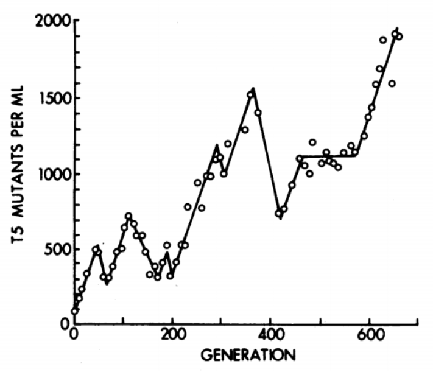
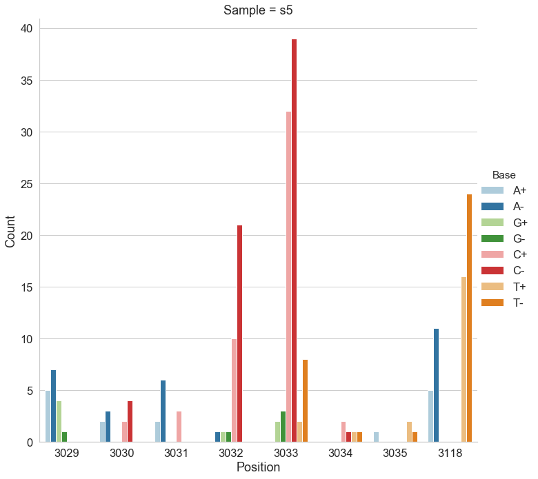

## Learning Objectives

By the end of this lecture, you will be able to:

- Explain why variant calling in haploid systems (bacteria, viruses, haploid eukaryotes) differs fundamentally from diploid variant calling
- Describe microbial populations as mixtures of haploid genomes with continuous allele frequencies
- Identify and explain key biases that affect variant calls: strand bias, cycle bias, placement bias
- Explain the indel left-alignment problem and why unified variant representation matters
- Compare the algorithmic approaches of major variant callers: LoFreq, FreeBayes, Mutect2, Snippy, breseq, iVar, bcftools, Clair3, and DeepVariant
- Interpret benchmarking results and select appropriate tools for bacterial resequencing, viral quasispecies analysis, and experimental evolution studies
- Explain how duplex sequencing provides ground truth for variant caller evaluation

---

## 1. Introduction: Why Haploid Variant Calling Is Different

### The diploid assumption

Most widely used variant callers -- GATK HaplotypeCaller, DeepVariant, and others -- were designed with **diploid organisms** in mind. In a diploid system, genotypes at any locus fall into three discrete categories:

| Genotype | Expected allele frequency |
|----------|--------------------------|
| Homozygous reference (0/0) | 0% alternative allele |
| Heterozygous (0/1) | ~50% alternative allele |
| Homozygous alternative (1/1) | ~100% alternative allele |

The caller's job reduces to distinguishing among these three states. Priors, likelihoods, and filters are all tuned for these discrete frequencies.

### The haploid reality

A bacterial colony, a viral isolate, or a yeast culture is **not a single genome**. It is a **population** of haploid genomes. When you extract DNA and sequence it, you are sampling from this population. The resulting data looks nothing like a diploid sample:

:::{.callout-important}
## Key Insight
Microbial and viral samples are **mixtures of multiple haploid genomes** where the frequencies of individual variants are **continuous** -- they can be 0.1%, 3%, 17%, 50%, or any value. This is fundamentally different from the discrete allele frequencies (0%, 50%, 100%) expected in diploid systems. A caller tuned for diploid genotypes will either miss low-frequency variants entirely or miscall them.
:::

### Where does variation come from?

Even a "clonal" bacterial culture accumulates mutations during growth. The classic chemostat experiments of [Dykhuizen & Hartl (1983)](https://www.ncbi.nlm.nih.gov/pmc/articles/PMC281569/) demonstrated that adaptive mutations arise and compete within bacterial populations on short timescales. In viral populations, mutation rates are even higher ($10^{-5}$ to $10^{-3}$ per base per replication cycle for RNA viruses), producing highly diverse **quasispecies** within a single infected host.

The consequence: **any sequencing experiment on a microbial or viral sample is implicitly a population genomics experiment**.



---

## 2. The Signal-vs-Noise Problem

### Microbial populations as mixtures of haplotypes

Consider a bacterial culture growing in a turbidostat (continuous culture at constant density). At any time point, the population contains:

- A **majority haplotype** (the "wild type" or founding clone)
- Multiple **minority haplotypes** carrying one or more mutations
- Allele frequencies that **change over time** as selection and drift act

When we sequence this population with deep coverage (e.g., 1000x), each position in the genome is represented by ~1000 reads. A variant present in 1% of the population should appear in ~10 reads. The question becomes: **is that signal real, or is it sequencing error?**

### The detection threshold problem

Illumina sequencing has a per-base error rate of approximately $10^{-2}$ to $10^{-3}$ (corresponding to Phred quality scores Q20--Q30). This means:

$$P(\text{error at a single base}) \approx 10^{-Q/10}$$

At Q30, $P(\text{error}) = 0.001$. At 1000x coverage, we expect ~1 erroneous read per position by chance. So a variant at 0.1% frequency (1 supporting read in 1000) is **indistinguishable from noise** without sophisticated statistical modeling.

:::{.callout-note}
## The Central Challenge
Variant calling in haploid systems is fundamentally a **signal-versus-noise** problem: distinguishing true low-frequency variants from sequencing errors. The tools described in this lecture differ primarily in how they model and separate these two sources of non-reference bases.
:::

### Biases that create false calls

Beyond random sequencing errors, several systematic biases generate false variant calls. We must understand and filter these to avoid spurious results.

#### Indel left-alignment and representation

Insertions and deletions (indels) in repetitive regions are **positionally ambiguous**. Consider a reference sequence `GGGCACACACAGGG` and a read with a 2-bp deletion in the CA-repeat region. The same deletion can be aligned in multiple valid ways:

| Alignment | REF allele | ALT allele |
|-----------|-----------|-----------|
| `GGGCAC--ACAGGG` | `CAC` | `C` |
| `GGGCA--CACAGGG` | `ACA` | `A` |
| `GGG--CACACAGGG` | `GCA` | `G` |

All three represent the **same biological event**, but they produce different VCF records. If two callers (or two reads) represent the same indel differently, they will appear as distinct variants, leading to false negatives in comparisons and inflated variant counts.

:::{.callout-important}
## Indel Normalization
[Tan et al. (2015)](https://doi.org/10.1093/bioinformatics/btv112) formalized the concept of **variant normalization**: left-aligning and trimming all indels to produce a unique, canonical representation. Their tool `vt normalize` enforces this consistently. GATK's `leftAlignAndTrimVariants` achieves the same result for ~96.6% of variants but fails on many multi-allelic indels. **Always normalize your VCF files before comparing variant calls across tools or samples.**
:::

#### Strand bias

**Strand bias** occurs when a variant is supported predominantly by reads mapped to one strand (forward or reverse) but not the other. True variants appear on both strands in roughly equal proportions; artifacts tend to be one-sided. We use a **2×2 contingency table** to test this statistically:

|  | Forward | Reverse |
|--|---------|---------|
| **Reference** | $a$ | $b$ |
| **Alternative** | $c$ | $d$ |

[Guo et al. (2012)](https://bmcgenomics.biomedcentral.com/articles/10.1186/1471-2164-13-666) showed that strand bias occurs randomly across genomic positions but is consistent between aligners (BWA and Bowtie produce similar bias patterns), suggesting it originates in the sequencing chemistry rather than the alignment step. For the mathematical formulation—Fisher's exact test and the Strand Odds Ratio—see [Section 8.2](#sec-strand-bias-formulas).

#### Cycle bias and placement bias

Beyond strand bias, two additional biases affect variant quality:

- **Cycle bias**: The variant appears preferentially at certain positions within the sequencing-by-synthesis cycle. Early and late cycles have different error profiles. A real variant should be distributed uniformly across cycles.

- **Placement bias (read position bias)**: The variant appears only near the ends (or only in the middle) of reads. Misalignment artifacts often cluster at read boundaries, especially near indels.

An ideal variant call shows balanced representation across all four dimensions: forward/reverse strand, early/late cycle, beginning/end of read, and reference/alternative allele frequency.

). The green star indicates an ideal case where the variant is evenly represented across read positions (placement bias), sequencing cycles (cycle bias), and both strands (strand bias).](../images/lecture19_sequencing_biases.png)

#### Multi-allelic sites

In a polymorphic microbial population, a single genomic position may have **three or four** different bases represented. Some callers (notably Mutect2) handle multi-allelic sites poorly, reporting only the highest-frequency alternative allele and discarding evidence for others. This is a critical limitation for population-level analyses.

---

## 3. How LoFreq Works

| Property | Detail |
|----------|--------|
| **Reference** | [Wilm et al. (2012)](https://academic.oup.com/nar/article/40/22/11189/1152727) Nucleic Acids Res 40(22):11189-201 |
| **Designed for** | Ultra-sensitive detection of low-frequency variants in mixed populations |
| **Algorithm** | Poisson-binomial model using per-base quality scores |
| **Key strength** | Near-perfect specificity; can detect variants below the average sequencing error rate |
| **GitHub** | [CSB5/lofreq](https://github.com/CSB5/lofreq) |

Each base in a sequencing read carries a quality score—the probability that the base call is wrong. LoFreq exploits this information directly: for every position in the genome, it asks *given all the per-base error probabilities at this position, how likely is it we'd see this many non-reference bases by chance alone?* If that probability is astronomically small, we call a variant.

LoFreq goes beyond simple base quality by merging four independent quality sources into a single per-base error probability: base quality (sequencer confidence), mapping quality (alignment confidence), base-alignment quality (correct column placement), and source quality (systematic error from a control sample). For the formal quality-merging formula and detailed explanations, see [Section 8.3](#sec-quality-merging). For the formal Poisson-binomial model and worked examples, see [Sections 8.3](#sec-quality-merging)–[8.4](#sec-poisson-binomial).

:::{.callout-tip}
## Why LoFreq excels at microbial data
Unlike callers that assume a fixed error rate, LoFreq uses the **actual quality score of every individual base**. This means it can detect a variant even when the variant frequency is *below* the average error rate -- as long as the supporting reads happen to have high quality scores. It also incorporates mapping quality, indel quality, and alignment quality into a merged error probability, making it robust to multiple error sources.
:::

**Worked example:** Suppose we observe 5 non-reference bases out of 100 reads at a position. The 5 supporting reads have Q30 quality (error probability 0.001) while the other 95 have Q20 quality (error probability 0.01). The expected number of errors is 5 × 0.001 + 95 × 0.01 = 0.955. Observing 5 non-reference bases when fewer than 1 is expected by chance is highly significant -- LoFreq would call this as a real variant. A naive caller using an average error rate might reach the same conclusion here, but the per-base model matters most when a few high-quality reads support a variant against a background of lower-quality reads.

LoFreq applies multiple testing correction across all genomic positions tested to control false positive rates (see [Section 8.5](#sec-multiple-testing) for details on Bonferroni, Holm, and FDR methods).

**Basic usage:**

```bash
lofreq call -f reference.fa -o variants.vcf aligned.bam
```

---

## 4. Tool Landscape

### 4.1 Tools designed for haploid/microbial systems

#### breseq

| Property | Detail |
|----------|--------|
| **Reference** | [Deatherage & Barrick (2014)](https://link.springer.com/protocol/10.1007/978-1-4939-0554-6_12) Methods Mol Biol 1151:165-188 |
| **Designed for** | Laboratory evolution experiments with haploid microbes |
| **Algorithm** | Read-evidence-based pipeline with junction detection for structural variants |
| **Key strength** | Detects SNPs, indels, large deletions, and mobile element insertions; HTML output |
| **GitHub** | [barricklab/breseq](https://github.com/barricklab/breseq) (last commit: 2025-11-17) |

**How breseq works:**

breseq is a comprehensive pipeline rather than a single algorithm. It:

1. Maps reads to a reference with Bowtie2
2. Identifies **read-alignment evidence** (RA) for point mutations using a Bayesian model that weighs base qualities against a prior on mutation rates
3. Detects **new junction evidence** (JC) from split reads -- reads that align partially to two different locations, indicating structural rearrangements, IS element insertions, or large deletions
4. Detects **missing coverage evidence** (MC) for deletions
5. Produces annotated HTML reports with mutation tables

breseq has a **polymorphism mode** (`-p`) that reports variants at sub-100% frequency. In this mode, breseq uses a **likelihood ratio test** comparing a single-allele model (all reads come from one base) against a two-allele mixture model (reads come from a mixture at some frequency). The test statistic is evaluated with a chi-squared significance test, providing a rigorous statistical framework for calling sub-clonal variants. For fixed-variant detection in clonal samples, breseq is highly reliable and widely used in experimental evolution studies.

:::{.callout-note}
## When to use breseq
breseq is ideal for the "compare evolved clone to ancestor" workflow common in laboratory evolution. It emphasizes **sensitivity** (detecting every real mutation, including structural variants) over **speed**. It is not designed for population-level frequency estimation or viral quasispecies analysis.
:::

---

#### Snippy

| Property | Detail |
|----------|--------|
| **Reference** | [Seemann T. Snippy: rapid haploid variant calling](https://github.com/tseemann/snippy) |
| **Designed for** | Fast SNP/indel calling in haploid bacterial genomes |
| **Algorithm** | BWA-MEM + FreeBayes (ploidy 1) + snpEff annotation pipeline |
| **Key strength** | Speed, simplicity, core genome SNP alignment for phylogenetics |
| **GitHub** | [tseemann/snippy](https://github.com/tseemann/snippy) (last commit: 2025-12-12) |

**How Snippy works:**

Snippy wraps a standard variant calling pipeline into a single command:

1. Maps reads to a reference with **BWA-MEM**
2. Calls variants with **FreeBayes** using `--ploidy 1`
3. Annotates variants with **snpEff**
4. Produces VCF, tab-delimited tables, and consensus FASTA

For multi-sample analyses, `snippy-core` generates a **core SNP alignment** (positions where all samples have unambiguous calls), suitable for phylogenetic tree construction. This makes Snippy the go-to tool for bacterial outbreak investigations and phylogenomic studies.

---

#### iVar

| Property | Detail |
|----------|--------|
| **Reference** | [Grubaugh et al. (2019)](https://genomebiology.biomedcentral.com/articles/10.1186/s13059-018-1618-7) Genome Biol 20:8 |
| **Designed for** | Viral amplicon-based sequencing (intrahost variant analysis) |
| **Algorithm** | Pileup-based with primer trimming, quality filtering, and frequency thresholds |
| **Key strength** | Handles amplicon artifacts (primer sequences, uneven coverage) |
| **GitHub** | [andersen-lab/ivar](https://github.com/andersen-lab/ivar) (last commit: 2025-08-02) |

**How iVar works:**

iVar was developed specifically for the **PrimalSeq** amplicon sequencing protocol used in Zika, West Nile, and SARS-CoV-2 genomics. It addresses a key problem: amplicon sequencing introduces primer-derived sequences into reads, which can create false variant calls at primer-binding sites.

iVar provides four core functions:

1. **Primer trimming**: Removes primer sequences from aligned reads using a BED file of primer coordinates
2. **Variant calling**: Uses `samtools mpileup` output, applies a minimum frequency threshold (default 3%) and minimum quality filter
3. **Consensus calling**: Generates consensus sequences with ambiguity codes at mixed positions
4. **Primer mismatch detection**: Flags reads with mismatches in primer regions

**Basic usage:**

```bash
# Trim primers from aligned reads
ivar trim -b primers.bed -p trimmed -i aligned.bam

# Call variants (pipe samtools mpileup into ivar)
samtools mpileup -A -d 0 -B -Q 0 aligned.bam | \
  ivar variants -p output -q 20 -t 0.03 -r reference.fa
```

---

### 4.2 General-purpose tools adapted for haploid use

#### FreeBayes

| Property | Detail |
|----------|--------|
| **Reference** | [Garrison & Marth (2012)](https://arxiv.org/abs/1207.3907) arXiv:1207.3907 |
| **Designed for** | Haplotype-based variant detection (any ploidy) |
| **Algorithm** | Bayesian haplotype-based genotyping |
| **Key for haploid use** | `--pooled-continuous` mode for continuous allele frequencies |
| **GitHub** | [freebayes/freebayes](https://github.com/freebayes/freebayes) (last commit: 2026-02-08) |

FreeBayes is a Bayesian variant caller that constructs candidate haplotypes from observed reads and evaluates the posterior probability of each. For haploid/microbial use, two critical flags exist:

- `--ploidy 1`: Tells FreeBayes to expect haploid genotypes (all sites homozygous REF or homozygous ALT)
- `--pooled-continuous`: Treats the sample as a **pool of unknown ploidy** with continuous allele frequencies -- this is the correct model for microbial populations

Additional recommended settings for microbial work:

```bash
freebayes --ploidy 1 \
          --pooled-continuous \
          --min-alternate-fraction 0.001 \
          --min-alternate-count 1 \
          --haplotype-length 0 \
          -f reference.fa aligned.bam
```

Setting `--haplotype-length 0` disables haplotype calling (which assumes linkage between nearby variants -- not appropriate for mixed populations). The `--min-alternate-fraction 0.001` lowers the reporting threshold to 0.1%.

:::{.callout-tip}
## FreeBayes trade-off
FreeBayes in `--pooled-continuous` mode is very **sensitive** (it detects many true variants) but has **poor specificity** (high false positive rate). In benchmarks, it reports correct variants but also many artifacts. Post-filtering is essential.
:::

---

#### GATK Mutect2

| Property | Detail |
|----------|--------|
| **Reference** | [Benjamin et al. (2019)](https://www.biorxiv.org/content/10.1101/861054v1) bioRxiv 861054 |
| **Designed for** | Somatic variant calling in cancer; adapted for non-diploid contexts |
| **Algorithm** | Local assembly + Bayesian somatic genotyping model |
| **Key for haploid use** | `--mitochondria-mode` for non-diploid calling |
| **GitHub** | [broadinstitute/gatk](https://github.com/broadinstitute/gatk) (last commit: 2026-02-04) |

Mutect2 was designed for somatic mutation detection in cancer (tumor vs. normal), where variant frequencies are also non-discrete. Its **mitochondrial mode** (`--mitochondria-mode true`) adjusts parameters for high-depth, non-diploid calling:

- Sets `--initial-tumor-lod` to 0 (more sensitive initial detection)
- Sets `--tumor-lod-to-emit` to 0 (reports all candidate variants)
- Adjusts `--pruning-lod-threshold` to $-4 \ln(10) \approx -9.21$ (retains more haplotypes during assembly)

For microbial data, an important additional parameter is `--f1r2-max-depth`, which controls the maximum depth used for learning the orientation bias model. Setting this to a very high value (e.g., 1000000) prevents downsampling at high-coverage microbial loci.

**Limitation**: Mutect2 struggles with **multi-allelic sites**. It outputs allele counts only for the highest-frequency alternative allele, discarding information about other variants at the same position. This is a significant drawback for polymorphic microbial populations.

---

#### GATK HaplotypeCaller

| Property | Detail |
|----------|--------|
| **Reference** | [Poplin et al. (2018)](https://doi.org/10.1101/201178) bioRxiv 201178 |
| **Designed for** | Germline variant calling (any ploidy) |
| **Algorithm** | Local de novo assembly + pair-HMM likelihood calculation |
| **Key for haploid use** | `-ploidy 1` |
| **GitHub** | [broadinstitute/gatk](https://github.com/broadinstitute/gatk) (last commit: 2026-02-04) |

HaplotypeCaller supports non-diploid calling through its `-ploidy` flag. Setting `-ploidy 1` constrains the genotyper to call only homozygous genotypes (0 or 1 copies of each allele), which is appropriate for calling **fixed variants** in a clonal bacterial sample. However, it **cannot detect low-frequency variants** in a mixed population, because the haploid model has no concept of intermediate allele frequencies.

:::{.callout-note}
## When HaplotypeCaller is appropriate
Use `-ploidy 1` for calling fixed (consensus-level) SNPs and indels in bacterial genomes -- for example, comparing a clinical isolate to a reference. Do **not** use it for detecting within-population variation.
:::

---

#### bcftools (mpileup + call)

| Property | Detail |
|----------|--------|
| **Reference** | [Danecek et al. (2021)](https://doi.org/10.1093/gigascience/giab008) GigaScience 10(2) |
| **Designed for** | General-purpose variant calling |
| **Algorithm** | Genotype likelihood calculation (mpileup) + multiallelic or consensus caller |
| **Key for haploid use** | `--ploidy` option or `--samples-file` with ploidy specification |
| **GitHub** | [samtools/bcftools](https://github.com/samtools/bcftools) (last commit: 2026-03-20) |

The bcftools pipeline is a lightweight, fast alternative:

```bash
bcftools mpileup -Ou -f reference.fa aligned.bam | \
  bcftools call -mv --ploidy 1 -Ob -o calls.bcf
```

The `-m` flag invokes the multiallelic caller (recommended over the legacy consensus caller `-c`). The `--ploidy 1` flag constrains calls to haploid genotypes. Like HaplotypeCaller, this approach detects **fixed variants only** and is not suitable for low-frequency variant detection.

---

### 4.3 Deep learning variant callers for long-read data

#### Clair3 and DeepVariant

| Property | Clair3 | DeepVariant |
|----------|--------|-------------|
| **Reference** | [Zheng et al. (2022)](https://doi.org/10.1038/s43588-022-00387-x) | [Poplin et al. (2018)](https://doi.org/10.1038/nbt.4235) |
| **Platform** | Oxford Nanopore | Illumina, PacBio, ONT |
| **Algorithm** | Pileup + full-alignment neural networks | CNN on pileup images |
| **Bacterial performance** | SNP F1: 99.99%, Indel F1: 99.53% | SNP F1: 99.99%, Indel F1: 99.61% |
| **GitHub** | [HKU-BAL/Clair3](https://github.com/HKU-BAL/Clair3) (last commit: 2026-03-20) | [google/deepvariant](https://github.com/google/deepvariant) (last commit: 2026-03-19) |

A 2024 benchmarking study ([Bogaerts et al. 2024, eLife](https://elifesciences.org/articles/98300)) evaluated deep learning variant callers on 14 bacterial species using ONT data. Key findings:

- Clair3 and DeepVariant **outperformed traditional callers** (Medaka, NanoCaller) on both SNPs and indels
- With super-accuracy (sup) basecalling, these tools achieved **F1 scores exceeding Illumina-based calling**
- As few as **10x ONT coverage** with Clair3 or DeepVariant matched full-depth Illumina accuracy
- These tools call **consensus (fixed) variants** only -- they do not detect low-frequency variants in mixed populations

---

### 4.4 Specialized pipelines

#### V-pipe

| Property | Detail |
|----------|--------|
| **Reference** | [Posada-Céspedes et al. (2021)](https://academic.oup.com/bioinformatics/article/37/12/1673/6104816) Bioinformatics 37(12):1673-1680 |
| **Designed for** | End-to-end viral diversity analysis from raw reads |
| **Components** | QC + alignment (BWA/Bowtie2/ngshmmalign) + variant calling (LoFreq/ShoRAH) + haplotype reconstruction |
| **GitHub** | [cbg-ethz/V-pipe](https://github.com/cbg-ethz/V-pipe) (last commit: 2025-09-25) |

V-pipe is a modular Snakemake pipeline that orchestrates the full workflow from raw FASTQ files to haplotype-resolved viral population descriptions. It incorporates ShoRAH for quasispecies reconstruction and LoFreq for SNV calling.

---

## 5. Tool Comparison Summary

Each of these tools has different statistical models, ploidy assumptions, and sensitivity/specificity trade-offs. The following table summarizes the key differences.

| Tool | Algorithm | Min detectable AF | Best use case | Ploidy model |
|------|-----------|:-----------------:|---------------|:------------:|
| **LoFreq** | Poisson-binomial | < 0.05% | Microbial/viral population diversity | Continuous |
| **breseq** | Bayesian + junction detection | ~5% (polymorphism mode) | Lab evolution (clone vs. ancestor) | Haploid |
| **Snippy** | FreeBayes (ploidy 1) | ~100% (fixed only) | Bacterial phylogenomics, outbreak SNPs | Haploid |
| **iVar** | Pileup + frequency threshold | ~3% (default `-t 0.03`) | Viral amplicon sequencing | Continuous |
| **FreeBayes** | Bayesian haplotype | ~0.1% (pooled-continuous) | Flexible; needs post-filtering | Any |
| **Mutect2** | Bayesian somatic | ~0.5% (mitochondria mode) | Adapted from cancer somatic calling | Somatic/mito |
| **HaplotypeCaller** | Assembly + pair-HMM | ~100% (fixed only) | Fixed variants in clonal isolates | Haploid (ploidy 1) |
| **bcftools** | Genotype likelihood | ~100% (fixed only) | Fast fixed-variant calling | Haploid (ploidy 1) |
| **Clair3/DeepVariant** | Deep learning (CNN) | ~100% (fixed only) | ONT long-read consensus calling | Haploid |

---

## 6. Benchmarking: Which Tools Perform Best?

### 6.1 The duplex sequencing gold standard

The most rigorous benchmark for microbial variant callers uses **duplex sequencing** ([Schmitt et al. 2012](https://doi.org/10.1073/pnas.1208715109)) to establish ground truth. Duplex sequencing tags individual DNA molecules with unique molecular identifiers (UMIs) on both ends, then uses consensus-building across read families to achieve error rates below $10^{-7}$—over **10,000-fold more accurate** than standard Illumina sequencing ([Salk et al. 2018](http://dx.doi.org/10.1038/nrg.2017.117)). For a detailed explanation of the duplex sequencing method, see [Section 8.1](#sec-duplex).

### 6.2 Benchmarking LoFreq, Mutect2, and FreeBayes on duplex sequencing data

[Mei et al. (2019)](https://academic.oup.com/gbe/article/11/10/3022/5572121) used duplex sequencing to study adaptive evolution on plasmid pBR322 in *E. coli* grown in a turbidostat. Using their data, we benchmarked variant callers against duplex consensus sequences as ground truth (course reference material).

**Test system:**

- *E. coli* DH5α transformed with pBR322 plasmid, grown in turbidostat
- Sample **s0** (beginning): nearly clonal, 38 variable sites among 4,361 bp
- Sample **s5** (late): 78 variable sites with frequencies ~1%, 27 shared with s0
- Target detection threshold: ~1% allele frequency



**Configurations tested:**

| Tool | Key parameters | Label |
|------|---------------|-------|
| LoFreq | `--no-default-filter` | nf |
| LoFreq | default settings | def |
| Mutect2 | `--mitochondria-mode true` | m |
| Mutect2 | `--mitochondria-mode true --f1r2-max-depth 1000000` | m\_md\_inf |
| FreeBayes | `--pooled-continuous --ploidy 1 --min-alternate-fraction 0.001 --haplotype-length 0` | hl-0\_maf-001\_pc |
| FreeBayes | `--pooled-continuous --ploidy 1 --min-alternate-fraction 0.001` | maf-001\_pc |

**Results:**


:::{.callout-important}
## Ranking: LoFreq > Mutect2 > FreeBayes

- **LoFreq** (default settings): Best overall performance. Accurately detected variants at known positive selection sites (positions 3,029--3,035 and 3,118 in the plasmid replication control region). The `--no-default-filter` option increased sensitivity slightly but at the cost of some specificity.
- **Mutect2**: Intermediate performance. Struggled with **multi-allelic sites** where multiple alternative bases co-exist; it reports counts for only the highest-frequency variant and discards information about others.
- **FreeBayes**: Poorest performance. High sensitivity but very high false-positive rate (poor positive predictive value). Required aggressive post-filtering to be usable.
:::

### 6.3 Bacterial whole-genome sequencing benchmarks

[Bush et al. (2023)](https://journals.asm.org/doi/10.1128/jcm.01842-22) performed *in silico* evaluation of variant calling methods for bacterial WGS assays, testing multiple combinations of read mappers and variant callers on simulated and real bacterial datasets. Key findings:

- For **fixed variant calling** (consensus-level), Snippy and bcftools `mpileup | call` performed well across diverse bacterial species
- Setting the correct **ploidy** is critical -- using diploid defaults on haploid data leads to systematic errors
- Read quality filtering and adapter removal significantly impact downstream variant calls

### 6.4 Deep learning callers on bacterial ONT data

[Bogaerts et al. (2024)](https://elifesciences.org/articles/98300) benchmarked deep learning callers across 14 bacterial species:

- **Clair3** and **DeepVariant** on sup-basecalled ONT data: median SNP F1 = 99.99%, indel F1 > 99%
- Traditional ONT caller **Medaka**: significantly lower accuracy
- **10x ONT coverage** with Clair3/DeepVariant matched or exceeded full-depth Illumina accuracy
- These results suggest ONT sequencing with deep learning callers is now viable for routine bacterial variant calling

---

## 7. Best Practices by Scenario

### Scenario 1: Bacterial resequencing (fixed variants)

**Goal**: Identify SNPs and indels between a clinical/environmental isolate and a reference genome.

**Recommended pipeline:**

1. Quality control: fastp or Trimmomatic
2. Mapping: BWA-MEM
3. Variant calling: **Snippy** (all-in-one) or **bcftools mpileup + call** with `--ploidy 1`
4. Normalization: `bcftools norm -f reference.fa`
5. Annotation: snpEff or Prokka

For ONT data: **Clair3** or **DeepVariant** with haploid model.

### Scenario 2: Bacterial population diversity / experimental evolution

**Goal**: Detect low-frequency variants (< 5%) in a mixed bacterial population.

**Recommended pipeline:**

1. Quality control: fastp
2. Mapping: BWA-MEM with stringent settings
3. Variant calling: **LoFreq** (primary) or **Mutect2** in mitochondria mode (secondary)
4. Normalization: `vt normalize` or `bcftools norm`
5. Filtering: Strand bias (FS < 60), minimum depth, minimum alternate count

For experimental evolution with clonal samples: **breseq** provides the most complete picture including structural variants.

### Scenario 3: Viral amplicon sequencing (e.g., SARS-CoV-2)

**Goal**: Call intrahost variants from tiled amplicon data.

**Recommended pipeline:**

1. Quality control and primer trimming: **iVar trim**
2. Mapping: BWA-MEM or minimap2
3. Variant calling: **iVar variants** (primary) or **LoFreq** (higher sensitivity)
4. Consensus: **iVar consensus**

### Scenario 4: Viral quasispecies reconstruction

**Goal**: Reconstruct full haplotypes from a mixed viral population.

**Recommended pipeline:**

1. Use **V-pipe** as the orchestrating pipeline
2. Variant calling: **LoFreq** or **ShoRAH**
3. Haplotype reconstruction: **ShoRAH** (reference-based) or **SAVAGE** (de novo)
4. For complex variants: consider dedicated tools as they become available

### Scenario 5: Outbreak investigation / phylogenomics

**Goal**: Build a SNP-based phylogeny from multiple bacterial isolates.

**Recommended pipeline:**

1. Call variants per isolate: **Snippy** against a common reference
2. Generate core SNP alignment: `snippy-core`
3. Build phylogeny: IQ-TREE, RAxML, or FastTree on the core alignment
4. Alternative: FDA's CSP2 pipeline for foodborne pathogens

---

:::{.callout-note}
## Technical Details Appendix
The following sections provide in-depth mathematical and procedural details for concepts introduced above. We separate these from the narrative to keep the main lecture accessible while preserving rigor for interested readers.
:::

## 8. Technical Details

### 8.1 Duplex Sequencing {#sec-duplex}

Duplex sequencing ([Schmitt et al. 2012](https://doi.org/10.1073/pnas.1208715109)) achieves ultra-high accuracy by exploiting the double-stranded nature of DNA. The method works as follows:

1. **UMI tagging**: We ligate adapters containing **unique molecular identifiers (UMIs)**—random oligonucleotide sequences—to both ends of each double-stranded DNA fragment. Each original molecule receives a unique pair of tags (α and β). The two complementary strands of the same molecule share the same UMI pair but in opposite orientation: strand 1 carries α-β, strand 2 carries β-α.

2. **PCR amplification and sequencing**: The tagged library undergoes standard PCR amplification and sequencing. Each original strand generates a family of PCR-descendant reads, all sharing the same UMI tag.

3. **Family grouping by UMI**: After sequencing, we group reads by their UMI tags. All reads descended from the same original single strand form a **read family**.

4. **Single-strand consensus sequences (SSCS)**: Within each read family, we build a consensus sequence by majority vote at each position. Random PCR errors and sequencing errors—which affect only a subset of family members—are eliminated. SSCS error rates reach approximately $10^{-4}$.

5. **Duplex consensus sequences (DCS)**: We identify complementary read families (α-β and β-α from the same original molecule) and combine their SSCS. A base in the DCS is called only if both complementary SSCS agree. Since the two strands are chemically independent, an error would have to occur at the same position on both strands independently—an event with probability on the order of $10^{-4} \times 10^{-4} = 10^{-8}$. In practice, duplex sequencing achieves error rates below $10^{-7}$.

): UMI-tagged double-stranded DNA is amplified, sequenced, grouped by UMI families, collapsed into single-strand consensus sequences (SSCS), and combined into duplex consensus sequences (DCS).](../images/lecture19_duplex_sequencing.jpeg)

**Why duplex sequencing serves as ground truth for variant caller benchmarking.** With error rates 10,000-fold lower than standard Illumina sequencing, duplex consensus sequences can reliably distinguish true biological variants at frequencies as low as 0.1% from sequencing artifacts. When we benchmark a variant caller, we compare its calls against duplex-derived variant lists—any variant consistently present in DCS data is almost certainly real, and any variant absent from DCS data is almost certainly a false positive.

---

### 8.2 Strand Bias Formulas {#sec-strand-bias-formulas}

Given the 2×2 contingency table of strand counts (ref-forward $a$, ref-reverse $b$, alt-forward $c$, alt-reverse $d$):

**Fisher's exact test (FS annotation in GATK):**

The probability of one specific configuration of the 2×2 table (given fixed marginals) is:

$$P_{\text{table}} = \frac{\binom{a+b}{a}\binom{c+d}{c}}{\binom{n}{a+c}}$$

where $n = a + b + c + d$. The test p-value sums this probability over all tables equally or more extreme than the observed one. GATK's FS annotation reports $\text{FS} = -10 \log_{10}(p\text{-value})$, so higher FS values indicate stronger strand bias.

**Strand Odds Ratio (SOR):**

$$\text{SOR} = \ln(R + 1/R) + \ln(\text{refRatio}) - \ln(\text{altRatio})$$

where $R = \frac{(a+1)(d+1)}{(b+1)(c+1)}$, $\text{refRatio} = \frac{\min(a,b)+1}{\max(a,b)+1}$, and $\text{altRatio} = \frac{\min(c,d)+1}{\max(c,d)+1}$ (pseudocounts of 1 are added to avoid division by zero). The $\ln(R + 1/R)$ term is the symmetrized log odds ratio, while the refRatio and altRatio terms penalize imbalanced strand distributions in both reference and alternative alleles.

---

### 8.3 LoFreq Quality Merging {#sec-quality-merging}

Most variant callers use only one quality signal per base: the base call quality (BQ) from the sequencer. LoFreq recognizes that a base can be wrong for multiple independent reasons, and it merges four quality sources into a single per-base error probability.

**The four quality sources:**

| Quality | Symbol | Source | What it captures |
|---------|--------|--------|-----------------|
| Base quality (BQ) | $P_B$ | Sequencer (stored in QUAL string) | Probability the base call itself is wrong |
| Mapping quality (MQ) | $P_M$ | Aligner (stored in MAPQ field) | Probability the read is mapped to the wrong location |
| Base-alignment quality (BAQ) | $P_A$ | Computed by LoFreq (Li 2011 HMM) | Probability the base is aligned to the wrong reference column |
| Source quality (SQ) | $P_S$ | Optional, computed by LoFreq | Probability of a systematic error at this position (based on a control/normal sample) |

**The joint error probability formula.** LoFreq treats these as independent error sources and combines them using a sequential "any of these could cause a wrong base" model. From the source code (`snpcaller.c`), the merged probability is:

$$P_J = P_M + (1 - P_M) \cdot P_S + (1 - P_M)(1 - P_S) \cdot P_A + (1 - P_M)(1 - P_S)(1 - P_A) \cdot P_B$$

where each $P_X = 10^{-Q_X/10}$ is the error probability derived from the corresponding Phred-scaled quality score $Q_X$.

:::{.callout-note}
## Interpreting the joint error formula
Read this formula left to right as a cascade of failure modes. First the read might be mismapped ($P_M$). If not (probability $1 - P_M$), there might be a systematic source error ($P_S$). If not, the base might be misaligned within the read ($P_A$). If none of those, the base call itself might be wrong ($P_B$). The joint probability is the probability that *at least one* of these errors occurs. When source quality is not used, $P_S = 0$ and the formula simplifies to three terms.
:::

**Base-alignment quality (BAQ).** BAQ addresses a subtle but critical problem: near indels, bases can be *correctly called* by the sequencer and the read *correctly mapped* to the right region, yet aligned to the wrong column of the reference. BAQ is computed using a profile Hidden Markov Model (HMM) with match, insertion, and deletion states ([Li, 2011](https://pubmed.ncbi.nlm.nih.gov/21320865/)). The HMM computes the posterior probability that each base in the read is aligned to the correct reference position. LoFreq uses a modified version of samtools' `kprobaln` code with parameters tuned for Illumina data (gap open probability $= 10^{-5}$, gap extension probability $= 0.4$). BAQ is enabled by default and can be disabled with `--no-baq`.

**Source quality (SQ).** An optional quality layer that captures position-specific systematic errors. When a matched normal or control BAM is available, LoFreq can learn which positions have recurrent non-reference bases even in the control, and penalize those positions accordingly. This is primarily used in `lofreq somatic`.

---

### 8.4 Poisson-Binomial Test {#sec-poisson-binomial}

LoFreq models the count of non-reference bases at a position as a **Poisson-binomial** random variable. For read $i$ at a given position, the probability of observing a non-reference base due to error is:

$$p_i = P_{J,i}$$

where $P_{J,i}$ is the merged error probability from [Section 8.3](#sec-quality-merging). The total number of error-induced non-reference bases across $d$ reads follows a Poisson-binomial distribution—the sum of $d$ independent but *non-identically distributed* Bernoulli trials:

$$X = \sum_{i=1}^{d} X_i, \quad X_i \sim \text{Bernoulli}(p_i)$$

The test is **one-sided** (right-tail): $H_0$ says all non-reference bases are errors; $H_1$ says there is a true variant. The probability of observing $k$ or more non-reference bases by chance alone is:

$$P(X \geq k) = 1 - \sum_{j=0}^{k-1} P(X = j)$$

If this p-value falls below a significance threshold (after multiple testing correction), the position is called as a variant.

**Computation: recursive convolution.** The exact Poisson-binomial PMF is computed via dynamic programming (recursive convolution) in log-space. Let $\mathbf{v}^{(n)}$ be the probability vector after incorporating $n$ reads. The recurrence is:

$$\log P^{(n)}(X = j) = \text{logsum}\!\Big(\log P^{(n-1)}(X = j) + \log(1 - p_n),\;\; \log P^{(n-1)}(X = j-1) + \log(p_n)\Big)$$

where $\text{logsum}(a, b) = \max(a,b) + \log(1 + e^{-|a-b|})$ is the numerically stable log-space addition. This runs in $O(d \cdot k)$ time rather than the full $O(d^2)$ since LoFreq only needs probabilities up to $k$ (the observed count, where $k \ll d$ in practice).

**Worked example.** Suppose $d = 4$ reads at a position with merged error probabilities $p_1 = 0.01$, $p_2 = 0.02$, $p_3 = 0.01$, $p_4 = 0.05$, and we observe $k = 2$ non-reference bases. We build the probability table row by row (shown in normal probability space for clarity; LoFreq does this in log-space):

*Initialization* ($n = 0$): $P^{(0)}(X=0) = 1$

*After read 1* ($p_1 = 0.01$):

| $j$ | $P^{(1)}(X=j)$ | Calculation |
|-----|----------------|-------------|
| 0 | 0.99 | $1 \times (1 - 0.01)$ |
| 1 | 0.01 | $1 \times 0.01$ |

*After read 2* ($p_2 = 0.02$):

| $j$ | $P^{(2)}(X=j)$ | Calculation |
|-----|----------------|-------------|
| 0 | 0.9702 | $0.99 \times 0.98$ |
| 1 | 0.0296 | $0.01 \times 0.98 + 0.99 \times 0.02$ |
| 2 | 0.0002 | $0.01 \times 0.02$ |

*After read 3* ($p_3 = 0.01$):

| $j$ | $P^{(3)}(X=j)$ | Calculation |
|-----|----------------|-------------|
| 0 | 0.960498 | $0.9702 \times 0.99$ |
| 1 | 0.039006 | $0.0296 \times 0.99 + 0.9702 \times 0.01$ |
| 2 | 0.000494 | $0.0002 \times 0.99 + 0.0296 \times 0.01$ |

*After read 4* ($p_4 = 0.05$):

| $j$ | $P^{(4)}(X=j)$ | Calculation |
|-----|----------------|-------------|
| 0 | 0.912473 | $0.960498 \times 0.95$ |
| 1 | 0.085081 | $0.039006 \times 0.95 + 0.960498 \times 0.05$ |
| 2 | 0.002420 | $0.000494 \times 0.95 + 0.039006 \times 0.05$ |

The p-value is $P(X \geq 2) = 1 - P(X=0) - P(X=1) = 1 - 0.912473 - 0.085081 = 0.002446$. Converted to Phred: $\text{QUAL} = -10 \log_{10}(0.002446) \approx 26$. With default significance $\alpha = 0.01$, this would be called as a variant (p-value $< \alpha$), though a marginal one.

Note how each row only depends on the previous row—this is the DP. Also note we only compute columns $j = 0 \ldots k$, not all the way to $j = d$.

:::{.callout-tip}
## Pruning optimization
LoFreq prunes computation early: if at any point the partial tail probability already exceeds $\alpha / B$ (where $\alpha$ is the significance level and $B$ is the Bonferroni factor), the position cannot be significant and computation stops. This makes LoFreq fast in practice -- most positions in a genome are *not* variants and are rejected quickly.
:::

**Poisson approximation for very deep coverage.** When coverage exceeds a configurable threshold (the `--approx-threshold` parameter, disabled by default), LoFreq falls back to a Poisson approximation:

$$P(X \geq k) \approx 1 - F_{\text{Poisson}}(k-1;\; \mu), \quad \mu = \sum_{i=1}^{d} p_i$$

This uses the fact that the Poisson-binomial converges to a Poisson distribution when each $p_i$ is small and $d$ is large. The approximation is computed via the GSL library's Poisson CDF function.

---

### 8.5 Multiple Testing Correction {#sec-multiple-testing}

When testing millions of genomic positions, we must correct for the fact that some will appear significant by chance. LoFreq supports three correction methods via `--bonf`:

**[Bonferroni correction](https://en.wikipedia.org/wiki/Bonferroni_correction)** (default). The simplest approach: multiply each p-value by $B$ (the number of tests) and reject if still below $\alpha$. Equivalently, a variant is called if:

$$\text{p-value} \times B < \alpha$$

By default, LoFreq uses **dynamic Bonferroni** -- $B$ equals the number of tests actually performed (positions $\times$ non-reference bases observed), not the full genome size. This is already more powerful than a fixed factor.

*Advantage:* Controls the **family-wise error rate (FWER)** -- the probability of *any* false positive across all tests. Strong guarantee.
*Disadvantage:* Very conservative. If you test 10 million positions, even moderately significant variants are rejected. Power decreases linearly with the number of tests. In practice, real low-frequency variants near the noise floor can be missed.

**[Holm-Bonferroni method](https://en.wikipedia.org/wiki/Holm%E2%80%93Bonferroni_method)** (`--bonf holm`). A step-down procedure: sort all p-values smallest to largest, then compare the $i$-th smallest p-value against $\alpha / (B - i + 1)$ instead of $\alpha / B$. Reject all tests up to the first non-rejection.

*Advantage:* Also controls FWER, but is **uniformly more powerful** than Bonferroni -- it can never reject fewer variants. The improvement is modest when most tests are non-significant (as in variant calling), but it's free: same guarantee, strictly more power.
*Disadvantage:* Still conservative for very large test counts. The gain over Bonferroni is most noticeable when many true variants cluster near the threshold.

**[Benjamini-Hochberg FDR](https://en.wikipedia.org/wiki/False_discovery_rate#Benjamini%E2%80%93Hochberg_procedure)** (`--bonf fdr`). Controls the **false discovery rate** -- the expected *proportion* of false positives among called variants, rather than the probability of any false positive at all. Sort p-values and compare the $i$-th smallest against $i \cdot \alpha / B$.

*Advantage:* **Much more powerful** than Bonferroni/Holm. If 1% of positions are true variants, FDR can detect far more of them because it tolerates a controlled fraction of false calls rather than demanding zero. This matters most when calling low-frequency variants in diverse populations.
*Disadvantage:* Weaker guarantee -- it controls the *rate* of false discoveries, not the probability of *any* false discovery. With FDR at $\alpha = 0.01$, you expect ~1% of your called variants to be false. For applications where even a single false positive is costly (e.g., clinical diagnostics), Bonferroni/Holm is safer.

:::{.callout-tip}
## Which correction to use?
For most microbial resequencing, **dynamic Bonferroni** (the default) is a good balance -- it's conservative but LoFreq's Poisson-binomial test is powerful enough that true variants typically have extremely small p-values. Switch to **FDR** when hunting for very low-frequency variants ($< 1\%$) in deep sequencing data where you expect many true positives and can tolerate a small false discovery rate. **Holm** is a safe middle ground -- strictly better than Bonferroni with no downside.
:::

---

### 8.6 The `lofreq call` Pipeline {#sec-lofreq-pipeline}

When you run `lofreq call -f ref.fa -o out.vcf aln.bam`, the following steps execute:

```text
                  ┌─────────────────┐
                  │  Input BAM      │
                  └────────┬────────┘
                           │
                  ┌────────▼────────┐
              1.  │  BAQ computation │  (profile HMM, on-the-fly)
                  └────────┬────────┘
                           │
                  ┌────────▼────────┐
              2.  │  Pileup generation│  (samtools mpileup internally)
                  │  + quality merge  │  (BQ + MQ + BAQ + SQ → P_J)
                  └────────┬────────┘
                           │
                  ┌────────▼────────┐
              3.  │  Per-position     │  (Poisson-binomial test for
                  │  statistical test │   each of 3 alt bases)
                  └────────┬────────┘
                           │
                  ┌────────▼────────┐
              4.  │  Bonferroni       │  (dynamic: correction factor =
                  │  correction       │   number of tests performed)
                  └────────┬────────┘
                           │
                  ┌────────▼────────┐
              5.  │  Default filters  │  (lofreq filter internally)
                  └────────┬────────┘
                           │
                  ┌────────▼────────┐
                  │  Output VCF      │
                  └─────────────────┘
```

**Step 1: BAQ computation.** LoFreq runs the profile HMM on each read to compute base-alignment qualities. This is done on-the-fly during pileup traversal. BAQ values are computed on-the-fly and used in memory without modifying the input BAM. However, `lofreq alnqual` can pre-compute and store BAQ as the `lb` tag in the BAM.

**Step 2: Pileup + quality merging.** For each genomic position, LoFreq generates a pileup of all covering reads and merges BQ, MQ, BAQ, and (optionally) SQ into a per-base error probability $P_J$ using the formula from [Section 8.3](#sec-quality-merging). Bases below minimum quality thresholds are excluded (defaults: $\text{min\_bq} = 6$, $\text{min\_mq} = 0$).

**Step 3: Statistical testing.** For each position with at least `--min-cov` reads (default: 1), LoFreq runs the Poisson-binomial test separately for each of the three possible non-reference bases. This produces up to three p-values per position.

**Step 4: Multiple testing correction.** LoFreq applies the selected correction method (see [Section 8.5](#sec-multiple-testing)).

**Step 5: Default filters.** After calling, LoFreq internally runs `lofreq filter` with these defaults:

| Filter | Default | FILTER tag in VCF |
|--------|---------|-------------------|
| Minimum coverage | 10 | `min_dp_10` |
| Strand bias (FDR) | $\alpha = 0.001$ | `sb_fdr` |
| Strand bias compound | $\geq 85\%$ of alt bases on one strand | (applied jointly with `sb_fdr`) |

The strand bias test uses Fisher's exact test on the 2×2 table of (ref-forward, ref-reverse, alt-forward, alt-reverse) counts. P-values are corrected across all called variants using FDR (Benjamini-Hochberg). The compound filter requires *both* a significant FDR-corrected strand bias p-value *and* that at least 85% of alternative bases fall on a single strand -- this prevents filtering variants with statistically significant but biologically negligible strand imbalance.

**What `--no-default-filter` disables.** This flag skips step 5 entirely. All variants passing the significance threshold after Bonferroni correction are reported, regardless of coverage or strand bias. Use this when you want to apply your own filtering downstream:

```bash
lofreq call --no-default-filter -f ref.fa -o raw.vcf aln.bam
lofreq filter -i raw.vcf -o filtered.vcf --cov-min 20 --sb-thresh 60
```

**Indel calling pipeline.** Indel calling requires indel qualities in the BAM file. The recommended preprocessing is:

```bash
# Step 1: Add indel qualities (Dindel method)
lofreq indelqual --dindel -f ref.fa -o with_iq.bam input.bam

# Step 2: Call indels alongside SNVs
lofreq call --call-indels -f ref.fa -o variants.vcf with_iq.bam
```

The `lofreq indelqual --dindel` command inserts indel quality tags (`BI` for insertion quality, `BD` for deletion quality) into the BAM, using a lookup table indexed by homopolymer run length at each position ([Albers et al., 2011, PMID 20980555](https://pubmed.ncbi.nlm.nih.gov/20980555/)). Longer homopolymers receive lower indel quality (higher error probability) because Illumina's sequencing-by-synthesis chemistry is prone to miscounting bases in homopolymer runs.

---

### 8.7 LoFreq VCF Output Reference {#sec-lofreq-vcf}

LoFreq produces VCF 4.0 output with no FORMAT or sample columns -- it reports population-level variant calls, not genotypes. Here is the complete field reference:

**QUAL field:**
$$\text{QUAL} = -10 \cdot \log_{10}(\text{p-value})$$
where the p-value is from the Poisson-binomial test. QUAL=1500 means $\text{p-value} = 10^{-150}$. This is *not* a genotype quality -- it measures the statistical evidence that the observed non-reference count exceeds what sequencing errors alone could produce.

**INFO fields:**

| Field | Type | Description |
|-------|------|-------------|
| `DP` | Integer | Raw read depth at the position (total pileup coverage) |
| `AF` | Float | Allele frequency of the alternative allele ($= \text{alt count} / \text{total depth}$) |
| `SB` | Integer | Phred-scaled strand bias p-value from Fisher's exact test: $\text{SB} = -10 \cdot \log_{10}(p_{\text{Fisher}})$. Higher = more strand bias. |
| `DP4` | 4 integers | Comma-separated counts: ref-forward, ref-reverse, alt-forward, alt-reverse |
| `HQA` | Integer | Count of high-quality alternative bases supporting the SNV call (SNVs only) |
| `HRUN` | Integer | Length of homopolymer run to the right of the indel position (indels only) |
| `INDEL` | Flag | Present if the variant is an insertion or deletion |
| `CONSVAR` | Flag | Defined in VCF header for consensus variants, but effectively unused in current LoFreq builds |

**FILTER field values:**

| FILTER | Meaning |
|--------|---------|
| `PASS` | Variant passed all default filters |
| `min_dp_10` | Failed minimum depth filter (DP < 10) |
| `sb_fdr` | Failed strand bias filter (FDR-corrected Fisher's exact test) |
| `min_snvqual_<N>` | Failed minimum SNV quality filter (if user-specified) |
| `min_indelqual_<N>` | Failed minimum indel quality filter (if user-specified) |
| `min_af_<X>` | Failed minimum allele frequency filter (if user-specified) |
| `max_af_<X>` | Failed maximum allele frequency filter (if user-specified) |
| `max_dp_<N>` | Failed maximum depth filter (if user-specified) |

**Worked example: reading a LoFreq VCF record**

Consider this realistic VCF line from a bacterial resequencing experiment at ~500x coverage:

```text
##fileformat=VCFv4.0
##source=lofreq call -f ref.fa -o vars.vcf aln.bam
##INFO=<ID=DP,Number=1,Type=Integer,Description="Raw Depth">
##INFO=<ID=AF,Number=1,Type=Float,Description="Allele Frequency">
##INFO=<ID=SB,Number=1,Type=Integer,Description="Phred-scaled strand bias at this position">
##INFO=<ID=DP4,Number=4,Type=Integer,Description="Counts for ref-forward bases, ref-reverse, alt-forward and alt-reverse bases">
##INFO=<ID=HQA,Number=1,Type=Integer,Description="Count of high quality alt bases supporting SNP call">
##INFO=<ID=CONSVAR,Number=0,Type=Flag,Description="Indicates that the variant is a consensus variant">
##FILTER=<ID=min_dp_10,Description="Minimum coverage 10">
##FILTER=<ID=sb_fdr,Description="Strand-bias filter (FDR corrected)">
#CHROM	POS	ID	REF	ALT	QUAL	FILTER	INFO
pBR322	3029	.	T	C	1847	PASS	DP=487;AF=0.049281;SB=1;DP4=230,233,12,12;HQA=24
```

**Field-by-field walkthrough:**

| Field | Value | Interpretation |
|-------|-------|----------------|
| CHROM | `pBR322` | Plasmid pBR322 reference sequence |
| POS | `3029` | Position 3029 -- within the RNAI/RNAII replication control region, a known hotspot for adaptive mutations in pBR322 |
| REF/ALT | `T` / `C` | T-to-C substitution |
| QUAL | `1847` | $\text{p-value} = 10^{-184.7} \approx 2 \times 10^{-185}$. Overwhelmingly significant -- not explainable by sequencing error. |
| FILTER | `PASS` | Passed all default filters (coverage $\geq 10$, no significant strand bias) |
| DP | `487` | 487 reads cover this position |
| AF | `0.049281` | ~4.9% of reads carry the C allele. This is a low-frequency variant in the population. |
| SB | `1` | Strand bias Phred score = 1 $\Rightarrow$ $p_{\text{Fisher}} = 10^{-0.1} \approx 0.79$. No strand bias (p-value near 1 means the 2x2 table is well-balanced). |
| DP4 | `230,233,12,12` | 230 ref-forward + 233 ref-reverse = 463 reference reads; 12 alt-forward + 12 alt-reverse = 24 variant reads. Near-perfect strand balance for both ref and alt. |
| HQA | `24` | All 24 alternative bases were high quality. |

:::{.callout-tip}
## Sanity checks on LoFreq VCF output
Always verify internal consistency: `AF` $\approx$ (DP4[2] + DP4[3]) / DP. Here: $(12 + 12)/487 = 0.04928$, matching `AF=0.049281`. Also check that `DP` $\approx$ sum of DP4: $230 + 233 + 12 + 12 = 487$. Discrepancies can indicate that some reads were filtered during pileup (e.g., below min_bq).
:::

**How QUAL=1847 was computed.** At 487x coverage with 24 variant-supporting reads, LoFreq used the per-base merged error probabilities of all 487 reads. If the variant-supporting reads had Q30 base quality, Q60 mapping quality, and high BAQ, their merged error probabilities might be around $p_i \approx 0.001$. The expected error count under $H_0$ is approximately $\sum p_i \approx 1$--$2$ errors across all reads. Observing 24 non-reference bases when $\sim 1$--$2$ are expected yields an astronomically small p-value, converted to QUAL $= -10 \log_{10}(p) = 1847$.

---

### 8.8 LoFreq Command-Line Reference {#sec-lofreq-cli}

| Option | Default | Description |
|--------|---------|-------------|
| `--call-indels` | off | Enable indel calling (requires indel qualities in BAM) |
| `--min-cov` | 1 | Minimum read depth to test a position |
| `--min-bq` | 6 | Minimum base quality; bases below this are ignored |
| `--min-alt-bq` | 6 | Minimum base quality for alternative (non-reference) bases |
| `--min-mq` | 0 | Minimum mapping quality; reads below this are ignored |
| `--max-mq` | 255 | Cap mapping quality at this value |
| `--sig` | 0.01 | Significance level ($\alpha$) for the Poisson-binomial test |
| `--bonf` | dynamic | Bonferroni factor. `dynamic` = number of tests performed; or specify an integer, or `holm`/`fdr` |
| `--no-default-filter` | off | Skip all post-call filtering (min_dp, strand bias) |
| `--no-baq` | off | Disable BAQ computation (faster but less accurate near indels) |

**`lofreq indelqual --dindel`** must be run before `--call-indels`:

```bash
lofreq indelqual --dindel -f ref.fa -o prepared.bam input.bam
lofreq call --call-indels -f ref.fa -o variants.vcf prepared.bam
```

The `--dindel` option assigns indel error probabilities based on local sequence context (homopolymer length), using a lookup table from the Dindel method ([Albers et al., 2011](https://pubmed.ncbi.nlm.nih.gov/20980555/)). Positions within long homopolymers get higher indel error probabilities (lower quality), reflecting the known tendency of Illumina chemistry to slip in such regions. The alternative `--uniform <INT>` assigns a constant indel quality everywhere -- use this for non-Illumina platforms.

:::{.callout-important}
## The full LoFreq pipeline for SNVs + indels
The complete recommended pipeline chains three preprocessing steps with variant calling:

```bash
# 1. Probabilistic realignment (Viterbi)
lofreq viterbi -f ref.fa -o realigned.bam input.bam

# 2. Add indel qualities
lofreq indelqual --dindel -f ref.fa -o iq.bam realigned.bam

# 3. Sort and index
samtools sort iq.bam -o sorted.bam && samtools index sorted.bam

# 4. Call variants (SNVs + indels)
lofreq call --call-indels -f ref.fa -o variants.vcf sorted.bam
```

`lofreq viterbi` performs probabilistic realignment using a Viterbi algorithm, correcting suboptimal alignments (especially around indels) by re-evaluating alignment paths using base qualities. This is analogous to GATK's local realignment but operates per-read rather than in a region-based assembly.

For whole genomes, use `lofreq call-parallel --pp-threads <N>` instead of `lofreq call` to distribute calling across multiple threads -- the interface is identical but processing is parallelized by genomic region.
:::

---

## 9. Summary

:::{.callout-important}
## Take-home messages

1. **Microbial/viral samples are populations**, not individuals. Variant frequencies are continuous, not discrete.
2. **LoFreq** is the best-performing tool for detecting low-frequency variants in microbial data, thanks to its Poisson-binomial error model that uses per-base quality scores.
3. For **fixed variant calling** in bacterial genomes, Snippy, bcftools, and GATK HaplotypeCaller (ploidy 1) all work well. For ONT data, Clair3 and DeepVariant are superior.
4. **Always normalize** your VCF files (left-align and trim indels) before comparing results across tools or samples.
5. **Strand bias**, cycle bias, and placement bias are the main sources of false positive variant calls. Use Fisher's exact test or the strand odds ratio to filter them.
6. **Duplex sequencing** provides ground-truth variant calls for benchmarking, with error rates < $10^{-7}$.
7. **No single tool is best for all scenarios** -- match the tool to your biological question and data type.
:::

---

## References

1. Bogaerts B et al. (2024) Benchmarking reveals superiority of deep learning variant callers on bacterial nanopore sequence data. *eLife* 13:e98300. [Link](https://elifesciences.org/articles/98300)
2. Bush SJ et al. (2023) In silico evaluation of variant calling methods for bacterial whole-genome sequencing assays. *J Clin Microbiol* 61(8):e01842-22. [Link](https://journals.asm.org/doi/10.1128/jcm.01842-22)
3. Danecek P et al. (2021) Twelve years of SAMtools and BCFtools. *GigaScience* 10(2):giab008. [Link](https://doi.org/10.1093/gigascience/giab008)
4. Deatherage DE & Barrick JE (2014) Identification of mutations in laboratory-evolved microbes from next-generation sequencing data using breseq. *Methods Mol Biol* 1151:165-188. [Link](https://link.springer.com/protocol/10.1007/978-1-4939-0554-6_12)
5. Dykhuizen DE & Hartl DL (1983) Selection in chemostats. *Microbiol Rev* 47(2):150-168. [Link](https://www.ncbi.nlm.nih.gov/pmc/articles/PMC281569/)
6. Garrison E & Marth G (2012) Haplotype-based variant detection from short-read sequencing. *arXiv* 1207.3907. [Link](https://arxiv.org/abs/1207.3907)
7. Grubaugh ND et al. (2019) An amplicon-based sequencing framework for accurately measuring intrahost virus diversity using PrimalSeq and iVar. *Genome Biol* 20:8. [Link](https://genomebiology.biomedcentral.com/articles/10.1186/s13059-018-1618-7)
8. Guo Y et al. (2012) The effect of strand bias in Illumina short-read sequencing data. *BMC Genomics* 13:666. [Link](https://bmcgenomics.biomedcentral.com/articles/10.1186/1471-2164-13-666)
9. Mei H et al. (2019) A high-resolution view of adaptive event dynamics in a plasmid. *Genome Biol Evol* 11(10):3022-3034. [Link](https://academic.oup.com/gbe/article/11/10/3022/5572121)
10. Posada-Céspedes S et al. (2021) V-pipe: a computational pipeline for assessing viral genetic diversity from high-throughput data. *Bioinformatics* 37(12):1673-1680. [Link](https://academic.oup.com/bioinformatics/article/37/12/1673/6104816)
11. Salk JJ et al. (2018) Enhancing the accuracy of next-generation sequencing for detecting rare and subclonal mutations. *Nat Rev Genet* 19:269-285. [Link](http://dx.doi.org/10.1038/nrg.2017.117)
12. Schmitt MW et al. (2012) Detection of ultra-rare mutations by next-generation sequencing. *Proc Natl Acad Sci USA* 109(36):14508-14513. [Link](https://doi.org/10.1073/pnas.1208715109)
13. Tan A et al. (2015) Unified representation of genetic variants. *Bioinformatics* 31(13):2202-2204. [Link](https://doi.org/10.1093/bioinformatics/btv112)
14. Wilm A et al. (2012) LoFreq: a sequence-quality aware, ultra-sensitive variant caller for uncovering cell-population heterogeneity from high-throughput sequencing datasets. *Nucleic Acids Res* 40(22):11189-11201. [Link](https://academic.oup.com/nar/article/40/22/11189/1152727)
