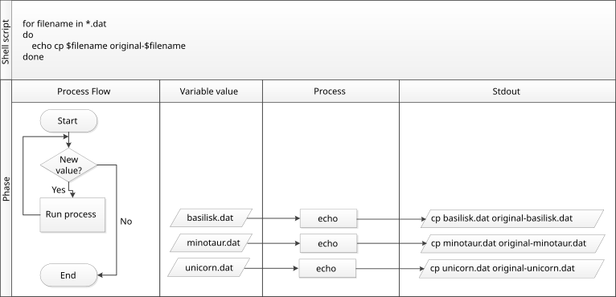
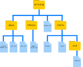

This lecture introduces you to the Unix command line (bash shell). You'll learn how to navigate files and directories, manipulate files, and use powerful tools like pipes, loops, and pattern matching.

::: {.callout-note}
This tutorial is based on [The Carpentries](https://carpentries.org) ["The Unix Shell"](https://swcarpentry.github.io/shell-novice/) lesson, licensed CC-BY 4.0.
:::

# Section 1: Setup

Before we dive into bash commands, we need to set up our working environment using GitHub Codespaces.

## Step 1: Create a GitHub Account

::: {.callout-note}
Use your PSU email because GitHub provides a lot of functionality for free to educational users.
:::

If you don't already have one, go to [github.com](https://github.com) and create a free account.

## Step 2: Create a New Repository

1. Click the **+** icon in the top right corner and select **New repository**
2. Name your repository `bashing` (or any other meaningful name you prefer)
3. Select **Public** or **Private** based on your preference
4. Check **Add a README file**
5. Click **Create repository**

## Step 3: Open a Codespace

GitHub Codespaces provides a complete VS Code environment in your browser:

1. Go to your newly created repository
2. Click the green **Code** button
3. Select the **Codespaces** tab
4. Click **Create codespace on main**

After a moment, you'll have a full VS Code environment running in your browser!

## Step 4: Open the Terminal

In VS Code (within Codespaces):

1. Use the menu: **Terminal** → **New Terminal**
2. Or use the keyboard shortcut: `` Ctrl+` `` (backtick)

A terminal panel will open at the bottom of the screen. This is where you'll type bash commands.

## Step 5: Verify Everything Works

Let's test that everything is working. Type the following command and press Enter:

```bash
ls
```

You should see a list of files in your current directory (at minimum, a `README.md` file). If you see this output, you're ready to go!

Try one more command:

```bash
pwd
```

This shows your current directory (pwd = "print working directory"). You should see something like `/workspaces/bashing`.

---

# Section 2: Bash Basics

## Background

Humans and computers commonly interact through a **graphical user interface** (GUI) - clicking icons and using menus. While intuitive, GUIs don't scale well for repetitive tasks.

Imagine copying the third line from 1000 text files in 1000 directories into a single file. With a GUI, this would take hours of clicking. With the Unix shell, it takes seconds.

The Unix shell is both a **command-line interface** (CLI) and a scripting language. It allows you to automate repetitive tasks quickly and efficiently.

## The Shell

The shell is a program where users type commands. The most popular Unix shell is **Bash** (Bourne Again SHell).

When you open a terminal, you see a **prompt** (usually ending in `$` or `>`), indicating the shell is waiting for input:

```
$
```

::: {.callout-important}
When typing commands from examples, **do not type the `$`** - only type the commands that follow it.
:::

## Setup Test Data

Let's download some test data to practice with:

```bash
cd ~
mkdir -p Desktop
cd Desktop
wget -c https://github.com/swcarpentry/shell-novice/raw/2929ba2cbb1bcb5ff0d1b4100c6e58b96e155fd1/data/shell-lesson-data.zip
unzip -u shell-lesson-data.zip
```

Now let's explore this data.

## Navigating Files and Directories

The **file system** organizes data into files and directories (folders). Several commands help us navigate.

At the top is the **root directory** (`/`) that holds everything else:


### `pwd` - Print Working Directory

Shows where you are:

```bash
pwd
```

### `ls` - List Contents

Shows what's in the current directory:

```bash
ls
```

Add the `-F` option to classify items (directories get `/`, executables get `*`):

```bash
ls -F
```

### Getting Help

Most commands support `--help`:

```bash
ls --help
```

Or use the manual pages:

```bash
man ls
```

(Press `q` to quit the manual)

### Useful `ls` Options

| Option | Description |
|--------|-------------|
| `-l` | Long format (shows permissions, size, date) |
| `-h` | Human-readable sizes (with `-l`) |
| `-a` | Show hidden files (starting with `.`) |
| `-t` | Sort by modification time |
| `-r` | Reverse order |

Try combining options:

```bash
ls -lh
```

### `cd` - Change Directory

Move into a directory:

```bash
cd shell-lesson-data
ls -F
```

Move up one level with `..`:

```bash
cd ..
pwd
```

Move to your home directory:

```bash
cd
pwd
```

Or use `~` as shorthand for home:

```bash
cd ~/Desktop/shell-lesson-data
```

The home directory is where user files are stored:


::: {.callout-tip}
## Shortcuts

- `~` = home directory
- `.` = current directory
- `..` = parent directory
- `-` = previous directory (try `cd -`)
:::

### Tab Completion

Start typing a path and press **Tab** to auto-complete:

```bash
cd ~/Desktop/shell-l    # Press Tab here!
```

## Working with Files and Directories

### `mkdir` - Make Directory

Create a new directory:

```bash
cd ~/Desktop/shell-lesson-data
mkdir thesis
ls -F
```

Create nested directories with `-p`:

```bash
mkdir -p project/data project/results
ls -FR project
```

### Creating Files

Create an empty file with `touch`:

```bash
cd thesis
touch draft.txt
ls
```

Or use a text editor. In VS Code, you can:
- Click **File** → **New File**
- Or run `code draft.txt` to open in the editor

### `cp` - Copy

Copy a file:

```bash
cd ~/Desktop/shell-lesson-data
cp notes.txt thesis/notes-backup.txt
ls thesis
```

Copy a directory (requires `-r` for recursive):

```bash
cp -r thesis thesis_backup
ls
```

### `mv` - Move (or Rename)

Rename a file:

```bash
mv thesis/draft.txt thesis/quotes.txt
ls thesis
```

Move a file to a different directory:

```bash
mv thesis/quotes.txt .
ls
```

### `rm` - Remove

::: {.callout-warning}
## Deleting is Forever!
The shell doesn't have a trash bin. Once deleted, files are gone permanently.
:::

Remove a file:

```bash
rm quotes.txt
ls quotes.txt
```

Remove a directory (requires `-r`):

```bash
rm -r thesis_backup
```

Use `-i` for interactive confirmation:

```bash
rm -i notes.txt
```

## Wildcards

Wildcards let you match multiple files:

| Wildcard | Matches |
|----------|---------|
| `*` | Zero or more characters |
| `?` | Exactly one character |

Examples in `molecules/` directory:

```bash
cd ~/Desktop/shell-lesson-data/molecules
ls *.pdb          # All .pdb files
ls p*.pdb         # Files starting with 'p'
ls ???ane.pdb     # Three characters + 'ane.pdb'
```

---

# Section 3: More Bash

Now let's explore more powerful features: pipes, filters, loops, and searching.

## Pipes and Filters

### `wc` - Word Count

Count lines, words, and characters:

```bash
cd ~/Desktop/shell-lesson-data/molecules
wc cubane.pdb
wc -l *.pdb    # Lines only
```

### Redirecting Output

Save output to a file with `>`:

```bash
wc -l *.pdb > lengths.txt
cat lengths.txt
```

::: {.callout-warning}
`>` overwrites files! Use `>>` to append instead.
:::

### `sort` - Sort Lines

```bash
sort -n lengths.txt    # Numeric sort
```

### `head` and `tail`

View the beginning or end of files:

```bash
head -n 3 lengths.txt    # First 3 lines
tail -n 2 lengths.txt    # Last 2 lines
```

### The Pipe Operator `|`

Connect commands - output of one becomes input to the next:

```bash
wc -l *.pdb | sort -n
wc -l *.pdb | sort -n | head -n 1
```

This is the **pipes and filters** philosophy: small tools that do one thing well, combined together.


### `cat` - Concatenate

Display file contents:

```bash
cat lengths.txt
```

Combine multiple files:

```bash
cat file1.txt file2.txt > combined.txt
```

## Loops

Loops repeat commands for each item in a list:

```bash
cd ~/Desktop/shell-lesson-data/creatures

for filename in basilisk.dat minotaur.dat unicorn.dat
do
    head -n 2 $filename | tail -n 1
done
```

Using wildcards:

```bash
for file in *.dat
do
    echo "Processing $file"
    head -n 3 $file
done
```

### Loop Syntax

```bash
for variable in list
do
    commands using $variable
done
```

The `$` before a variable name retrieves its value.

### Practical Example: Backup Files

```bash
for filename in *.dat
do
    cp $filename original-$filename
done
ls
```

### Dry Run with `echo`

Test what a loop would do before running it:

```bash
for filename in *.dat
do
    echo "cp $filename backup-$filename"
done
```

Here's how a for loop executes:



## Finding Things

### `grep` - Search File Contents

Find lines matching a pattern:

```bash
cd ~/Desktop/shell-lesson-data/writing
grep "not" haiku.txt
```

Useful options:

| Option | Description |
|--------|-------------|
| `-w` | Match whole words only |
| `-n` | Show line numbers |
| `-i` | Case insensitive |
| `-r` | Search recursively in directories |
| `-v` | Invert match (lines NOT matching) |

Examples:

```bash
grep -n "the" haiku.txt
grep -w "The" haiku.txt
grep -i "the" haiku.txt
grep -r "Yesterday" .
```

### `find` - Search for Files

The `find` command searches for files by name or properties. Consider this directory structure:



Find files by name or properties:

```bash
find . -type f              # All files
find . -type d              # All directories
find . -name "*.txt"        # Files ending in .txt
```

### Combining `find` and `grep`

Find files, then search within them:

```bash
grep "FE" $(find .. -name "*.pdb")
```

The `$()` runs the command inside and substitutes its output.

---

# Section 4: Wrap Up

## Committing Your Work

You've created files and directories in your Codespace. Let's save this work to GitHub using VS Code's built-in Git support.

### Step 1: Open Source Control

Click the **Source Control** icon in the left sidebar (or press `Ctrl+Shift+G`).

### Step 2: Stage Changes

You'll see a list of changed files. Click the **+** icon next to each file to stage it, or click **+** next to "Changes" to stage all.

### Step 3: Write a Commit Message

In the message box at the top, type a brief description of your changes:

```
Add shell lesson practice files
```

### Step 4: Commit

Click the **checkmark** icon (or press `Ctrl+Enter`) to commit your changes.

### Step 5: Push to GitHub

Click **Sync Changes** to push your commits to GitHub. Your work is now saved!

## Summary

You've learned:

- **Navigation**: `pwd`, `ls`, `cd`
- **File operations**: `mkdir`, `touch`, `cp`, `mv`, `rm`
- **Viewing files**: `cat`, `head`, `tail`
- **Redirection**: `>`, `>>`, `|`
- **Processing**: `wc`, `sort`, `grep`, `find`
- **Automation**: `for` loops
- **Version control**: Committing with VS Code

These commands form the foundation for working efficiently on the command line. The more you practice, the more natural they become!

## Key Points

- The shell reads commands and runs programs
- `pwd`, `ls`, and `cd` navigate the file system
- `cp`, `mv`, and `rm` manage files and directories
- `*` and `?` are wildcards that match filenames
- `|` pipes connect commands together
- `for` loops automate repetitive tasks
- `grep` finds patterns in files; `find` finds files by name
