## Learning Objectives

By the end of this lecture, you will be able to:

- Understand the most common NGS-related data types (FASTQ, SAM/BAM, VCF)
- Upload and organize sequencing data in Galaxy using collections
- Assess read quality with `fastp` and `MultiQC`
- Map reads to a reference genome with `BWA-MEM2`
- Remove PCR duplicates and realign reads around indels
- Call variants in haploid systems using `LoFreq`
- Annotate variants with `SnpEff` and extract results with `SnpSift`
- Interpret variant tables to answer biological questions

## Setup

:::{.callout-warning}
This step is essential for a successful workshop. Please do this first and ask questions if anything does not work!
:::

:::{.callout-note}
If you ALREADY have an account at <https://usegalaxy.org> skip to step 3.
:::

1. Create an account at <https://usegalaxy.org>
2. Validate your account using a link that was emailed to you
3. Log in
4. Click on <https://usegalaxy.org/join-training/bmmb554-26/>

You should see the following screen:

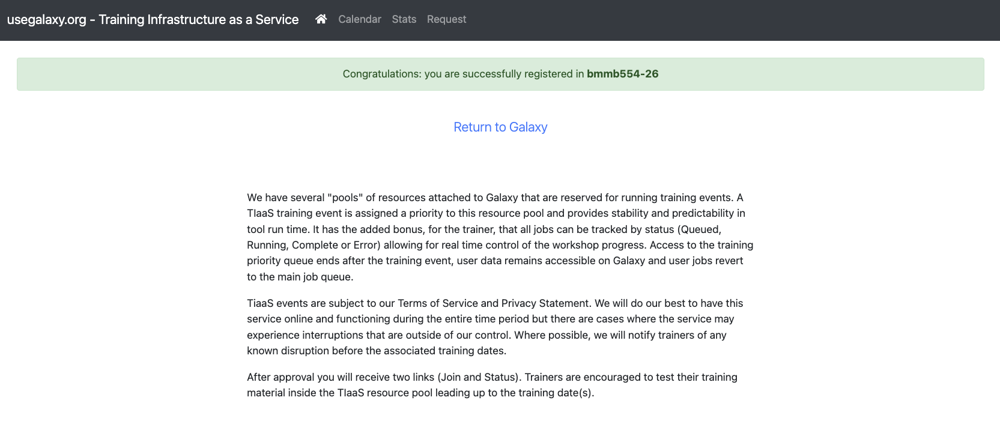

---

## 1. The Story

To make this tutorial realistic we use an example from the real world. We start with four sequencing datasets (FASTQ files) representing four individuals positive for malaria---a life-threatening disease caused by *Plasmodium* parasites transmitted to humans through the bites of infected female *Anopheles* mosquitoes.

Our goal: determine whether the malaria parasite (*Plasmodium falciparum*) infecting these individuals is resistant to [Pyrimethamine](https://en.wikipedia.org/wiki/Pyrimethamine)---an antimalarial drug. Resistance is conferred by a mutation in the `PF3D7_0417200` (*dhfr*) gene [1]. Given sequencing data from four individuals we will determine which ones carry mutations in this gene.

:::{.callout-important}
## Analysis Outline
The analysis begins with FASTQ files representing four individuals sequenced using a paired-end protocol (each sample = two files: forward and reverse reads). We combine files into a **Collection**, map against the *P. falciparum* reference genome, call variants, annotate them, and produce a final table answering our question.
:::

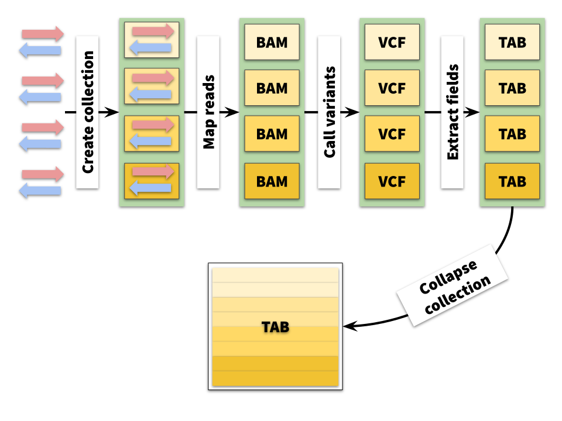

---

## 2. From Reads to Variants

We use data from four infected individuals sequenced within the [MalariaGen](https://www.malariagen.net/data_package/open-dataset-plasmodium-falciparum-v70/) effort:

| Accession | Location |
|-----------|----------|
| [ERR636434](https://www.ncbi.nlm.nih.gov/sra/?term=ERR636434) | Ivory Coast |
| [ERR636028](https://www.ncbi.nlm.nih.gov/sra/?term=ERR636028) | Ivory Coast |
| [ERR042232](https://www.ncbi.nlm.nih.gov/sra/?term=ERR042232) | Colombia |
| [ERR042228](https://www.ncbi.nlm.nih.gov/sra/?term=ERR042228) | Colombia |

These accessions correspond to datasets stored in the [Sequence Read Archive](https://www.ncbi.nlm.nih.gov/sra) (SRA) at NCBI.

### 2.1 Upload data into Galaxy

For this tutorial the data has been down-sampled to ensure quick processing. The FASTQ datasets are deposited in a [Zenodo library](https://zenodo.org/records/15354240).

---

#### Upload accessions into Galaxy

1. Go to your Galaxy instance (e.g., [usegalaxy.org](https://usegalaxy.org))
2. Click the **Upload Data** button:
   
3. In the dialog box click **Paste/Fetch**:
   
4. Paste the following URLs into the box:

```default
https://zenodo.org/records/15354240/files/ERR042228_F.fq.gz
https://zenodo.org/records/15354240/files/ERR042228_R.fq.gz
https://zenodo.org/records/15354240/files/ERR042232_F.fq.gz
https://zenodo.org/records/15354240/files/ERR042232_R.fq.gz
https://zenodo.org/records/15354240/files/ERR636028_F.fq.gz
https://zenodo.org/records/15354240/files/ERR636028_R.fq.gz
https://zenodo.org/records/15354240/files/ERR636434_F.fq.gz
https://zenodo.org/records/15354240/files/ERR636434_R.fq.gz
```

5. Change datatype to `fastqsanger.gz`
   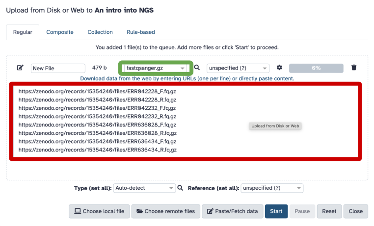
6. Click **Start**, then **Close**

---

This creates eight datasets---each sample has forward and reverse read files (4 x 2 = 8):

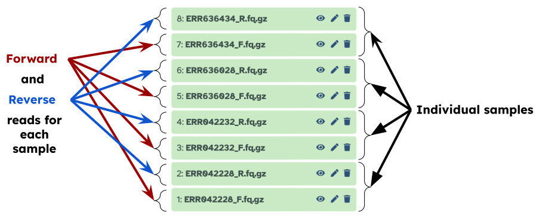

---

## 3. FASTQ Format

We covered FASTQ structure and quality score encoding in detail in [Lecture 6](lecture6.ipynb). As a brief recap, [FASTQ](https://en.wikipedia.org/wiki/FASTQ_format) stores sequencing reads as four lines per record---header (`@`), sequence, `+`, and ASCII-encoded quality scores. The **FASTQ Sanger** version [2] is the accepted standard; Galaxy uses it exclusively.

### 3.1 Paired-end data

In paired-end sequencing, both ends of short DNA molecules (< 1 kb) are sequenced, producing two reads per fragment. Mate-pair sequencing is similar but targets the ends of long molecules joined by an internal adapter.

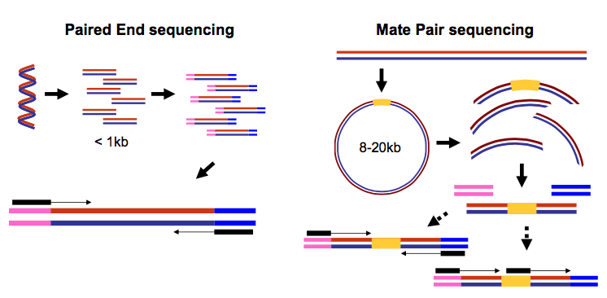

Paired-end data can be stored as:

- **Two separate files** --- one for forward reads, one for reverse reads (read IDs must match in order)
- **A single interleaved file** --- forward and reverse reads alternate

**Two separate files:**

File 1 (forward):

```
@M02286:19:000000000-AA549:1:1101:12677:1273 1:N:0:23
CCTACGGGTGGCAGCAGTGAGGAATATTGGTCAATGGACGGAAGTCT
+
ABC8C,:@F:CE8,B-,C,-6-9-C,CE9-CC--C-<-C++,,+;CE
```

File 2 (reverse):

```
@M02286:19:000000000-AA549:1:1101:12677:1273 2:N:0:23
CACTACCCGTGTATCTAATCCTGTTTGATACCCGCACCTTCGAGCTTA
+
--8A,CCE+,,;,<CC,,<CE@,CFD,,C,CFF+@+@CCEF,,,B+C,
```

:::{.callout-important}
## Read order matters
Read IDs must be **identical** in both files and listed in **the same order**. Some files append `/1` and `/2` tags to distinguish forward and reverse reads.
:::

**Interleaved file:**

```
@1/1
AGGGATGTGTTAGGGTTAGGGTTAGGGTTAGGGTTAGGGTTAGGGTTA
+
EGGEGGGDFGEEEAEECGDEGGFEEGEFGBEEDDECFEFDD@CDD<ED
@1/2
CCTAACCCTAACCCTAACCCTAACCCTAACCCTAACCCTAACCCTAAC
+
GHHHDFDFGFGEGFBGEGGEGEGGGHGFGHFHFHHHHHHHEF?EFEFF
```

In this tutorial, paired-end data is provided as two separate files per sample.

### 3.2 Quality scores

Recall from [Lecture 6](lecture6.ipynb) that each base carries a Phred quality score $Q = -10 \cdot \log_{10}(p)$, where $p$ is the error probability (Q20 = 99% accuracy, Q30 = 99.9%). These scores are encoded as ASCII characters, but different Illumina versions have used different encodings and offsets:

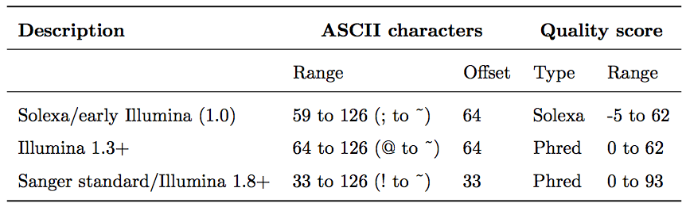

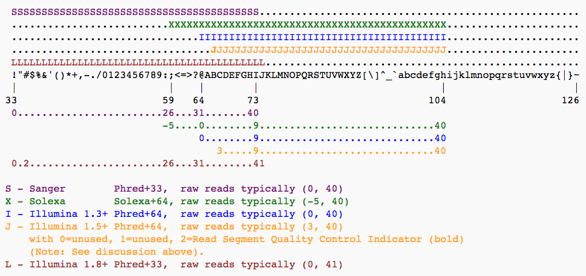

Starting with Illumina format 1.8, scores use the standard Sanger/Phred format.

### 3.3 Assessing quality with FastQC

One of the first steps in NGS analysis is assessing data quality. Several tools exist for this purpose:

- [FastQC](https://www.bioinformatics.babraham.ac.uk/projects/fastqc/) -- the legacy standard, widely recognized but slow
- [Falco](https://github.com/smithlabcode/falco) -- a fast, drop-in replacement for FastQC producing identical output
- [fastp](https://github.com/OpenGene/fastp) -- combines QC reporting with adapter removal and quality filtering in a single pass; commonly used in the Galaxy ecosystem

In this lecture we use `fastp` downstream because it handles both QC and cleanup simultaneously but the plots below show `FastQC` output as an illustration.

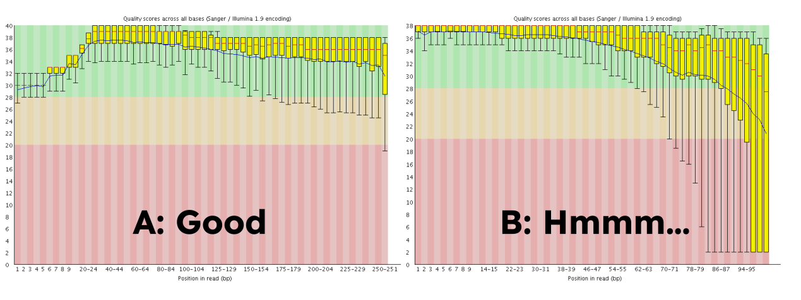{fig-align="center"}

Dataset **A** has long reads (250 bp) with excellent quality (no scores below 30). Dataset **B** has lower quality with read ends dipping below 20---these reads may need trimming.

---

## 4. Bundle Data into a Collection

We want to perform the same analysis on all four samples. Rather than repeating operations eight times, we bundle datasets into a **Collection**. Collections in Galaxy are logical groupings that reflect semantic relationships between datasets.

We create a **paired collection** with two levels: the first level contains samples, the second contains forward and reverse reads for each sample.

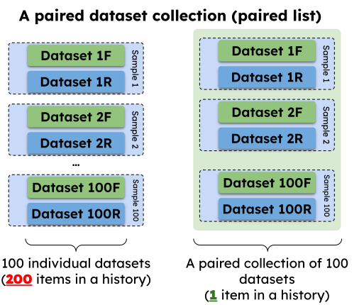

---

#### Create a paired collection

Follow the steps shown in [this video](https://www.youtube.com/watch?v=OW4n61BIHAc) (2 minutes). After creating the collection, click its name in the history panel to explore the contents.

---

## 5. Quality Control with `fastp` and `MultiQC`

Raw FASTQ data often contains adapter fragments from library preparation and low-quality reads. `fastp` automatically detects and removes common sequencing adapters and prunes low-quality segments.

---

#### Run `fastp`

Run **fastp** with the following parameters:

- **Single-end or paired reads**: `Paired collection`
- **Select paired collection(s)**: the collection created in the previous step

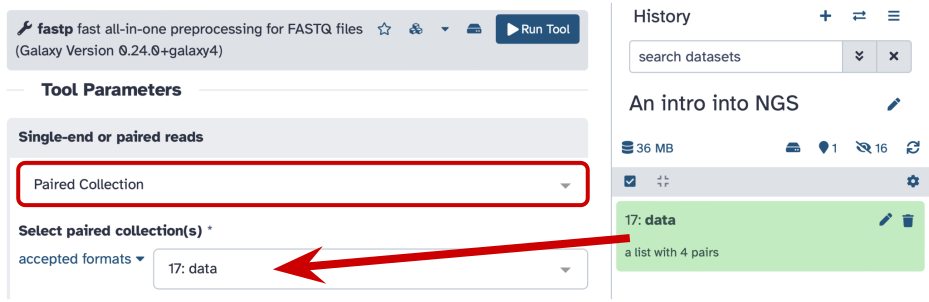

`fastp` generates cleaned data plus HTML and JSON reports as three collections:


---

You can click individual HTML reports to inspect quality, but for many samples this becomes impractical. Instead, feed the JSON output from `fastp` into `MultiQC` to visualize QC data for **all** samples at once.

---

#### Run `MultiQC` on `fastp` JSON data

Run **MultiQC** with:

- **Which tool was used to generate logs?**: `fastp`
- **Output of fastp**: JSON output from the previous step

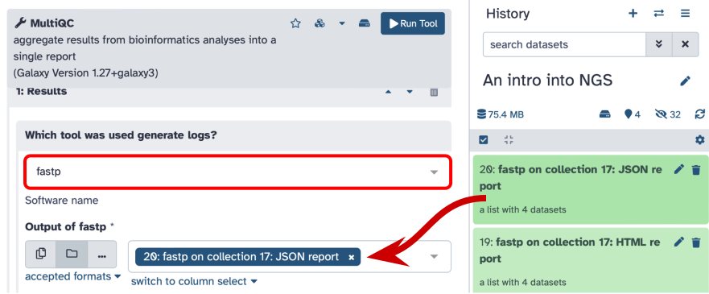

Click the eye icon on the "Webpage" output to see the QC report:


---

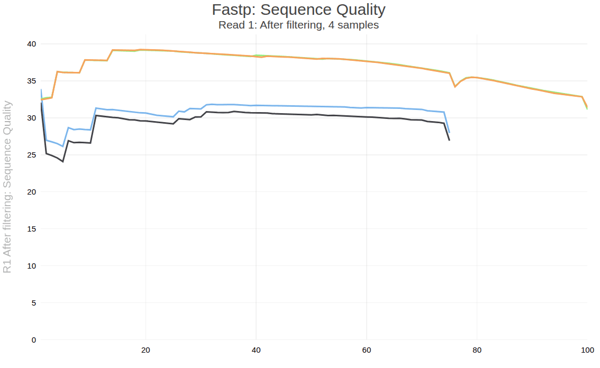

Two samples have very high quality values and 100 bp reads. The other two have somewhat lower (but acceptable) quality and shorter 80 bp reads.

---

## 6. Mapping Reads

Galaxy provides several mappers including `bowtie`, `bwa-mem`, and `bwa-mem2`. We use `bwa-mem2`---the latest version of this popular aligner.

### 6.1 Upload reference genome

When the genome index is not pre-installed on Galaxy, you need to upload the reference yourself. We use the 3D7 strain *P. falciparum* reference genome.

---

#### Upload the *P. falciparum* genome

Paste the following URL into the Upload tool and set datatype to `fasta.gz`:

```default
https://zenodo.org/records/15354240/files/GCF_000002765.6.fa.gz
```

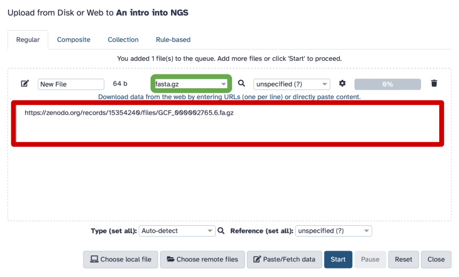

---

### 6.2 Map the reads

---

#### Map reads with `BWA-MEM2`

Run **BWA-MEM2** with:

- **Will you select a reference genome from your history or use a built-in index?**: `Use a reference genome from history and build index if necessary`
- **Use the following dataset as the reference**: the uploaded reference genome
- **Single or Paired-end reads**: `Paired collection`
- **Select a paired collection**: the cleaned FASTQ collection from `fastp`

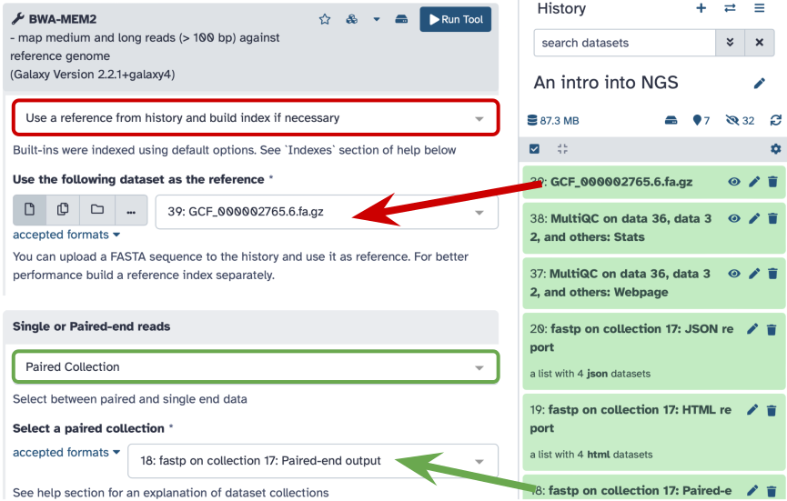

---

`BWA-MEM2` produces four BAM outputs---one per sample.

### 6.3 SAM/BAM format

:::{.callout-note}
## What are BAM files?
The [SAM/BAM](https://samtools.github.io/hts-specs/SAMv1.pdf) format is the accepted standard for storing aligned reads. SAM is human-readable and tab-delimited; BAM is its binary, indexed form optimized for fast random access. In Galaxy, BAM datasets are always indexed and sorted by coordinate.
:::

SAM files contain a short header section and a long alignment section where each row represents one read alignment:

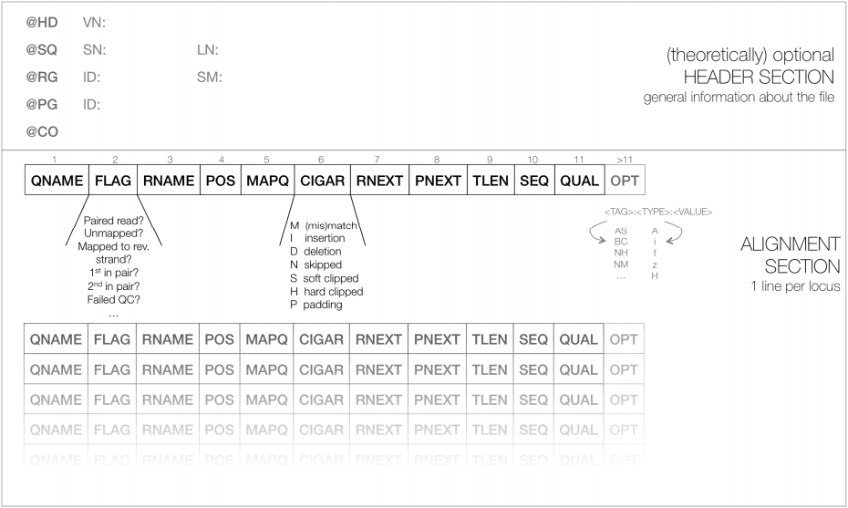

Each line in the header starts with `@`. For example, `@SQ` lines list reference sequence names (`SN`) and lengths (`LN`):

```
@SQ SN:chr1 LN:1000
@SQ SN:chr2 LN:1000
@SQ SN:chr3 LN:1000
```

Each alignment has 11 mandatory fields:

```
<QNAME> <FLAG> <RNAME> <POS> <MAPQ> <CIGAR> <RNEXT> <PNEXT> <TLEN> <SEQ> <QUAL>
```

(Older documentation may use `MRNM`, `MPOS`, `ISIZE` for the last three positional fields.)

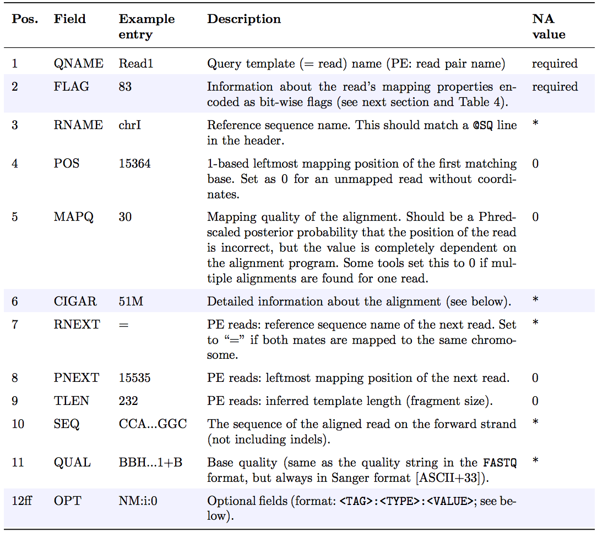

#### The FLAG field

The FLAG field encodes properties of a read as a sum of binary values:

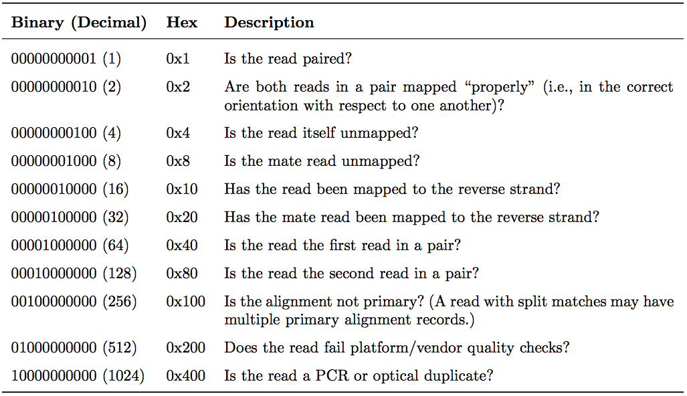

Common FLAG values for single-end reads:

- **0**: mapped to forward strand
- **4**: unmapped
- **16**: mapped to reverse strand

Common FLAG values for paired-end reads:

- **83** (1+2+16+64): paired, proper pair, first in pair, reverse strand
- **99** (1+2+32+64): paired, proper pair, first in pair, mate on reverse strand
- **147** (1+2+16+128): paired, proper pair, second in pair, reverse strand
- **163** (1+2+32+128): paired, proper pair, second in pair, mate on reverse strand

#### The CIGAR string

CIGAR (*Concise Idiosyncratic Gapped Alignment Report*) describes operations needed to align a read to the reference:

- **M** -- alignment match (can be match or mismatch)
- **I** -- insertion in read relative to reference
- **D** -- deletion in read relative to reference
- **N** -- skipped region (e.g., intron in RNA-seq)
- **S** -- soft clipping (clipped bases present in read)
- **H** -- hard clipping (clipped bases absent from record)
- **=** -- sequence match (not widely used)
- **X** -- sequence mismatch (not widely used)

The sum of M, I, S, =, X operations equals the read length.

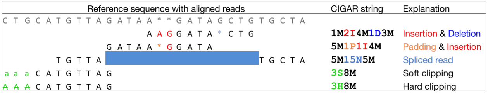

#### Read groups

SAM/BAM format supports labeling reads with **read group** tags, allowing results from multiple experiments to be pooled in a single BAM file. Downstream tools like variant callers recognize read groups and output results per group.

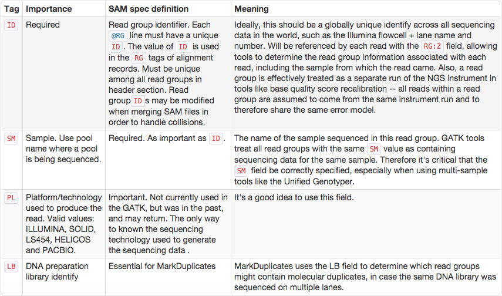

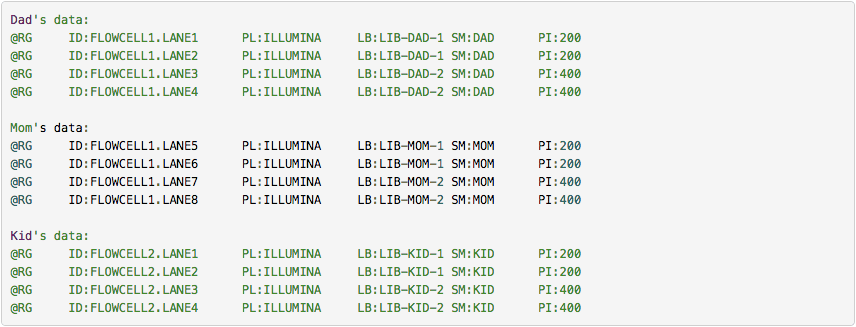

#### SAM/BAM processing toolkits

- [DeepTools](https://deeptools.readthedocs.io) -- visualization, QC, normalization
- [SAMtools](http://www.htslib.org/) -- sorting, merging, indexing, pileup
- [BEDtools](https://bedtools.readthedocs.io/) -- interval-based analysis
- [Picard](https://broadinstitute.github.io/picard/) -- HTS data manipulation

---

## 7. Remove Duplicates

### 7.1 What are read duplicates?

PCR amplification during library preparation introduces biases [3]. Some fragments are amplified more than others, producing **PCR duplicates**---reads with identical alignment coordinates that originate from the same template molecule rather than independent sampling. On patterned flow cells (NovaSeq, NextSeq 2000), **optical duplicates** are a distinct artifact: clusters appear as duplicates due to physical proximity rather than PCR amplification. `MarkDuplicates` detects these using the `OPTICAL_DUPLICATE_PIXEL_DISTANCE` parameter.

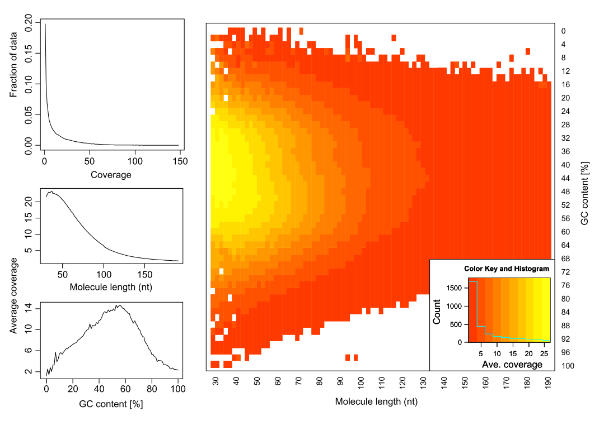

Duplicates can be identified by outer alignment coordinates or sequence-based clustering. `MarkDuplicates` from the [Picard](https://broadinstitute.github.io/picard/) package is the standard tool.

:::{.callout-important}
## Caution with small genomes
When sequencing targets are small (bacterial, viral, or organellar genomes, amplicons), reads can share coordinates **by chance** rather than PCR duplication. Aggressive duplicate removal in these cases removes real signal. The balance depends on coverage, insert size variance, and allele frequencies [4].
:::

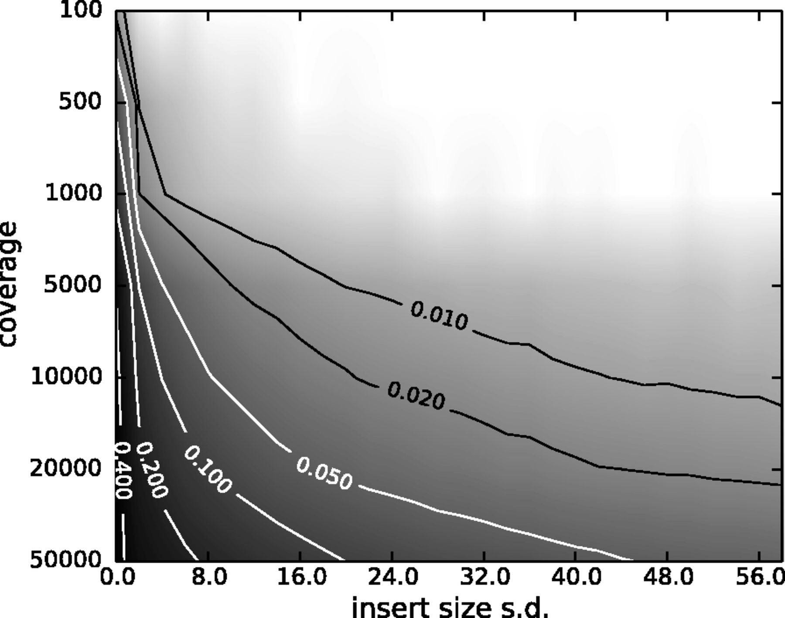

### 7.2 Run MarkDuplicates

---

#### Remove duplicates

Run **MarkDuplicates** with:

- **Select SAM/BAM dataset or dataset collection**: BAM output from `BWA-MEM2`
- **If true do not write duplicates to the output file instead of writing them with appropriate flags set**: `Yes`

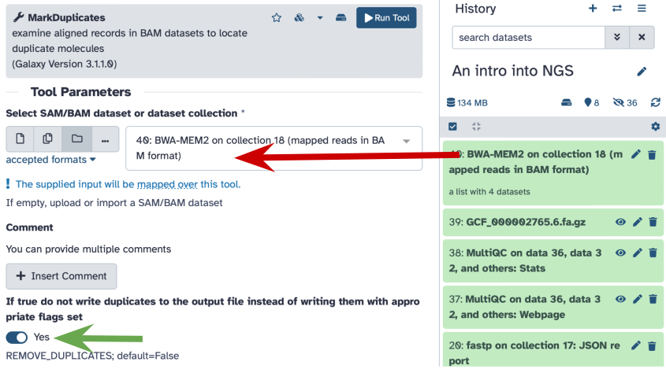

---

## 8. Calling Variants

We use **LoFreq** for variant calling. Our samples are from human blood, where *Plasmodium* parasites exist in a **haploid** state (only the zygote is diploid, and that stage occurs in the mosquito). LoFreq is specifically designed for calling variants in haploid and mixed-population scenarios---exactly what we covered in [Lecture 19](lecture19.qmd).

### 8.1 Realign reads around indels

As we discussed in [Lecture 19](lecture19.qmd), indels in repetitive regions can be aligned in multiple valid ways, each producing a different variant call. **Left-aligning** indels guarantees consistency across samples and callers.

---

#### Realign reads around indels

Run **Realign reads** (LoFreq Viterbi) with:

- **Reads to realign**: output of `MarkDuplicates`
- **Choose the source for the reference genome**: `History`
- **Reference**: the uploaded *P. falciparum* genome

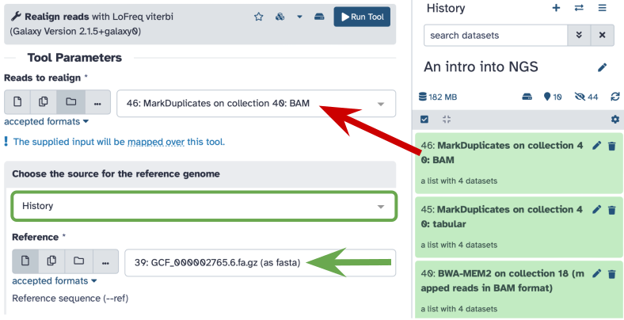

---

### 8.2 Call variants

---

#### Call variants with LoFreq

Run **Call variants** (LoFreq) with:

- **Input reads in BAM format**: output of the realignment step
- **Choose the source for the reference genome**: `History`
- **Reference**: the uploaded reference genome
- **Types of variants to call**: `SNVs and indels`
- **Variant calling parameters**: `Configure settings`
    - **Minimal coverage**: `10`
    - **Minimum baseQ**: `20`
    - **Minimum baseQ for alternate bases**: `20`
    - **Minimum mapping quality**: `20`

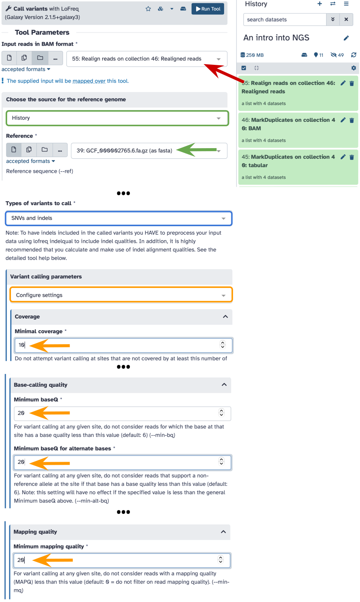

---

The output is a collection of [VCF](https://en.wikipedia.org/wiki/Variant_Call_Format) files containing all variants found between reads and the reference genome.

---

## 9. Annotating Variants

### 9.1 Build a SnpEff database

To annotate variants with their predicted effects, we first need a `SnpEff` database built from the reference genome and gene annotations.

---

#### Upload gene annotations

Paste the following URL into the Upload tool and set datatype to `gtf.gz`:

```default
https://zenodo.org/records/15354240/files/GCF_000002765.6_GCA_000002765.ncbiRefSeq.gtf.gz
```


---

#### Build SnpEff database

Run **SnpEff Build** with:

- **Name for the database**: `Pf`
- **Input annotations are in**: `GTF`
- **GTF dataset to build database from**: the uploaded GTF file
- **Choose the source for the reference genome**: `History`
- **Genome in FASTA format**: the reference genome

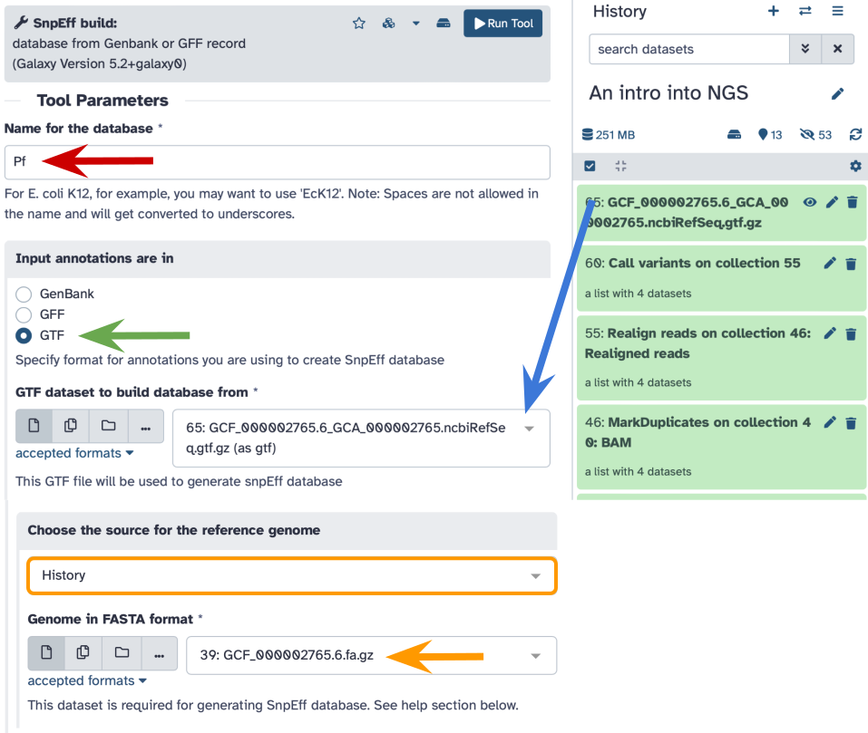

---

### 9.2 Annotate variant effects

---

#### Run SnpEff eff

Run **SnpEff eff** with:

- **Sequence changes (SNPs, MNPs, InDels)**: VCF output from LoFreq
- **Genome source**: `Custom snpEff database in your history`
- **SnpEff Genome Data**: the database built in the previous step

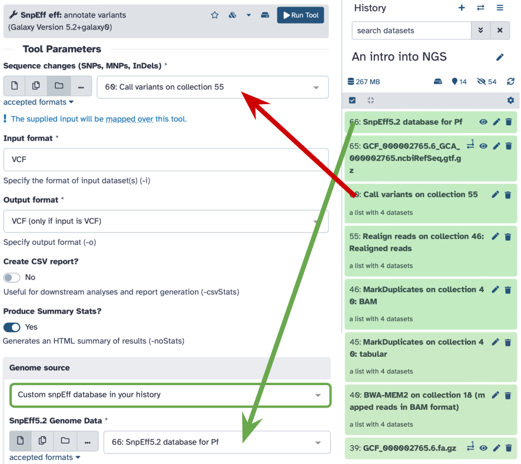

---

### 9.3 Extract variant fields with SnpSift

The annotated VCF files can be viewed in a genome browser, but converting them to tab-delimited tables is more practical for analysis.

---

#### Extract fields with SnpSift

Run **SnpSift Extract Fields** with:

- **Variant input file in VCF format**: output of SnpEff eff
- **Fields to extract**:

```
CHROM POS REF ALT QUAL DP AF SB DP4 ANN[*].EFFECT ANN[*].IMPACT ANN[*].GENE ANN[*].AA_POS ANN[*].HGVS_C ANN[*].HGVS_P
```

- **One effect per line**: `Yes`

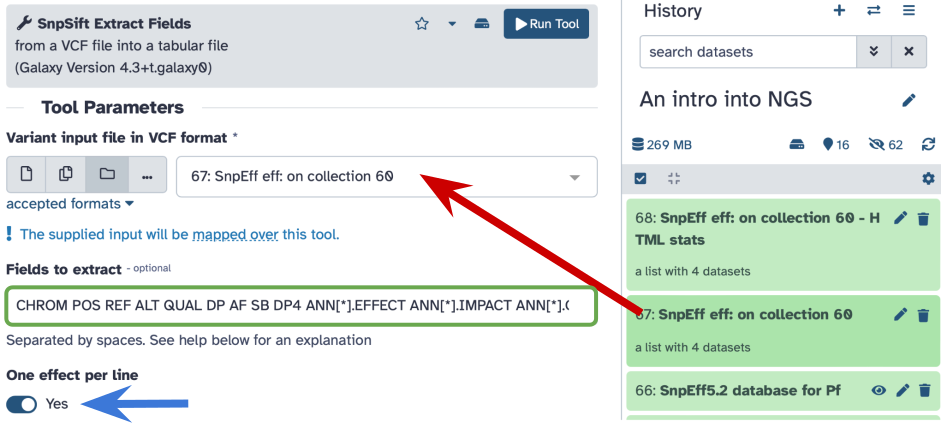

---

The extracted fields:

| # | Field | Meaning |
|---|-------|---------|
| 1 | `CHROM` | Chromosome name |
| 2 | `POS` | Position on chromosome |
| 3 | `REF` | Reference allele |
| 4 | `ALT` | Alternative allele (observed in reads) |
| 5 | `QUAL` | Variant quality (from LoFreq) |
| 6 | `DP` | Read depth at this position |
| 7 | `AF` | Alternative allele frequency |
| 8 | `SB` | Strand bias P-value (Fisher's exact test) |
| 9 | `DP4` | Depths: Fwd Ref, Rev Ref, Fwd Alt, Rev Alt |
| 10 | `ANN[*].EFFECT` | Predicted effect on protein |
| 11 | `ANN[*].IMPACT` | Expected phenotype impact |
| 12 | `ANN[*].GENE` | Gene containing the variant |
| 13 | `ANN[*].AA_POS` | Amino acid position affected |
| 14 | `ANN[*].HGVS_C` | Nucleotide change (CDS coordinates) |
| 15 | `ANN[*].HGVS_P` | Amino acid change (protein coordinates) |

### 9.4 Collapse collection into a single dataset

The extracted fields still exist as a collection (one file per sample). To perform secondary analysis we **collapse** the collection into a single dataset. Collapsing concatenates all elements and prepends sample IDs so each line is traceable to its source.

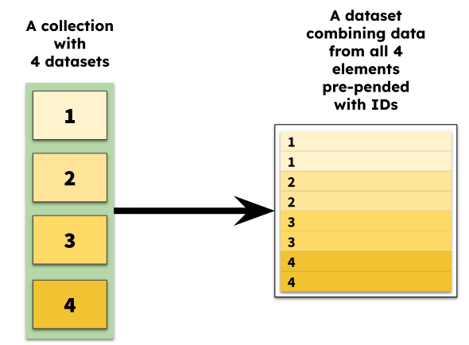

---

#### Collapse the collection

Run **Collapse Collection** with:

- **Collection of files to collapse**: output of SnpSift Extract Fields
- **Keep one header line**: `Yes`
- **Prepend File name**: `Yes`
- **Where to add dataset name**: `Same line and each line in dataset`

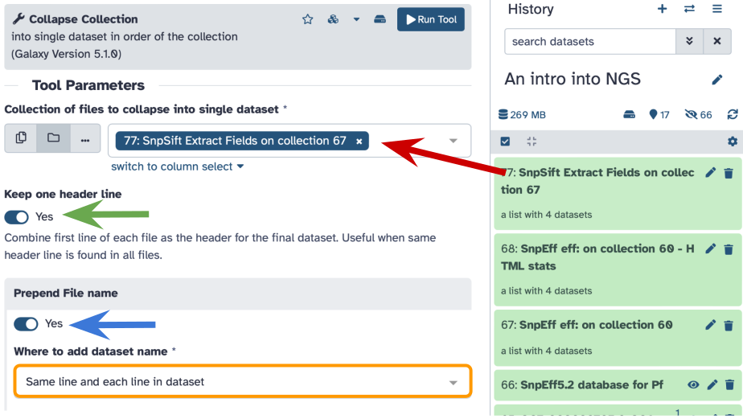

---

**Example input** (a collection with two elements, 15 columns each):

Element `ERR042228.fq`:
```
NC_004318.2   676399   C    T   1344.0   45   0.977778   0   0,0,23,22   missense_variant    MODERATE PF3D7_0415200   914   c.2740G>A    p.Glu914Lys
NC_004318.2   676631   C    T   2000.0   60   0.966667   0   0,0,32,27   synonymous_variant  LOW      PF3D7_0415200   836   c.2508G>A    p.Lys836Lys
```

Element `ERR042232.fq`:
```
NC_004318.2   671152   G    A   1324.0   42   0.952381   0   0,1,20,21   synonymous_variant  LOW      PF3D7_0415100   90    c.270G>A   p.Gln90Gln
NC_004318.2   671641   A    T   1300.0   43   0.906977   0   0,0,16,27   missense_variant    MODERATE PF3D7_0415100   253   c.759A>T   p.Glu253Asp
```

**Output** (single dataset, 16 columns---sample ID prepended):
```
ERR042228.fq NC_004318.2   676399   C    T   1344.0   45   0.977778   0   0,0,23,22   missense_variant    MODERATE PF3D7_0415200   914   c.2740G>A    p.Glu914Lys
ERR042228.fq NC_004318.2   676631   C    T   2000.0   60   0.966667   0   0,0,32,27   synonymous_variant  LOW      PF3D7_0415200   836   c.2508G>A    p.Lys836Lys
ERR042232.fq NC_004318.2   671152   G    A   1324.0   42   0.952381   0   0,1,20,21   synonymous_variant  LOW      PF3D7_0415100   90    c.270G>A   p.Gln90Gln
ERR042232.fq NC_004318.2   671641   A    T   1300.0   43   0.906977   0   0,0,16,27   missense_variant    MODERATE PF3D7_0415100   253   c.759A>T   p.Glu253Asp
```

---

## 10. Anything Interesting?

Cowman et al. [1] showed that *P. falciparum* strains with an amino acid change at **residue 108** of the *dhfr* gene have increased resistance to pyrimethamine. In the *P. falciparum* 3D7 reference, this gene is [PF3D7_0417200](https://www.ncbi.nlm.nih.gov/gene/9221804).

---

#### Filter for variants in the gene of interest

Run **Filter** with:

- **Filter**: output of Collapse Collection
- **With following condition**: `c13=='PF3D7_0417200'`
- **Number of header lines to skip**: `1`

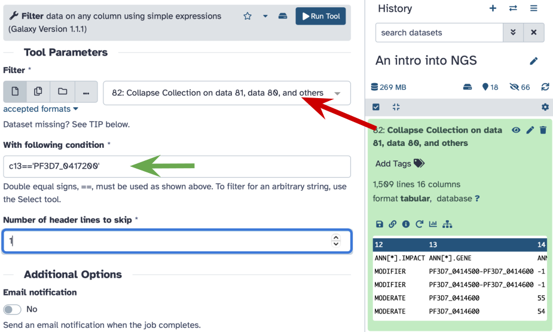

---

### Results

| Sample | CHROM | POS | REF | ALT | QUAL | DP | AF | SB | DP4 | EFFECT | IMPACT | GENE | AA_POS | HGVS_C | HGVS_P |
|--------|-------|-----|-----|-----|------|----|----|----|----|--------|--------|------|--------|--------|--------|
| **ERR042228.fq** | NC_004318.2 | 748410 | G | A | 2335 | 70 | 0.957 | 0 | 0,0,30,40 | missense_variant | MODERATE | PF3D7_0417200 | **108** | c.323G>A | **p.Ser108Asn** |
| ERR636028.fq | NC_004318.2 | 748239 | A | T | 6941 | 194 | 0.985 | 0 | 0,0,117,77 | missense_variant | MODERATE | PF3D7_0417200 | 51 | c.152A>T | p.Asn51Ile |
| ERR636028.fq | NC_004318.2 | 748262 | T | C | 7627 | 211 | 0.981 | 0 | 0,0,117,93 | missense_variant | MODERATE | PF3D7_0417200 | 59 | c.175T>C | p.Cys59Arg |
| **ERR636028.fq** | NC_004318.2 | 748410 | G | A | 8292 | 233 | 0.991 | 0 | 0,0,112,121 | missense_variant | MODERATE | PF3D7_0417200 | **108** | c.323G>A | **p.Ser108Asn** |
| ERR636434.fq | NC_004318.2 | 748262 | T | C | 67 | 214 | 0.019 | 0 | 113,97,2,2 | missense_variant | MODERATE | PF3D7_0417200 | 59 | c.175T>C | p.Cys59Arg |

:::{.callout-important}
## Key Finding
While three samples contain mutations in the *dhfr* gene (`PF3D7_0417200`), only two---**ERR042228** and **ERR636028**---have amino acid replacements at position 108 (Serine to Asparagine, **p.Ser108Asn**). These two individuals are likely infected with pyrimethamine-resistant *P. falciparum*.

Note that ERR636434 has a variant at position 59 but at very low frequency (AF = 0.019), suggesting it may be a minor subpopulation or sequencing artifact.
:::

---

## Summary

:::{.callout-important}
## Take-home Messages

- **FASTQ Sanger** is the standard sequencing data format; Galaxy uses it exclusively for downstream processing
- **Paired-end data** can be provided as two files or interleaved; Galaxy collections organize these logically
- **`fastp`** handles adapter removal and quality filtering; **`MultiQC`** aggregates QC reports across samples
- **`BWA-MEM2`** is a fast, reliable mapper; when the genome index is unavailable, upload the reference and build it on the fly
- **SAM/BAM** is the standard aligned-read format; key toolkits include SAMtools, Picard, DeepTools, and BEDtools
- **Duplicate removal** is critical for variant calling but must be used cautiously on small genomes
- **LoFreq** is designed for variant calling in haploid and mixed-population scenarios
- **SnpEff/SnpSift** annotate variants with predicted effects and extract structured tables
- **Collections** enable batch processing of many samples through the same pipeline
- Large-scale pathogen surveillance follows exactly this workflow: sequence, map, call variants, annotate, interpret
:::

## 11. Why MRSA?

The variant-calling workflow we just completed on *Plasmodium* data is directly applicable to bacterial pathogens. In upcoming lectures we apply it to methicillin-resistant *Staphylococcus aureus* (MRSA)---one of the most clinically important drug-resistant organisms worldwide [5].

### *S. aureus* as commensal and pathogen

*Staphylococcus aureus* colonizes the nares of 28--32% of the US population and is both a frequent commensal and a leading cause of bacteraemia, endocarditis, skin and soft tissue infections, and osteomyelitis. Any item in contact with skin can serve as a fomite---from white coats and ties to phones and mobile telephones---and colonization can persist for months within the home environment.

### Methicillin resistance

Penicillin resistance arose in the 1940s, mediated by the beta-lactamase gene *blaZ*. The first semi-synthetic anti-staphylococcal penicillins were developed around 1960, and MRSA was observed within one year of their clinical use. Methicillin resistance is mediated by *mecA*, carried on the staphylococcal cassette chromosome *mec* (SCC*mec*). *mecA* encodes penicillin-binding protein 2a (PBP2a), which has low affinity for beta-lactams, conferring resistance to this entire class of antibiotics.

### Genome structure

The *S. aureus* genome is approximately 2.8 Mb. The **core genome** (~75%) contains essential genes for metabolism and replication and is highly conserved across strains. The **accessory genome** (~25%) consists of mobile genetic elements (MGEs)---pathogenicity islands, bacteriophages, chromosomal cassettes, transposons, and plasmids---which are acquired through horizontal transfer. Mediators of virulence, immune evasion, and antibiotic resistance are commonly found in the accessory genome, making it more variable and often more strain-specific than the core.

![Genomic map of MRSA USA300 strain FPR3757. The innermost track represents GC content. Moving outwards: antibiotic resistance genes (orange), virulence factors (green), tRNAs, mobile genetic elements including the chromosomal cassette (SCC*mec*), ACME island, pathogenicity islands, and prophage regions. From Turner et al. (2019) [5].](../images/mrsa_usa300_genome.png){fig-align="center"}

### Clonal complexes and global epidemiology

Over 90% of known *S. aureus* genomes fall into just four predominant clonal complexes (CCs): CC5, CC8, CC398, and CC30. The molecular epidemiology of MRSA is characterized by serial emergence of regionally dominant clones:

- **USA300** (CC8, SCC*mec* IV) --- the most prominent CA-MRSA strain in North America, carrying ACME and PVL
- **EMRSA-15** (ST22, CC22) and **EMRSA-16** (ST36, CC30) --- dominant HA-MRSA strains in the United Kingdom and Europe
- **ST239** (CC8) --- a globally distributed HA-MRSA lineage, especially in Asia and South America
- **ST398** (CC398) --- livestock-associated MRSA found in Europe, Asia, and the Americas

Healthcare-associated MRSA (HA-MRSA) and community-associated MRSA (CA-MRSA) were historically distinguished by SCC*mec* type (I--III vs IV--V), clinical setting, and resistance profiles. CA-MRSA strains tend to be more susceptible to non-beta-lactam antibiotics and sometimes produce Panton--Valentine leukocidin (PVL). However, this distinction is blurring as genotypes invade each other's niches---CA-MRSA has replaced HA-MRSA in many hospitals.

### Why whole genome sequencing matters

Traditional typing methods---pulsed-field gel electrophoresis (PFGE), multilocus sequence typing (MLST), *spa* typing---have limited resolution. Whole genome sequencing is "precise and highly discriminatory," enabling reconstruction of transmission chains within healthcare systems and communities, outbreak tracking, and evolutionary analysis at single-nucleotide resolution. WGS has revealed that USA300 emerged through rapid clonal expansion rather than convergent evolution, and has provided sufficient resolution to determine household clustering and hospital introduction events.

---

## What's Next

**Next Tuesday (Mar 31):** We step back from variant calling to learn **interval operations**---the fundamental algebra for manipulating genomic coordinates. Every analysis we have done so far (mapping, variant calling, annotation) produces data tied to genomic positions. BEDTools provides a systematic way to combine, compare, and filter these position-based results. We will use the *P. falciparum* variant data from today as input.

**Following lectures:** We apply the variant-calling workflow to *S. aureus* MRSA data from Kaku et al. [6]---a nationwide surveillance of 270 MRSA bloodstream infection isolates from 45 Japanese hospitals. We then transition to **genome assembly** using the extended dataset from Hisatsune et al. [7], who performed *de novo* assembly of 580 BSI-derived *S. aureus* isolates to characterize the evolutionary trajectory of high-risk clones.

---

## References

1. [Cowman, A.F. et al. (1988). Amino acid changes linked to pyrimethamine resistance in the dihydrofolate reductase-thymidylate synthase gene of *Plasmodium falciparum*. *PNAS*, 85(23), 9109-9113.](https://doi.org/10.1073/pnas.85.23.9109)
2. [Cock, P.J. et al. (2010). The Sanger FASTQ file format for sequences with quality scores, and the Solexa/Illumina FASTQ variants. *Nucleic Acids Research*, 38(6), 1767-1771.](https://doi.org/10.1093/nar/gkp1137)
3. [Kanagawa, T. (2003). Bias and artifacts in multitemplate polymerase chain reactions (PCR). *Journal of Bioscience and Bioengineering*, 96(4), 317-323.](https://doi.org/10.1016/S1389-1723(03)90130-7)
4. [Zhou, W. et al. (2014). Bias from removing read duplicates in ultra-deep sequencing experiments. *Bioinformatics*, 30(8), 1073-1080.](https://doi.org/10.1093/bioinformatics/btt771)
5. [Turner, N.A. et al. (2019). Methicillin-resistant *Staphylococcus aureus*: an overview of basic and clinical research. *Nature Reviews Microbiology*, 17, 203-218.](https://doi.org/10.1038/s41579-018-0147-4)
6. [Kaku, N. et al. (2022). Changing molecular epidemiology and characteristics of MRSA isolated from bloodstream infections: nationwide surveillance in Japan in 2019. *Journal of Antimicrobial Chemotherapy*, 77(8), 2130-2141.](https://doi.org/10.1093/jac/dkac154)
7. [Hisatsune, J. et al. (2025). *Staphylococcus aureus* ST764-SCC*mec*II high-risk clone in bloodstream infections revealed through national genomic surveillance integrating clinical data. *Nature Communications*, 16, 2698.](https://doi.org/10.1038/s41467-025-57575-2)
