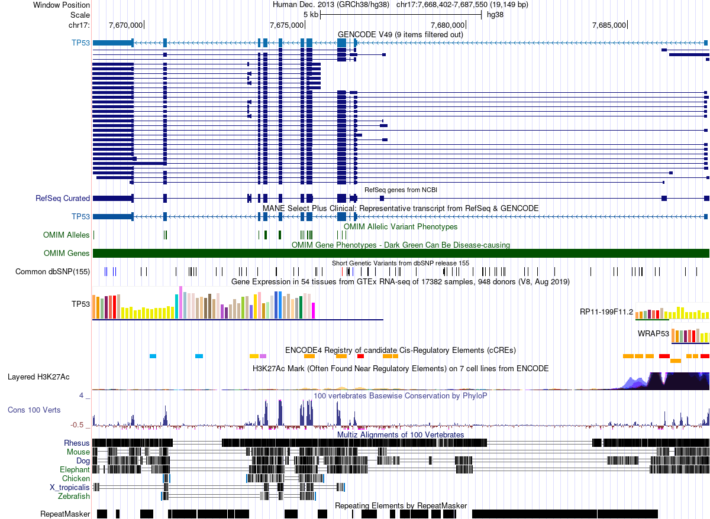
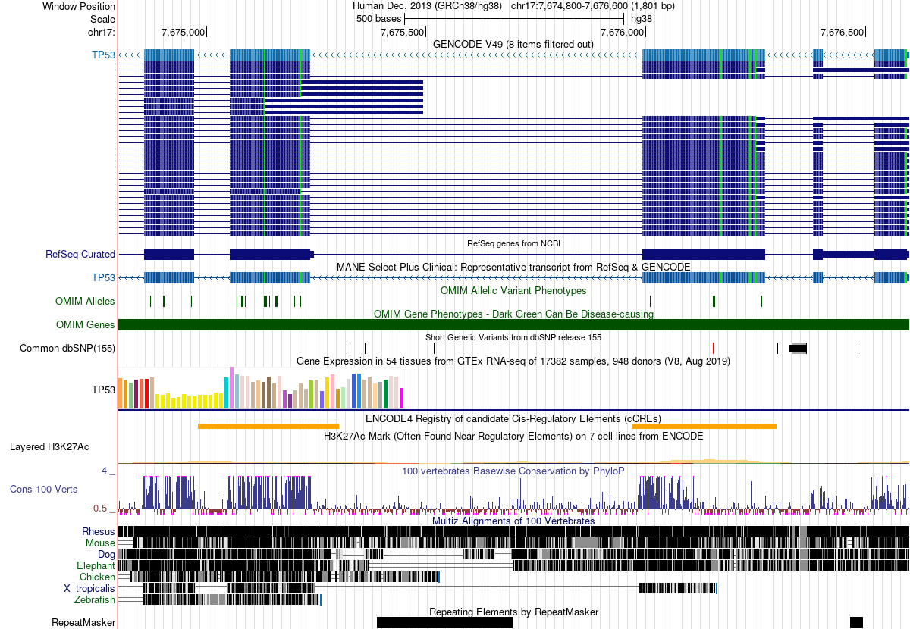
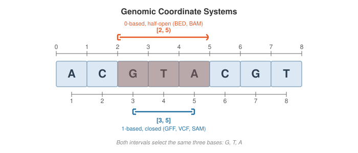
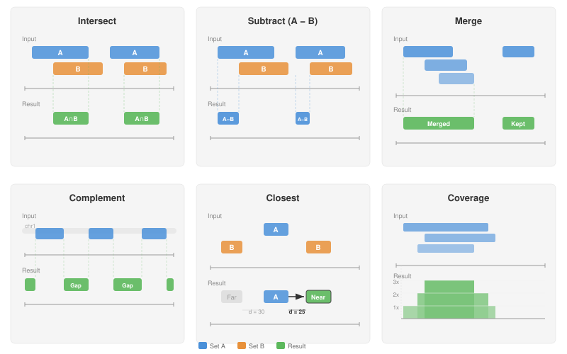
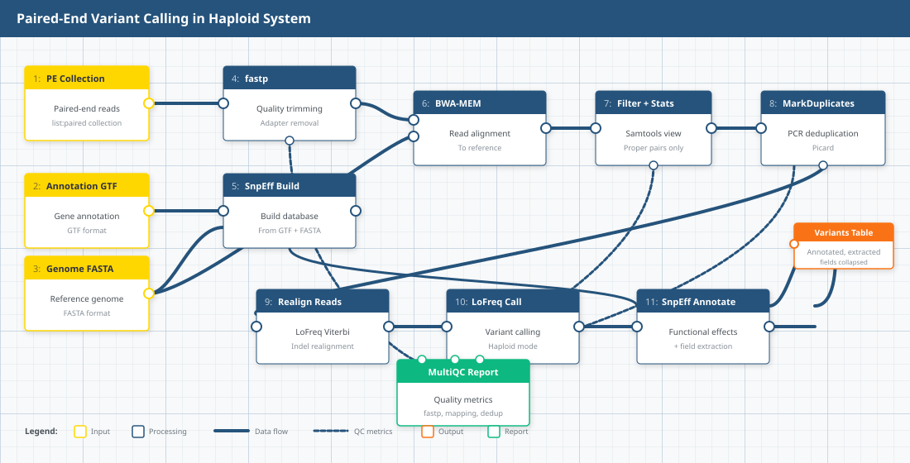

## Learning Objectives

By the end of this lecture, you will be able to:

- Distinguish 0-based half-open from 1-based closed coordinate systems
- Read and write BED and GFF/GTF format files
- Perform core interval operations: intersect, subtract, merge, complement, closest, and coverage
- Use BEDTools in Galaxy to manipulate genomic intervals
- Apply interval operations to filter and combine genomic annotations
- Navigate the UCSC Genome Browser and recognize tracks as interval datasets

---

## 1. The Genome Browser: Intervals Everywhere

The [UCSC Genome Browser](https://genome.ucsc.edu) is the most widely used tool for visualizing genomic data [4]. It displays a region of a reference genome as a horizontal coordinate axis, with datasets stacked vertically as **tracks**. Here we look at the human *TP53* tumor suppressor gene on chromosome 17:



The horizontal axis spans ~19 kb of chromosome 17. Every colored block, bar, or line in the image represents a **genomic interval**---a feature with a start and end position on the chromosome.

### 1.1 What Is a Track?

A track is a dataset projected onto genomic coordinates. Each feature within a track is an interval. The browser view above contains over a dozen tracks, each representing a different type of genomic annotation:

- **GENCODE / RefSeq gene models** --- exons (thick blocks) and introns (thin lines with arrows) defining transcript structure
- **OMIM Alleles** --- positions of disease-associated variants (single-base intervals)
- **Common dbSNP** --- known polymorphisms from dbSNP release 155
- **GTEx expression** --- tissue-specific expression levels (bar chart mapped to gene intervals)
- **ENCODE cCREs** --- candidate cis-regulatory elements (enhancers, promoters, insulators)
- **H3K27Ac** --- histone acetylation peaks marking active regulatory regions
- **Conservation (PhyloP)** --- per-base conservation scores across 100 vertebrates
- **Multiz alignments** --- cross-species sequence alignments (Rhesus, Mouse, Dog, Elephant, Chicken, Zebrafish)
- **RepeatMasker** --- repetitive elements (SINEs, LINEs, DNA transposons)

Zooming in reveals the individual interval features more clearly:



### 1.2 The Key Insight

:::{.callout-important}
Every track in the genome browser is a collection of genomic intervals. Genes, repeats, regulatory elements, variants, aligned reads---all intervals. The browser is visualizing interval arithmetic. This lecture teaches you to perform that arithmetic yourself.
:::

---

## 2. What Is a Genomic Interval?

Every genomic feature---a gene, an exon, a variant, a ChIP-seq peak, an aligned read---can be represented as an **interval**: a contiguous stretch of a chromosome defined by three values:

```
(chromosome, start, end)
```

Interval arithmetic lets us ask relational questions about these features: Which variants fall inside genes? Which peaks overlap promoters? What fraction of the genome is covered by repeats? The answers come from a small set of set-theoretic operations on intervals.

:::{.callout-note}
In [Lecture 20](lecture20.qmd) we produced VCF files containing variant positions, used GTF gene annotations, and mentioned BEDTools as a key toolkit. This lecture formalizes the interval algebra behind those operations.
:::

---

## 3. Coordinate Systems

Genomics uses two coordinate conventions. Confusing them causes off-by-one errors---the single most common bug in bioinformatics pipelines.



### 3.1 0-Based, Half-Open

Used by **BED** format.

- The first base of a chromosome is position **0**
- The interval is `[start, end)`---start is included, end is excluded
- Length = `end - start`

Example: the three bases `GTA` starting at the third position of `ACGTACGT` are represented as `(2, 5)`.

### 3.2 1-Based, Closed

Used by **GFF/GTF**, **SAM/BAM**, and **VCF** formats.

- The first base of a chromosome is position **1**
- The interval is `[start, end]`---both start and end are included
- Length = `end - start + 1`

The same three bases `GTA` are represented as `(3, 5)`.

### 3.3 Format-to-Coordinate Mapping

| Format | System | First base | End included? |
|--------|--------|-----------|---------------|
| [BED](https://genome.ucsc.edu/FAQ/FAQformat.html#format1) | 0-based, half-open | 0 | No |
| [GFF/GTF](https://github.com/The-Sequence-Ontology/Specifications/blob/master/gff3.md) | 1-based, closed | 1 | Yes |
| [SAM/BAM](https://samtools.github.io/hts-specs/SAMv1.pdf) | 1-based, closed | 1 | Yes |
| [VCF](https://samtools.github.io/hts-specs/VCFv4.3.pdf) | 1-based | 1 | N/A (single position) |

:::{.callout-note}
BAM is the binary-compressed form of SAM. Internally BAM stores positions as 0-based, but this is a serialization detail---every tool that reads BAM (`samtools`, `pysam`, IGV) presents coordinates as 1-based, identical to SAM. You never need to handle this conversion yourself.
:::

### 3.4 Converting Between Systems

To convert the same feature:

- BED → GFF: `GFF_start = BED_start + 1`, `GFF_end = BED_end`
- GFF → BED: `BED_start = GFF_start - 1`, `BED_end = GFF_end`

:::{.callout-warning}
## The Off-by-One Trap
Mixing coordinate systems silently shifts every interval by one base. Downstream analyses will appear to work but produce subtly wrong results---variants assigned to wrong genes, peaks missing promoters by one base. Always check which system your files use before combining them.
:::

---

## 4. Interval File Formats

### 4.1 [BED Format](https://genome.ucsc.edu/FAQ/FAQformat.html#format1)

BED (Browser Extensible Data) is the simplest and most widely used interval format. It is tab-delimited and 0-based half-open.

**BED3** --- the minimal form:

```
NC_004318.2	322	1056
NC_004318.2	4528	6356
NC_004318.2	9843	12402
```

Three columns: `chrom`, `chromStart`, `chromEnd`.

**BED6** adds name, score, and strand:

```
NC_004318.2	322	1056	PF3D7_0400100	0	+
NC_004318.2	4528	6356	PF3D7_0400200	0	-
NC_004318.2	9843	12402	PF3D7_0400300	0	+
```

**BED12** extends to 12 columns, adding fields for thick display regions and block (exon) structure---used for multi-exon gene models in genome browsers.

:::{.callout-note}
BED files must be **tab-delimited** (not space-delimited) and should **not** have a header line. Many tools silently produce wrong results if these conventions are violated.
:::

### 4.2 [GFF3](https://github.com/The-Sequence-Ontology/Specifications/blob/master/gff3.md)/[GTF](https://genome.ucsc.edu/FAQ/FAQformat.html#format4) Format

GFF3 (General Feature Format) and GTF (Gene Transfer Format, essentially GFF version 2) use nine tab-delimited columns and 1-based closed coordinates:

```
NC_004318.2	RefSeq	gene	323	1056	.	+	.	ID=PF3D7_0400100;Name=RNF5
NC_004318.2	RefSeq	gene	4529	6356	.	-	.	ID=PF3D7_0400200;Name=PF3D7_0400200
```

Columns: `seqid`, `source`, `type`, `start`, `end`, `score`, `strand`, `phase`, `attributes`.

Notice the same gene `PF3D7_0400100` has start=322 in BED and start=323 in GFF---a direct consequence of the coordinate system difference.

### 4.3 [VCF](https://samtools.github.io/hts-specs/VCFv4.3.pdf) Positions

VCF uses 1-based coordinates for the `POS` field. Students encountered this in [Lecture 19](lecture19.qmd) and [Lecture 20](lecture20.qmd). A VCF record with `POS=1024` refers to the 1024th base on the chromosome.

To convert a single-nucleotide variant to BED: `BED_start = VCF_POS - 1`, `BED_end = VCF_POS`.

---

## 5. Core Interval Operations

Six operations form the foundation of interval arithmetic in genomics. Nearly every analysis question can be decomposed into a sequence of these operations.



### 5.1 Intersect

**What it does:** finds the overlapping portions between two interval sets A and B.

**Biological use case:** "Which of my called variants fall within annotated genes?" We answered this in Lecture 20 using SnpEff---but the underlying operation is an intersection of variant positions with gene intervals.

```bash
bedtools intersect -a variants.bed -b genes.bed
```

Key flags:

- `-wa` / `-wb`: report the original A/B entry (not just the overlap)
- `-v`: report entries in A with **no** overlap in B (the anti-join)
- `-f 0.50`: require at least 50% of A to be overlapped
- `-r`: apply the overlap fraction reciprocally to both A and B

### 5.2 Subtract

**What it does:** removes portions of A that overlap with B.

**Biological use case:** "Remove all variants in repetitive or low-complexity regions before downstream analysis."

```bash
bedtools subtract -a variants.bed -b repeats.bed
```

### 5.3 Merge

**What it does:** collapses overlapping or adjacent intervals within a single set into non-overlapping intervals.

**Biological use case:** "Collapse overlapping exon annotations into non-redundant gene bodies."

```bash
bedtools sort -i exons.bed | bedtools merge -i -
```

:::{.callout-note}
`bedtools merge` requires **sorted** input. Always pipe through `bedtools sort` first.
:::

### 5.4 Complement

**What it does:** returns the regions of the genome **not** covered by any interval in the input set.

**Biological use case:** "What fraction of chromosome 4 is intergenic (not covered by any gene annotation)?"

```bash
bedtools complement -i genes.bed -g genome.txt
```

The `-g` flag requires a **genome file**---a two-column tab-delimited file listing each chromosome and its length:

```
NC_004318.2	1200490
```

### 5.5 Closest

**What it does:** for each interval in A, finds the nearest interval in B.

**Biological use case:** "For each intergenic variant, what is the nearest gene?"

```bash
bedtools closest -a intergenic_variants.bed -b genes.bed
```

### 5.6 Coverage

**What it does:** counts how many intervals in B overlap each interval in A.

**Biological use case:** "How many variants fall within each gene? Which genes have the highest variant density?"

```bash
bedtools coverage -a genes.bed -b variants.bed
```

Output appends columns for: count of overlaps, number of bases covered, interval length, and fraction covered.

---

## 6. BEDTools

### 6.1 History

BEDTools was created by Aaron Quinlan and Ira Hall in 2010 [1]. It provides over 30 subcommands for interval manipulation and has become the de facto standard for genomic interval arithmetic. The toolkit is available both on the command line and within Galaxy.

### 6.2 Architecture

Early versions of BEDTools used **interval trees**---a balanced binary search tree where each node stores an interval, enabling overlap queries in O(log n + k) time (n = database intervals, k = overlaps found). For ~25,000 genes, finding overlaps requires roughly 15 comparisons instead of 25,000. Modern BEDTools (v2.18+) defaults to a **sweep-line algorithm** ("chromsweep") for sorted input, which scans both files in coordinate order and achieves even better performance in practice. The interval tree approach is retained as a fallback for unsorted data.

### 6.3 Command Pattern

Every BEDTools command follows the same pattern:

```bash
bedtools <subcommand> [options] -a <fileA> -b <fileB>
```

Common subcommands:

| Subcommand | Operation |
|-----------|-----------|
| `intersect` | Intersect two interval sets |
| `subtract` | Subtract B from A |
| `merge` | Merge overlapping intervals |
| `complement` | Genome regions not in input |
| `closest` | Nearest feature in B for each in A |
| `coverage` | Count overlaps and compute coverage |
| `sort` | Sort intervals by position |
| `getfasta` | Extract FASTA sequences for intervals |
| `slop` | Expand intervals by a fixed number of bases |
| `flank` | Create intervals from the flanks of features |

---

## 7. Hands-On: Variants in *S. aureus*

### 7.1 The Story

Kaku et al. [5] conducted a nationwide surveillance of methicillin-resistant *Staphylococcus aureus* (MRSA) bloodstream infections across 51 Japanese hospitals in 2019. They collected 270 MRSA isolates from blood cultures and performed whole-genome sequencing to characterize the molecular epidemiology of these infections. The key finding: SCC*mec* type IV has replaced SCC*mec* type II as the dominant MRSA lineage in Japanese bloodstream infections, with ST8-IV (30.7%) and ST1-IV (29.6%) as the most prevalent combinations. The study revealed distinct geographic patterns---ST1-IV dominated in eastern Japan while ST8-IV was more common in the west---and demonstrated that the newer type IV strains show greater susceptibility to clindamycin and minocycline compared to the older type II strains.

We use a subset of these data---already processed through a variant-calling pipeline---to practice interval operations. Our goal: determine whether specific genes of interest carry mutations in these MRSA isolates.

### 7.2 The Variant-Calling Workflow

The data in the shared history were generated using the [Paired-End Variant Calling in Haploid System](https://iwc.galaxyproject.org/workflow/haploid-variant-calling-wgs-pe-main/) workflow from the Intergalactic Workflow Commission (IWC). This standardized Galaxy workflow takes three inputs---paired-end reads, a reference genome, and gene annotations---and produces an annotated variant table.



The pipeline proceeds in four phases:

1. **Quality control**: `fastp` trims adapters and low-quality bases from paired-end reads
2. **Alignment**: `BWA-MEM` maps trimmed reads to the reference genome, followed by `Samtools view` (filtering to properly paired reads) and `MarkDuplicates` (removing PCR duplicates)
3. **Variant calling**: `LoFreq Viterbi` realigns reads around indels, then `LoFreq Call` identifies variants in haploid mode
4. **Annotation**: `SnpEff` annotates variants with functional effects (missense, synonymous, etc.) and `SnpSift` extracts key fields into a final table

A `MultiQC` report aggregates quality metrics from fastp, mapping, and deduplication steps. The final output is a collapsed table of annotated variants across all samples.

### 7.3 Data

Import the pre-analyzed history into your Galaxy account:

:::{.callout-warning}
## Setup
1. Make sure you are logged in to [usegalaxy.org](https://usegalaxy.org)
2. Import the shared history: <https://usegalaxy.org/u/cartman/h/unnamed-history-13>
3. Click **Import history** (the "+" icon at the top of the history panel)
:::

The history contains variant calls (VCF) and gene annotations (GFF) from the MRSA analysis pipeline.

### 7.4 Genes of Interest

We focus on five *S. aureus* NCTC 8325 genes that play roles in virulence, cell wall maintenance, and antibiotic resistance:

| Protein accession | Gene | Function |
|-------------------|------|----------|
| YP_500520.1 | SAOUHSC_02023 | Bifunctional autolysin |
| YP_499546.1 | SAOUHSC_01049 | Predicted protein |
| YP_501041.1 | SAOUHSC_02545 | Predicted protein |
| YP_500662.1 | SAOUHSC_02165 | Predicted protein |
| YP_499519.1 | SAOUHSC_01022 | Predicted protein |

Our question: **Do any of these genes carry genetic variants in the MRSA isolates?** We will answer this using `bedtools intersect`---overlaying variant positions with gene coordinates.

:::{.callout-tip}
## Hands-On Exercise
We will work through this analysis together in class using the Galaxy history above and the BEDTools operations from Sections 5 and 6.
:::

---

## 8. Beyond BEDTools

BEDTools is the most widely used interval toolkit, but alternatives exist for specific workflows:

- **`bedops`** [2]---optimized for speed on very large datasets; uses a streaming architecture that avoids loading entire files into memory
- **`pybedtools`** [3]---a Python wrapper around BEDTools that enables scripting interval operations in Python (with optional conversion to pandas DataFrames)
- **`GenomicRanges`**---the R/Bioconductor equivalent; dominant in the R ecosystem for genomic data analysis
- **`bioframe`**---a pure Python library built on pandas; no BEDTools dependency required

The choice depends on your analysis environment: BEDTools for command-line pipelines, `pybedtools` or `bioframe` for Python scripts, `GenomicRanges` for R workflows. The underlying operations are identical.

---

:::{.callout-important}
## Summary

- Every genomic feature is an **interval** defined by (chromosome, start, end)
- **Coordinate systems matter**: BED uses 0-based half-open; GFF/GTF and SAM/BAM use 1-based closed; VCF uses 1-based positions. Mixing systems causes off-by-one errors.
- Six core operations---**intersect, subtract, merge, complement, closest, coverage**---form the algebra of genomic interval analysis
- **BEDTools** is the standard toolkit, available on the command line and in Galaxy
- Most genomic analysis questions can be decomposed into sequences of interval operations
:::

---

## References

1. [Quinlan, A.R. & Hall, I.M. (2010). BEDTools: a flexible suite of utilities for comparing genomic features. *Bioinformatics*, 26(6), 841--842.](https://doi.org/10.1093/bioinformatics/btq033)
2. [Neph, S. et al. (2012). BEDOPS: high-performance genomic feature operations. *Bioinformatics*, 28(14), 1919--1920.](https://doi.org/10.1093/bioinformatics/bts277)
3. [Dale, R.K. et al. (2011). pybedtools: a flexible Python library for manipulating genomic datasets and annotations. *Bioinformatics*, 27(24), 3423--3424.](https://doi.org/10.1093/bioinformatics/btr539)
4. [Kent, W.J. et al. (2002). The Human Genome Browser at UCSC. *Genome Research*, 12(6), 996--1006.](https://doi.org/10.1101/gr.229102)
5. [Kaku, N. et al. (2022). Changing molecular epidemiology and characteristics of MRSA isolated from bloodstream infections: nationwide surveillance in Japan in 2019. *Journal of Antimicrobial Chemotherapy*, 77(8), 2130--2141.](https://doi.org/10.1093/jac/dkac154)
