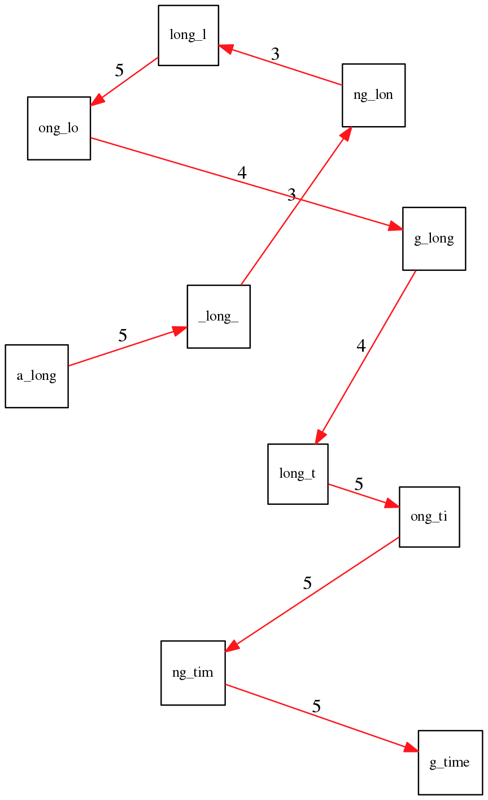
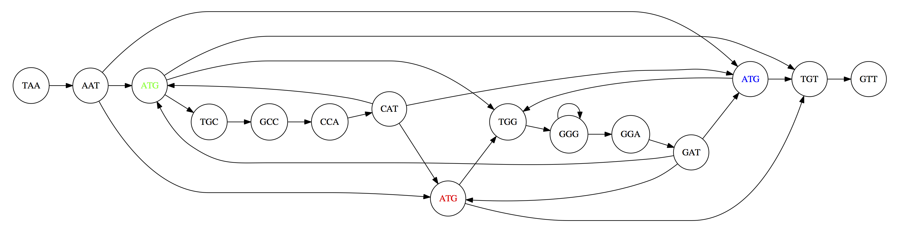
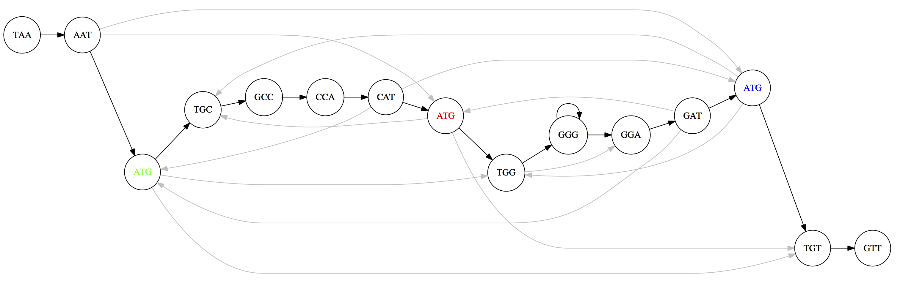
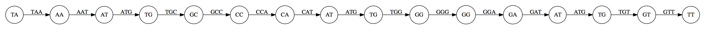
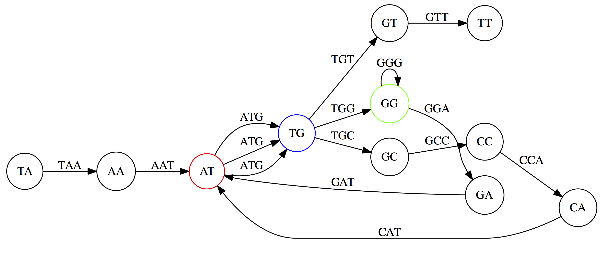
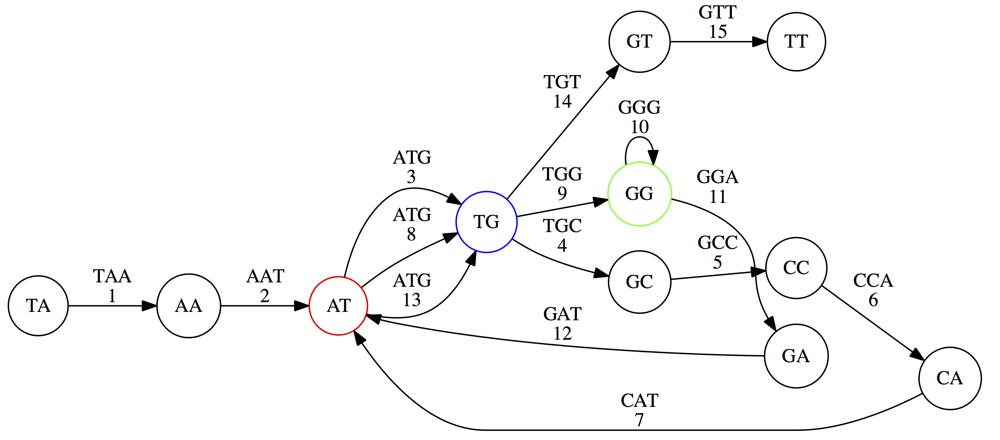
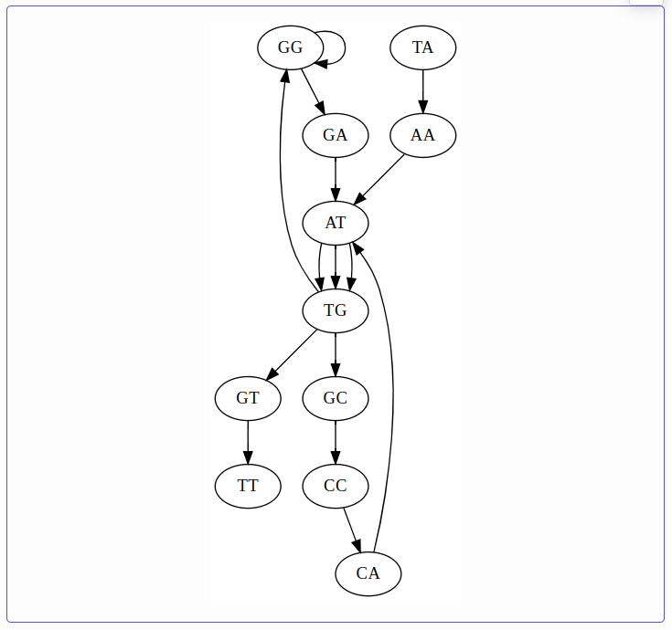
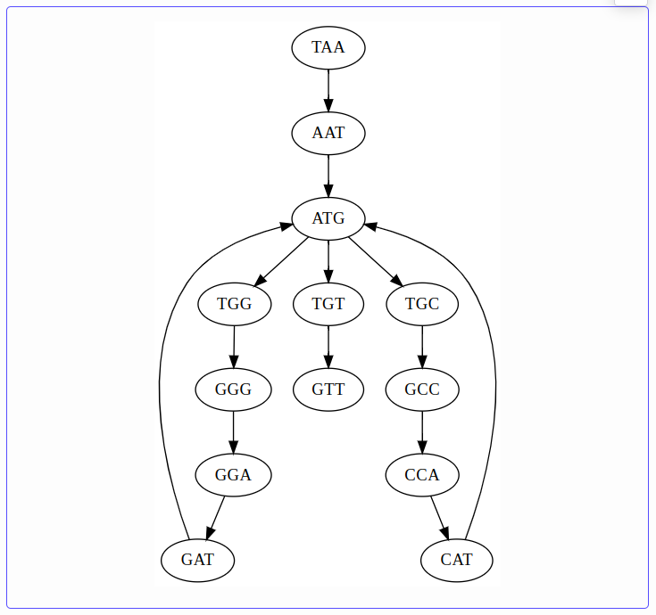
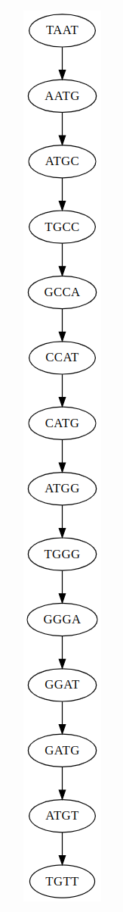
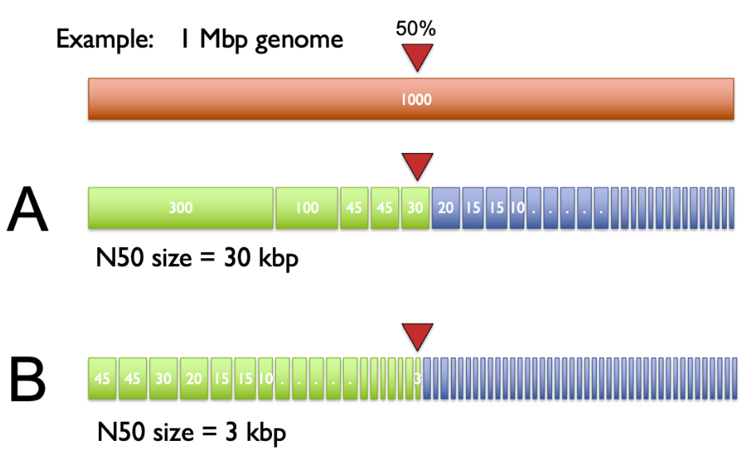

## Learning Objectives

By the end of this lecture, you will be able to:

- Explain why genome assembly is like solving a puzzle without the picture on the box
- Define k-mer composition and coverage
- State the three laws of assembly
- Construct overlap graphs and de Bruijn graphs from k-mer collections
- Distinguish Hamiltonian paths from Eulerian paths and explain why the latter are computationally tractable
- Explain how k-mer size and read length affect repeat resolution
- Define contig, scaffold, and N50

---

## 1. The Assembly Problem

Genome assembly is reconstructing a genome sequence from sequencing reads---without knowing what the answer looks like. It is analogous to assembling a jigsaw puzzle without the picture on the box [1].

Whole-genome shotgun sequencing works by copying the input DNA many times, then randomly fragmenting all copies into short pieces (reads). The term "shotgun" refers to this random fragmentation---as if the genome was blasted apart. Our task: take the resulting pile of fragments and reconstruct the original sequence.

```
                   CTAGGCCCTCAATTTTT
                 CTCTAGGCCCTCAATTTTT
               GGCTCTAGGCCCTCATTTTTT
            CTCGGCTCTAGCCCCTCATTTT
         TATCTCGACTCTAGGCCCTCA           <- Reads (Given)
         TATCTCGACTCTAGGCC
     TCTATATCTCGGCTCTAGG
 GGCGTCTATATCTCG
 GGCGTCGATATCT
 GGCGTCTATATCT
 -----------------------------------
 ???????????????????????????????????     <- Genome (Unknown)
```

---

## 2. K-mer Composition

Genomes are strings of text. Sequencing generates reads---substrings of the genome. For simplicity, assume all reads have the same length $k$. The **k-mer composition** of a genome is the collection of all its length-$k$ substrings.

For the short "genome" `TATGGGGTGC` with $k = 3$:

$$
Composition_3(\texttt{TATGGGGTGC}) = \texttt{ATG, GGG, GGG, GGT, GTG, TAT, TGC, TGG}
$$

We list k-mers in lexicographic (alphabetical) order because a sequencing machine does not produce reads in any particular order---we do not know where each read came from in the genome.

---

## 3. Assembly by Overlap

Given a scrambled collection of k-mers, we try to reconstruct the genome by **tiling** k-mers that overlap in $k-1$ nucleotides. Consider these five 3-mers:

$$
\texttt{AAT ATG GTT TAA TGT}
$$

Tiling them by their overlaps:

```
TAA
 AAT
  ATG
   TGT
    GTT
-------
TAATGTT
```

This works perfectly for simple cases. But what happens with repeats? Consider a larger 3-mer collection:

$$
\texttt{AAT ATG ATG ATG CAT CCA GAT GCC GGA GGG GTT TAA TGC TGG TGT}
$$

The 3-mer `ATG` appears **three times**. Each `ATG` can be followed by `TGC`, `TGG`, or `TGT`---we don't know which goes where. Choosing the wrong extension leads to a dead end or an incorrect assembly.

One successful tiling produces the "genome path":


---

## 4. Coverage

**Coverage** is the number of reads covering a given position in the genome. In this example:

```
TAA
 AAT
  ATG
   TGT
    GTT
-------
TAATGTT
0123456
```

Position 0 has coverage 1, position 3 has coverage 3. The **average coverage** is total bases in reads divided by genome length: $\frac{15}{7} \approx 2\times$.

A more realistic example with ~$5\times$ coverage:

```
                  CTAGGCCCTCAATTTTT
                CTCTAGGCCCTCAATTTTT
              GGCTCTAGGCCCTCATTTTTT
           CTCGGCTCTAGCCCCTCATTTT
        TATCTCGACTCTAGGCCCTCA
        TATCTCGACTCTAGGCC
    TCTATATCTCGGCTCTAGG
GGCGTCTATATCTCG
GGCGTCGATATCT
GGCGTCTATATCT
-----------------------------------
GGCGTCTATATCTCGGCTCTAGGCCCTCATTTTTT
```

Average coverage: $\frac{177}{35} \approx 5\times$.

---

## 5. The Three Laws of Assembly

### The First Law: Overlaps Imply Co-location

If the **suffix** of one read matches the **prefix** of another, the two reads may originate from overlapping positions in the genome:

```
TCTATATCTCGGCTCTAGG    <- read 1
    |||||||||||||||
    TATCTCGACTCTAGGCC  <- read 2
```

The match does not need to be perfect. Differences may arise from sequencing errors, allelic variation (in diploid organisms), or polymorphisms within a population of cells.

### The Second Law: Higher Coverage Is Better

Higher coverage means more overlaps, longer overlaps, and fewer gaps:

```
         TATCTCGACTCTAGGCCCTCA         <- Low coverage (few reads)
 -----------------------------------
 GGCGTCTATATCTCGGCTCTAGGCCCTCATTTTTT   <- Genome
 -----------------------------------
     TCTATATCTCGGCTCTAGG
 GGCGTCTATATCTCG                       <- Higher coverage (many reads)
 GGCGTCGATATCT
 ...
```

### The Third Law: Repeats Are Evil

Consider the string `a_long_long_long_time`. If we try to find the shortest superstring from its 6-mers, the greedy algorithm maximizes overlap and produces `a_long_long_time`---collapsing one repeat:


The correct path has a lower total overlap but produces the right string:



This is a fundamental problem: **repeats shorter than the read length cannot be resolved**. They produce ambiguous paths in the assembly graph.

---

## 6. Graph-Based Assembly

Finding overlaps between all reads defines a **directed graph**. Edges connect reads whose suffix matches another read's prefix. The assembly problem becomes finding a path through this graph that reconstructs the genome.

### 6.1 Overlap Graphs and Hamiltonian Paths

In an **overlap graph**, each **node** is a read and each **edge** represents an overlap between two reads. Reconstructing the genome means finding a path that visits every **node** exactly once---a **Hamiltonian path**.

For the 3-mer collection from Section 3, the overlap graph connects every pair of 3-mers that share a 2-mer overlap:



The three copies of `ATG` create ambiguity: multiple Hamiltonian paths exist, producing different genome reconstructions:




The problem: finding a Hamiltonian path is **NP-complete**---there is no efficient algorithm guaranteed to find the solution for large graphs. For a bacterial genome with millions of reads, this is computationally intractable.

### 6.2 De Bruijn Graphs and Eulerian Paths

[Nicolaas de Bruijn](https://en.wikipedia.org/wiki/Nicolaas_Govert_de_Bruijn) (1918--2012) proposed a different graph representation that transforms the problem from NP-complete to efficiently solvable.

In a **de Bruijn graph**:

- Each **edge** represents a k-mer
- Each **node** represents a (k-1)-mer (the prefix or suffix of a k-mer)
- Two k-mers are connected if the suffix of one equals the prefix of the other

For the genome `AAABBBBA` with $k = 3$:

```
3-mers: AAA, AAB, ABB, BBB, BBB, BBA

        AA → AB → BB → BA
         ↺         ↺
```

Each edge is a k-mer. Each node is a distinct (k-1)-mer:



Identical nodes are **glued together**, simplifying the graph:



Reconstructing the genome now means finding a path that visits every **edge** exactly once---an **Eulerian path**:



Unlike the Hamiltonian path problem, Euler proved in 1736 that Eulerian paths can be found efficiently.

:::{.callout-note}
## Euler's Theorem
A connected directed graph has an Eulerian path if and only if every node is **balanced** (number of incoming edges equals number of outgoing edges), with at most two exceptions (the start and end nodes). This can be checked and solved in linear time.
:::

### 6.3 The Bridges of Konigsberg

Euler's insight originated from a famous puzzle: can you walk through the city of Konigsberg (now Kaliningrad) crossing each of its seven bridges exactly once?

![The Bridges of Konigsberg. (a) A map of old Konigsberg with four land areas. (b) The bridge graph: each land area is a node, each bridge is an edge. All nodes are unbalanced, so no Eulerian path exists. From Compeau et al. (2011) [2].](../images/lecture23_konigsberg.png)

Euler proved this is impossible because all nodes in the graph have **odd degree**---an odd number of edges---so no Eulerian path exists. This was the birth of graph theory in 1736, and the same mathematics underlies modern genome assembly.

---

## 7. Overlap Graphs vs. De Bruijn Graphs

| Property | Overlap Graph | De Bruijn Graph |
|----------|--------------|-----------------|
| **Nodes represent** | Reads | (k-1)-mers |
| **Edges represent** | Overlaps between reads | k-mers |
| **Assembly = finding** | Hamiltonian path (visit every node once) | Eulerian path (visit every edge once) |
| **Computational complexity** | NP-complete | Linear time |
| **Construction** | All-vs-all pairwise comparison, O(n$^2$) | k-mer decomposition via hash tables |
| **Best for** | Long reads (ONT, PacBio) | Short reads (Illumina) |
| **Repeat handling** | Better---long reads span repeats | Sensitive to k-mer size |
| **Error tolerance** | More robust | Errors create spurious nodes/edges |

Modern short-read assemblers (SPAdes, MEGAHIT) use de Bruijn graphs. Long-read assemblers (Flye, Hifiasm) use overlap-based approaches, leveraging the fact that long reads can span most repeats directly.

Repeats also cause ambiguity in de Bruijn graphs. Without edge numbering, multiple Eulerian walks are possible:


---

## 8. K-mer Size and Repeat Resolution

The choice of $k$ is critical for de Bruijn graph assembly. Repeats shorter than $k$ are resolved; repeats longer than $k$ create ambiguous paths.

For the genome `TAATGCCATGGGATGTT` with the repeated 3-mer `ATG`:

**k = 3** --- the de Bruijn graph has multiple Eulerian paths; the repeat is unresolved:



**k = 4** --- complexity decreases, but ambiguity remains:



**k = 5** --- only one path exists; $k$ exceeds the repeat length and the assembly is unambiguous:



This is why **longer reads are so valuable**: they span repeats that short k-mers cannot resolve. Oxford Nanopore reads of 10--100 kb can span most bacterial repeats (insertion sequences ~1 kb, transposons ~5 kb, rRNA operons ~5 kb), enabling complete, single-contig assemblies.

:::{.callout-important}
## The Fundamental Trade-off
- **Larger k**: resolves more repeats but requires higher coverage (fewer k-mers per read) and is more sensitive to sequencing errors
- **Smaller k**: tolerates lower coverage and errors but collapses repeats
- Modern assemblers use **multiple k-mer sizes** simultaneously to balance this trade-off
:::

---

## 9. Assembly Quality Metrics

How do we evaluate an assembly? Three key terms:

- **Contig** --- a contiguous sequence reconstructed from overlapping reads. An assembly typically consists of multiple contigs separated by gaps.
- **Scaffold** --- an ordered set of contigs with estimated gap sizes between them. Scaffolding uses paired-end or long-read information to order and orient contigs.
- **N50** --- the length of the shortest contig such that contigs of that length or longer cover at least 50% of the total assembly. Higher N50 = more contiguous assembly.

To compute N50: sort contigs from longest to shortest, then cumulatively add their lengths. The contig that pushes the running total past 50% of the genome size is the N50.



For a bacterial genome like *S. aureus* (~2.8 Mb):

- A short-read-only assembly might produce 50--200 contigs with N50 of 50--200 kb
- A long-read assembly with Flye typically produces 1--3 contigs with N50 equal to the chromosome length (~2.8 Mb)

:::{.callout-note}
## Connecting to Your MRSA Assembly
The Flye assemblies you are running from [Lecture 22](lecture22.qmd) should ideally produce a single circular contig for the *S. aureus* chromosome (~2.8 Mb) plus separate small contigs for plasmids. We will evaluate your assembly results using these metrics in the next class.
:::

---

## 10. Modern Assemblers

The theory above translates into real tools. This section surveys the major assemblers in current use, organized by the type of data they were designed for.

### 10.1 Short-Read Assemblers

#### SPAdes

[SPAdes](https://github.com/ablab/spades) [4] builds **multi-sized de Bruijn graphs**---constructing graphs at multiple values of $k$ and merging them. This addresses the fundamental trade-off: small $k$ captures low-coverage regions while large $k$ resolves repeats. SPAdes iteratively increases $k$ and uses paired-end information (k-bimers) to bridge gaps. Originally designed for single-cell sequencing (where coverage is extremely uneven due to MDA amplification bias), SPAdes became the default short-read assembler for bacterial genomes. Variants include metaSPAdes for metagenomics and rnaSPAdes for transcriptome assembly.

![SPAdes multi-sized de Bruijn graph. (A) Standard de Bruijn graph at k=3 is tangled with many edges. (B) Same graph after gluing---h-paths of length 2 are highlighted. (C) Graph at k=4 is fragmented into 3 disconnected components. (D) The multisized de Bruijn graph DB(Reads, 3, 4) combines both, producing a graph that is neither tangled nor fragmented. From Bankevich et al. (2012) [4].](../images/lecture23_spades_algorithm.png)

#### Minia

[Minia](https://github.com/GATB/minia) [18] demonstrated that a de Bruijn graph for an entire human genome can be stored in **constant memory** (~5.7 GB) using a **Bloom filter**---a probabilistic data structure that tests set membership without storing the elements themselves. False positives (phantom k-mers not in the data) are handled by a small auxiliary "critical false positive" table. This made Minia the first assembler capable of assembling a human genome on a desktop computer. While Minia's output (unitigs/contigs) is less polished than SPAdes, its memory-efficient representation was foundational---the same Bloom filter approach influenced MEGAHIT's succinct de Bruijn graph and the broader GATB (Genome Assembly & Analysis Tool Box) library.

#### MEGAHIT

[MEGAHIT](https://github.com/voutcn/megahit) [5] uses a **succinct de Bruijn graph** (SdBG)---a compressed representation that dramatically reduces memory consumption. Like SPAdes, it iterates over multiple $k$-mer sizes. MEGAHIT assembled a 252 Gbp soil metagenome on a single compute node, making it the tool of choice for large-scale metagenome assembly on limited hardware.

---

### 10.2 Long-Read Assemblers

#### Canu

[Canu](https://github.com/marbl/canu) [6] follows the classic **Overlap-Layout-Consensus** (OLC) paradigm in three explicit stages: correct reads, trim low-quality regions, then assemble. Its key innovation is **adaptive k-mer weighting**---inspired by tf-idf from information retrieval---which downweights repetitive k-mers during overlap detection so that unique overlaps dominate.

![Canu pipeline. Three stages---Correct, Trim, Assemble---each builds overlap databases independently. From Koren et al. (2017) [6].](../images/lecture23_canu_algorithm.png)

#### Flye

[Flye](https://github.com/mikolmogorov/Flye) [3] takes a fundamentally different approach: it skips error correction entirely and instead builds a **repeat graph** directly from noisy reads. Flye first generates "disjointigs"---arbitrary concatenations of reads that traverse the genome---then identifies repeats by self-alignment and constructs a graph where edges represent unique or repetitive genomic segments. Reads are then aligned back to the graph to resolve which repeat copies connect to which unique regions.

![Flye algorithm. (a) Genome with repeats R1 and R2. (b) Reads spanning repeats. (c-d) Disjointigs are generated and concatenated. (f-i) A repeat graph is built and progressively resolved using read paths. From Kolmogorov et al. (2019) [3].](../images/lecture23_flye_algorithm.png)

This approach is an order of magnitude faster than correct-then-assemble methods like Canu. Flye is the assembler you used in [Lecture 22](lecture22.qmd) for your MRSA data.

#### Miniasm

[Miniasm](https://github.com/lh3/miniasm) [7] implements the most extreme version of OLC: **overlap and layout only, no consensus**. It takes raw overlaps from minimap and produces an assembly graph in minutes---a bacterial genome assembles in seconds. The output is unpolished (error rate matches the reads), so miniasm is typically paired with Racon or Medaka for polishing. Miniasm is used as a building block inside other tools like Unicycler and Autocycler.

#### Shasta

[Shasta](https://github.com/paoloshasta/shasta) [8] uses a modified OLC approach with **run-length encoding**---compressing homopolymers before overlap detection, which eliminates the most common Nanopore error type. Shasta assembled a complete human genome from Nanopore reads in under 6 hours on a single machine.

#### NextDenovo

[NextDenovo](https://github.com/Nextomics/NextDenovo) [9] uses a two-module **correct-then-assemble** strategy (NextCorrect + NextGraph) with a string graph approach. It achieves comparable or better results than Canu at significantly lower computational cost, making it a strong choice for large-scale long-read assembly projects.

---

### 10.3 HiFi-Specific Assemblers

PacBio HiFi reads (>99% accuracy, 10--20 kb) have spawned assemblers that exploit their low error rate.

#### Hifiasm

[Hifiasm](https://github.com/chhylp123/hifiasm) [10] builds a **phased assembly graph** that preserves haplotype information throughout the assembly process. Standard assemblers collapse heterozygous alleles; hifiasm keeps them separate. It performs haplotype-aware error correction that fixes sequencing errors while preserving true heterozygous variants, then constructs a graph where reads from the same haplotype connect to each other. With trio data (parental short reads) or Hi-C data, hifiasm produces fully phased diploid assemblies.

![Hifiasm algorithm. HiFi reads undergo haplotype-aware error correction that preserves heterozygous alleles. A phased string graph separates haplotypes, producing primary + alternate assemblies or fully phased haplotype assemblies with complementary data. From Cheng et al. (2021) [10].](../images/lecture23_hifiasm_algorithm.png)

#### LJA (La Jolla Assembler)

[LJA](https://github.com/AntonBankevich/LJA) [11] uses a **multiplex de Bruijn graph** that adapts $k$-mer size locally across the graph---using smaller $k$ in low-complexity regions and larger $k$ near repeats. LJA reduces the HiFi read error rate by three orders of magnitude before graph construction, producing five-fold fewer misassemblies than other HiFi assemblers.

---

### 10.4 Hybrid and T2T Assemblers

#### MaSuRCA

[MaSuRCA](https://github.com/alekseyzimin/masurca) [16] (Maryland Super-Read Celera Assembler) takes a unique approach to hybrid assembly: it converts short paired-end reads into **super-reads**---longer, highly accurate synthetic reads constructed by extending each read in both directions using the de Bruijn graph until a branch point is reached [17]. When long reads (PacBio or ONT) are available, MaSuRCA further combines super-reads with long reads to create **mega-reads**---long reads with short-read accuracy. The mega-reads are then assembled using a modified OLC assembler (CABOG). This approach has been particularly successful for large, repetitive plant genomes---MaSuRCA assembled the 4.3 Gb *Aegilops tauschii* (bread wheat progenitor) genome with an N50 of 487 kb.

#### Verkko

[Verkko](https://github.com/marbl/verkko) [12] combines HiFi and ONT ultra-long reads to achieve **telomere-to-telomere** (T2T) phased diploid assembly. It builds a multiplex de Bruijn graph from HiFi reads, then uses ONT ultra-long reads (>100 kb) to traverse tangles and bubbles in the graph. Haplotype markers from trio or Hi-C data separate maternal and paternal paths.

![Verkko pipeline. HiFi reads build a compressed de Bruijn graph (via MBG); ONT ultra-long reads resolve tangles (via GraphAligner); haplotype markers phase the graph (via Rukki); Canu generates consensus. From Rautiainen et al. (2023) [12].](../images/lecture23_verkko_algorithm.png)

Verkko assembled 20 of 46 diploid human chromosomes gap-free in its original publication. It is the assembler behind many of the T2T reference genomes being produced by the Human Pangenome Reference Consortium.

#### Hybracter

[Hybracter](https://github.com/gbouras13/hybracter) [13] is an automated **pipeline** (not a novel algorithm) that orchestrates Flye for long-read assembly, then polishes with short reads if available. It automatically classifies contigs as chromosome vs. plasmid and recovers small plasmids that other assemblers miss. Hybracter is designed for bacterial genomics at scale---processing hundreds of isolates with minimal user input.

---

### 10.5 Consensus Assemblers

#### Autocycler

[Autocycler](https://github.com/rrwick/Autocycler) [14] takes a **consensus meta-assembly** approach: it runs multiple assemblers (Flye, miniasm, etc.) on subsampled read sets, then builds a compacted de Bruijn graph from the resulting assemblies and derives a consensus. The key insight, demonstrated by its predecessor [Trycycler](https://github.com/rrwick/Trycycler) [15]: combining multiple assembly attempts produces lower error rates than any single assembler. Autocycler automates this process entirely (Trycycler required manual curation). Written in Rust for performance.

---

### 10.6 Summary Table

| Assembler | Algorithm | Input data | Best for |
|-----------|-----------|-----------|----------|
| **SPAdes** [4] | Multi-sized de Bruijn graph | Illumina | Bacterial/small genomes, single-cell |
| **Minia** [18] | Bloom filter de Bruijn graph | Illumina | Memory-limited, large genomes |
| **MEGAHIT** [5] | Succinct de Bruijn graph | Illumina | Metagenomes, memory-limited |
| **Canu** [6] | OLC with tf-idf weighting | ONT, PacBio | Accurate long-read assembly |
| **Flye** [3] | Repeat graph | ONT, PacBio | Fast long-read assembly, bacteria to human |
| **Miniasm** [7] | OLC (no consensus) | ONT, PacBio | Ultra-fast draft assemblies |
| **Shasta** [8] | OLC with run-length encoding | ONT | Fast Nanopore-only, large genomes |
| **NextDenovo** [9] | String graph | ONT, PacBio | Cost-effective long-read assembly |
| **Hifiasm** [10] | Phased assembly graph | PacBio HiFi | Haplotype-resolved diploid genomes |
| **LJA** [11] | Multiplex de Bruijn graph | PacBio HiFi | Lowest misassembly rate |
| **MaSuRCA** [16] | Super-reads/mega-reads + OLC | Illumina +/- ONT/PacBio | Large, repetitive genomes (plants) |
| **Verkko** [12] | Hybrid de Bruijn + OLC | HiFi + ONT UL | T2T phased diploid assembly |
| **Hybracter** [13] | Pipeline (Flye + polishing) | ONT +/- Illumina | Automated bacterial assembly |
| **Autocycler** [14] | Consensus meta-assembly | ONT | Highest-accuracy bacterial genomes |

---

:::{.callout-important}
## Summary

- Genome assembly reconstructs a genome from scrambled reads---a puzzle without the picture
- **Three laws**: overlaps imply co-location; higher coverage is better; repeats are evil
- **Overlap graphs** represent reads as nodes and overlaps as edges; assembly requires finding a Hamiltonian path (NP-complete)
- **De Bruijn graphs** represent k-mers as edges and (k-1)-mers as nodes; assembly requires finding an Eulerian path (linear time)
- Larger k resolves more repeats but needs more coverage; smaller k tolerates errors but collapses repeats
- Long reads (ONT, PacBio) span repeats that short reads cannot resolve, enabling complete assemblies
- **N50** measures assembly contiguity: the contig length at which 50% of the genome is covered
- Modern assemblers span a wide range: de Bruijn graph (SPAdes, MEGAHIT), OLC/repeat graph (Canu, Flye), phased graphs (hifiasm), and hybrid approaches (Verkko) for T2T assembly
:::

---

## References

1. [Langmead, B. Assembly & Shortest Common Superstring and De Bruijn Graph Assembly. Lecture notes, Johns Hopkins University.](http://www.langmead-lab.org/teaching-materials/)
2. [Compeau, P.E.C. et al. (2011). How to apply de Bruijn graphs to genome assembly. *Nature Biotechnology*, 29, 987--991.](https://doi.org/10.1038/nbt.2023)
3. [Kolmogorov, M. et al. (2019). Assembly of long, error-prone reads using repeat graphs. *Nature Biotechnology*, 37, 540--546.](https://doi.org/10.1038/s41587-019-0072-8)
4. [Bankevich, A. et al. (2012). SPAdes: A new genome assembly algorithm and its applications to single-cell sequencing. *Journal of Computational Biology*, 19(5), 455--477.](https://doi.org/10.1089/cmb.2012.0021)
5. [Li, D. et al. (2015). MEGAHIT: an ultra-fast single-node solution for large and complex metagenomics assembly via succinct de Bruijn graph. *Bioinformatics*, 31(10), 1674--1676.](https://doi.org/10.1093/bioinformatics/btv033)
6. [Koren, S. et al. (2017). Canu: scalable and accurate long-read assembly via adaptive k-mer weighting and repeat separation. *Genome Research*, 27(5), 722--736.](https://doi.org/10.1101/gr.215087.116)
7. [Li, H. (2016). Minimap and miniasm: fast mapping and de novo assembly for noisy long sequences. *Bioinformatics*, 32(14), 2103--2110.](https://doi.org/10.1093/bioinformatics/btw152)
8. [Shafin, K. et al. (2020). Nanopore sequencing and the Shasta toolkit enable efficient de novo assembly of eleven human genomes. *Nature Biotechnology*, 38, 1044--1053.](https://doi.org/10.1038/s41587-020-0503-6)
9. [Hu, J. et al. (2024). NextDenovo: an efficient error correction and accurate assembly tool for noisy long reads. *Genome Biology*, 25, 107.](https://doi.org/10.1186/s13059-024-03252-4)
10. [Cheng, H. et al. (2021). Haplotype-resolved de novo assembly using phased assembly graphs with hifiasm. *Nature Methods*, 18, 170--175.](https://doi.org/10.1038/s41592-020-01056-5)
11. [Bankevich, A. et al. (2022). Multiplex de Bruijn graphs enable genome assembly from long, high-fidelity reads. *Nature Biotechnology*, 40, 1075--1081.](https://doi.org/10.1038/s41587-022-01220-6)
12. [Rautiainen, M. et al. (2023). Telomere-to-telomere assembly of diploid chromosomes with Verkko. *Nature Biotechnology*, 41, 1474--1482.](https://doi.org/10.1038/s41587-023-01662-6)
13. [Bouras, G. et al. (2024). Hybracter: enabling scalable, automated, complete and accurate bacterial genome assemblies. *Microbial Genomics*, 10, 001244.](https://doi.org/10.1099/mgen.0.001244)
14. [Wick, R.R. et al. (2025). Autocycler: long-read consensus assembly for bacterial genomes. *Bioinformatics*, 41(9), btaf474.](https://doi.org/10.1093/bioinformatics/btaf474)
15. [Wick, R.R. et al. (2021). Trycycler: consensus long-read assemblies for bacterial genomes. *Genome Biology*, 22, 266.](https://doi.org/10.1186/s13059-021-02483-z)
16. [Zimin, A.V. et al. (2013). The MaSuRCA genome assembler. *Bioinformatics*, 29(21), 2669--2677.](https://doi.org/10.1093/bioinformatics/btt476)
17. [Zimin, A.V. et al. (2017). Hybrid assembly of the large and highly repetitive genome of *Aegilops tauschii*, a progenitor of bread wheat, with the MaSuRCA mega-reads algorithm. *Genome Research*, 27(5), 787--792.](https://doi.org/10.1101/gr.213405.116)
18. [Chikhi, R. & Rizk, G. (2013). Space-efficient and exact de Bruijn graph representation based on a Bloom filter. *Algorithms in Molecular Biology*, 8, 22.](https://doi.org/10.1186/1748-7188-8-22)
