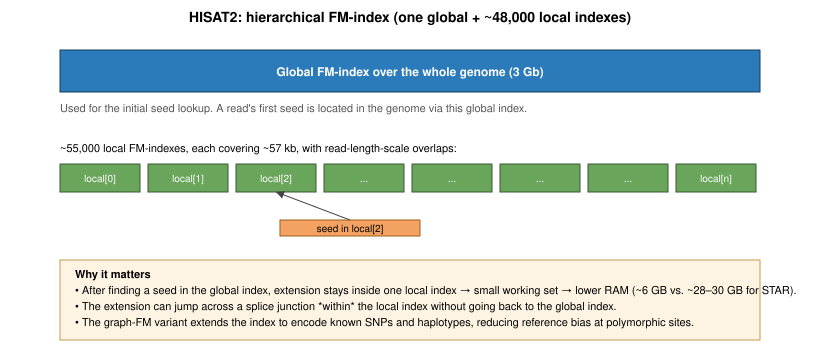
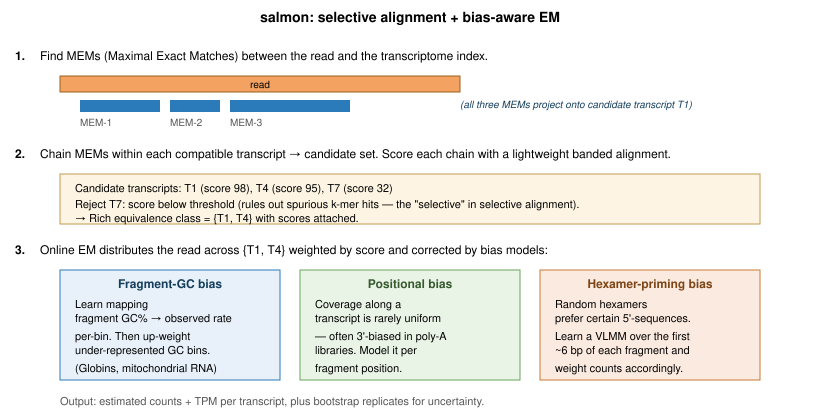

## Learning Objectives

By the end of this lecture, you will be able to:

- Explain what bulk RNA-seq measures and why it supplanted microarrays
- Describe the main library-preparation choices (rRNA depletion vs. poly-A enrichment, stranded vs. unstranded, single-end vs. paired-end)
- Identify the quality-control metrics that matter at the read, alignment, and gene-level stages
- Distinguish splice-aware alignment (`STAR`, `HISAT2`) from pseudoalignment/selective alignment (`kallisto`, `salmon`)
- Compute and compare raw counts, CPM, RPKM, FPKM, TPM, TMM, and DESeq2 size-factor--normalized counts
- Choose an appropriate expression metric for within-sample, between-sample, and differential-expression comparisons

This lecture follows the structure of the Weill Cornell *RNA-seq Analysis Course* [1] and the Conesa et al. community survey [2].

---

## 1. What RNA-seq Measures

A cell's transcriptome is the set of RNA molecules present at a given moment---their identities, their relative abundances, and their isoform structures. **Bulk RNA-seq** sequences the pooled transcriptome of a tissue or cell population and reports, for every annotated feature, an estimate of how many molecules were captured. The readout is quantitative, genome-wide, and reference-free in principle.

Bulk RNA-seq replaced microarrays over the 2008--2012 period for three reasons [3]:

- **Dynamic range**: sequencing counts span roughly five orders of magnitude; microarray fluorescence saturates at three
- **No prior probe design**: any transcript in the sample is observable, including unannotated isoforms, fusion transcripts, and non-model organisms
- **Allele- and isoform-level resolution**: short reads can be assigned to specific exons, splice junctions, and SNP-containing positions

The cost: RNA-seq is a **counting experiment with nuisance variables**. The number of reads assigned to a gene depends on the gene's true abundance, its length, the library size, the GC content, the priming bias, and dozens of smaller effects. Much of RNA-seq analysis is about separating biology from these nuisances.

::: {.callout-note}
## RNA-seq Is Not an Absolute Assay
Counts are **relative**: if one gene is 10× more abundant than another in the same library, that ratio is preserved (in expectation), but the absolute number of mRNA molecules per cell is not. Recovering absolute abundance requires spike-ins (ERCC controls) or UMI-based single-cell methods.
:::

::: {.callout-note}
## Bulk vs. Single-cell
*Bulk* RNA-seq pools transcripts from many cells (sometimes millions) and reports their average. *Single-cell* RNA-seq (scRNA-seq) resolves each cell individually, producing a sparse count matrix with cells as columns. The mathematics of quantification, normalization, and differential expression differ substantially between the two, and a dedicated scRNA-seq lecture treats them separately. Everything below is for bulk.
:::

---

## 2. From RNA to Reads: Library Preparation

### 2.1 RNA Extraction and Integrity

Total RNA is extracted from lysed cells, typically with column- or bead-based kits. **RNA integrity** is the single most consequential input-quality metric. Degraded RNA yields libraries dominated by 3' ends and inflates the apparent expression of short transcripts.

Integrity is assessed on a Bioanalyzer or TapeStation and reported as an **RNA Integrity Number (RIN)** on a 1--10 scale [4]:

- RIN ≥ 7: generally acceptable for differential-expression experiments
- RIN 5--7: usable with caution (3' bias detectable); include RIN as a covariate
- RIN < 5: expect systematic artifacts; use rRNA depletion rather than poly-A selection

### 2.2 Selection: Poly-A vs. rRNA Depletion

Ribosomal RNA (rRNA) accounts for ~80--90% of total cellular RNA. Sequencing it is almost always wasteful, so libraries are enriched for mRNA using one of two strategies:

| Strategy | Mechanism | Captures | Misses |
|----------|-----------|----------|--------|
| **Poly-A selection** | Oligo-dT beads capture polyadenylated transcripts | Mature mRNA | Histone mRNAs, many lncRNAs, pre-mRNA, prokaryotic RNA |
| **rRNA depletion** | Probes hybridize to rRNA; unbound fraction is kept (Ribo-Zero, RiboMinus) | Everything non-rRNA | Nothing in particular |

Poly-A selection is cheaper and cleaner but biases against degraded RNA (3' fragments lose their tails) and non-polyadenylated species. rRNA depletion is required for prokaryotes, formalin-fixed tissue, and any experiment targeting lncRNAs or nascent transcription.

### 2.3 Fragmentation, cDNA Synthesis, and Adapters

The enriched RNA is fragmented (heat + divalent cations, or enzymatically) to the size range the sequencer can read---typically 200--400 nt. Fragments are reverse-transcribed to cDNA using random hexamer primers. A second strand is synthesized, ends are repaired, A-tails are added, and sequencing adapters are ligated.

### 2.4 Strand-Specificity

Unstranded protocols lose track of which strand the original RNA came from. **Stranded protocols** preserve this information by marking the second-strand synthesis---most commonly via dUTP incorporation, where the second strand is digested before amplification (the Illumina TruSeq Stranded and NEBNext Ultra II Directional kits both use this chemistry).

Strand-specificity matters when:

- Annotating antisense transcripts
- Quantifying genes on opposite strands that overlap
- Discovering novel intergenic transcripts where orientation is diagnostic

Downstream tools (`featureCounts`, `HTSeq-count`, `salmon`) need the library's strand orientation as an argument. Misspecifying it silently halves or doubles counts.

### 2.5 PCR Amplification, Duplicates, and UMIs

A limited number of PCR cycles amplify the ligated library. PCR creates **optical and amplification duplicates**---reads with identical start coordinates that are often treated as a single molecule during deduplication. In bulk RNA-seq, coordinate-based duplicate removal is controversial: highly expressed genes genuinely produce many reads starting at the same position, and `picard MarkDuplicates` will flag them as duplicates. The common compromise is to *report* duplication rate as a QC metric but *not* remove duplicates before counting [2].

**Unique Molecular Identifiers (UMIs)** resolve the ambiguity. A UMI is a short (8--12 nt) random barcode ligated to each molecule *before* PCR. Two reads that share both a start coordinate *and* the same UMI came from one pre-PCR molecule; two reads that share a start coordinate but have different UMIs were genuinely distinct molecules. Tools such as `UMI-tools` [29] and `fastp`'s `--umi` mode collapse reads by UMI after alignment, recovering accurate molecule counts. UMIs are standard in the Lexogen QuantSeq, NEBNext Ultra II with UMI adapters, and TruSeq UMI kits; for bulk RNA-seq they are optional but strongly recommended whenever PCR-duplicate-related bias could mask the biology (low-input libraries, long-term storage studies, rare-transcript detection).

### 2.6 Single-End vs. Paired-End

Paired-end sequencing reads both ends of each fragment. For RNA-seq it is almost always preferable:

- Splice junctions are detected more reliably when one mate spans the junction and the other anchors in an exon
- Multi-mappers resolve better with two reads than one
- Fragment length is measurable (important for FPKM and for transcript-level quantification)

Single-end is acceptable for simple differential-expression experiments where gene-level counts suffice and cost is constrained.

---

## 3. Quality Control

QC happens at three stages and the questions differ at each.

### 3.1 Read-Level QC --- `FastQC` and `MultiQC`

`FastQC` [5] summarizes per-sample read quality. The indicators that matter for RNA-seq:

- **Per-base quality**: expected drop at the end; anything flat below Q30 is a flag
- **Per-base sequence content**: random hexamer priming causes a *characteristic* non-uniform pattern in the first ~12 bases---this is normal for RNA-seq and not a trimming target
- **Overrepresented sequences**: adapter contamination, residual rRNA, or a dominant transcript (globin, actin)
- **Sequence duplication level**: high in RNA-seq by design; report but do not over-interpret

`MultiQC` [6] aggregates per-sample reports into a project-wide dashboard. For a 12-sample experiment you read one HTML file, not twelve.

Light adapter and quality trimming with `fastp` [7] or `Trim Galore` is standard. Aggressive trimming hurts more than it helps: modern aligners soft-clip adapter remnants automatically.

### 3.2 Alignment-Level QC

After mapping, three metrics summarize library quality:

- **Mapping rate**: >80% of reads mapping to the genome is typical for a clean human/mouse library; <60% suggests contamination or wrong reference
- **Exonic fraction**: fraction of mapped bases landing in annotated exons; should be 70--90% for poly-A libraries
- **Gene-body coverage**: uniform 5'→3' coverage indicates intact RNA; a 3' spike indicates degradation; a 5' spike can indicate DNA contamination

Tools: `Picard CollectRnaSeqMetrics`, `QoRTs` [8], `RSeQC` [9].

### 3.3 Feature-Level QC

At the count-matrix stage:

- **Library-size distribution**: order-of-magnitude differences between samples are a batch-effect red flag
- **Sample-sample correlation**: within-group Pearson correlations on log-CPM values should exceed 0.9 for replicates of the same condition
- **PCA on the variance-stabilized matrix**: replicates should cluster; unexpected clustering usually indicates a confounding batch variable

---

## 4. Read Alignment

Bulk RNA-seq reads come from mature (spliced) mRNA but are usually aligned to the (unspliced) genome. The alignment has to cope with a physical gap between the genomic location of a read's 5' portion and the location of its 3' portion---the intervening intron, which may be hundreds or hundreds of thousands of bases long.

{width=100%}

Roughly a third of reads in a typical Illumina mRNA-seq library span at least one exon-exon junction [2]. A DNA aligner (`BWA`, `Bowtie2`) would either soft-clip these reads, discard them, or place them to the wrong location (an intronless pseudogene or a paralog). Splice-aware aligners solve the problem in one of two broad families: **whole-genome splice-aware alignment** (`STAR`, `HISAT2`), which produces full genomic coordinates, and **pseudoalignment / selective alignment** (`kallisto`, `salmon`), which skips coordinates and reports transcript-level counts directly.

### 4.1 Splice-Aware Alignment to the Genome

#### 4.1.1 STAR: Maximal Mappable Prefix search

**STAR** [10] is the dominant short-read RNA-seq aligner. Its central idea is the **Maximal Mappable Prefix (MMP)**: at a given position in the read, the longest prefix of the remaining sequence that *matches* somewhere in the genome. STAR computes MMPs over a **sparse** (decimated) suffix array of the genome---large (~28 GB RAM for human at default density) but fast, because the stride decimation trades memory for constant-factor work per lookup.

The alignment proceeds in four conceptual steps:

1. **Seed with an MMP.** Starting at position 1 of the read, find the longest prefix that matches the genome. The prefix may match uniquely or at several positions; all matches become candidate **anchors** on the genome
2. **MMP terminates at a junction (or a mismatch).** The MMP stops when the next base in the read cannot extend any of the current matches. In RNA-seq, the usual reason is that the read has crossed a splice junction---the next base comes from a different exon, which in the genome lies thousands of bases further along (across an intron)
3. **Restart MMP past the anchor.** STAR begins a new MMP search starting just after the previous anchor ended, finding a second anchor in a different exon
4. **Stitch anchors into a splice alignment.** STAR joins consecutive anchors by searching the intervening genomic interval for canonical splice boundaries---GT-AG (most introns), GC-AG, and AT-AC (minor spliceosome). A scoring function (anchor length, number of mismatches, junction motif) picks the best stitching. The result is encoded in the CIGAR as `xM yN zM`, where `N` is the intron

{width=100%}

A practical detail: if one anchor is short (say, only 6--10 bp spilling over the junction), STAR may not confidently identify it. The **two-pass mode** solves this: pass 1 collects all junctions that any read confidently spanned; pass 2 re-aligns the library with those junctions appended to the index, so short anchors get matched against a *known* junction rather than needing to be discovered from scratch. Two-pass has two flavors---`Basic` mode is per-sample; a *multi-sample* two-pass collects junctions across all samples before rebuilding the index, which is standard for consortium-scale projects. Two-pass is the recommended mode whenever junction sensitivity matters (isoform-level analysis, fusion detection, novel-transcript discovery).

STAR also handles:

- **Known annotations** supplied as GTF at index build time, injected as *sjdb* (splice-junction database) entries
- **Chimeric reads** (fusions, backsplices): emitted to a separate file when an anchor pair cannot be stitched within one chromosome or within a reasonable distance
- **Multi-mappers**: reported up to a user-set limit with the `NH` tag, each with a fractional alignment score (`AS`) that downstream counters can use

#### 4.1.2 HISAT2: a hierarchical graph FM-index

**HISAT2** [11] solves the same problem with a very different data structure. Instead of a suffix array, HISAT2 uses an **FM-index**---the compressed full-text index behind Bowtie2 and BWA---extended by two *separable* innovations:

- **Hierarchical indexing (HFM).** One *global* FM-index covers the full genome; in addition, ~55,000 *local* FM-indexes each cover ~57 kb of the genome, with overlaps sized to accommodate the longest expected read. A read's seed is located via the global index; extension (including across splice junctions) happens inside one or a few local indexes. This was already the innovation in the original HISAT
- **Graph FM-index (GFM).** HISAT2 adds a second layer: the FM-index is built over a *graph* that encodes common SNPs and short haplotypes from a variation database (e.g., dbSNP, 1000 Genomes), reducing reference bias at polymorphic sites

{width=100%}

The consequence is memory footprint: ~6 GB of RAM for the human graph index (or ~4 GB for the plain hierarchical index without variants) versus ~28--30 GB for STAR. The trade-off is that HISAT2 is somewhat less sensitive at noncanonical junctions and at low-expressed isoforms, and its default output includes fewer reported multi-mapper alignments.

#### 4.1.3 What comes out: BAM, CIGAR, and strand tags

Both STAR and HISAT2 produce coordinate-sorted BAM files with:

- A `N` operator in the CIGAR marking the intron for each junction-spanning read
- An `XS` tag on each junction-spanning read indicating the inferred transcript strand (`+` or `-`, from the GT-AG orientation)
- Optional `NH` and `HI` tags enumerating multi-mapping alternatives

Downstream counters (`featureCounts`, `HTSeq`) use the coordinates directly; the `XS` tag is required for stranded-library quantification of overlapping genes.

### 4.2 Pseudoalignment and Selective Alignment

For gene- and transcript-level *quantification*, coordinate-level alignment is more work than necessary. We do not need the exact BAM position; we need to know which *transcripts* each read is compatible with, and the total count per transcript. Pseudoaligners exploit this to be 10--100× faster than STAR while producing DE-equivalent results [15].

#### 4.2.1 kallisto: the transcriptome de Bruijn graph

**kallisto** [12] indexes the *transcriptome* (not the genome) as a colored **de Bruijn graph**:

- Every k-mer that appears in any transcript becomes a node
- Edges link k-mers that overlap by k−1 bases, as in any DBG
- Each node carries a **color set**: the set of transcripts whose sequence contains that k-mer

The coloring is the key to quantification. Two different isoforms of the same gene share many k-mers (identical exons) but differ at isoform-specific k-mers (alternative exons, alternative UTRs). In the DBG, these appear as **bubbles**: a shared path splits into transcript-specific branches and merges again.

{width=100%}

For each read, kallisto:

1. Looks up its k-mers in the T-DBG through an efficient k-mer hash table
2. Follows the path through the DBG and collects the color set at each node
3. Intersects the color sets → the read's **equivalence class**, i.e., the set of transcripts compatible with the read's k-mer content
4. Increments the count for that equivalence class

The critical observation: kallisto does *not* compute a base-level alignment, does *not* record genomic coordinates, does *not* store mismatches. Two reads that differ by a single SNP but share the same k-mer skeleton land in the same equivalence class. This is why it is called *pseudo*alignment.

After processing all reads, many equivalence classes contain more than one transcript (e.g., a read that hits only shared-exon k-mers of a gene with two isoforms). kallisto runs **expectation-maximization** on the equivalence-class counts:

- E-step: given current transcript abundances $\alpha_t$ and effective lengths $\tilde{L}_t$, fractionally assign each equivalence class across its member transcripts proportional to $\alpha_t / \tilde{L}_t$ (effective length in the denominator, so longer transcripts do not artificially win the tug-of-war)
- M-step: re-estimate each transcript's abundance as the sum of its fractional assignments

EM converges in seconds for a human-scale transcriptome and produces `est_counts` (estimated reads per transcript) and TPM per transcript.

#### 4.2.2 salmon: selective alignment with bias correction

**salmon** [13] started as a kallisto-like pseudoaligner but evolved into **selective alignment**: it does compute a lightweight alignment score per candidate transcript, just not a full coordinate-level BAM. The procedure:

1. **Find MEMs** (Maximal Exact Matches) between the read and the transcriptome. A suffix-array--based structure returns every transcript that shares a reasonably long exact substring with the read
2. **Chain MEMs** within each candidate transcript and score the chain with a fast banded alignment (limited-gap, limited-mismatch). This is the "selective" step---it *rejects* transcripts whose best MEM chain fails the alignment score threshold, eliminating the spurious candidates that pure k-mer lookup would include (e.g., processed pseudogenes with most but not all k-mers in common with the parent gene)
3. **Emit a rich equivalence class**: the surviving candidates and their alignment scores
4. **Online EM** distributes the read across candidates weighted by score, correcting for three learned biases

{width=100%}

The three bias models are the practical reason salmon is preferred over kallisto for reference-quality quantification:

- **Fragment-GC bias** [28]. PCR amplification favors fragments in a certain GC range; the preferred range depends on the thermocycler, enzyme, and cycles. Salmon learns the observed-vs-expected fragment count per GC bin and up-weights under-sampled bins. Correcting fragment-GC bias changes gene-level counts by 5--50% for GC-extreme genes (globins, many mitochondrial genes, olfactory receptors) and materially affects DE calls
- **Positional bias**. Coverage along a transcript is rarely uniform. Poly-A libraries tend to be 3'-biased (especially with partially degraded RNA); rRNA-depletion libraries can have a 5' bump. Salmon fits a spline to the observed coverage profile per fragment length
- **Sequence-specific priming bias**. Random hexamer priming does not produce uniform fragment starts; certain 5'-sequences are strongly preferred. Salmon learns a variable-length Markov model (VLMM) over the first ~6 bp of each fragment and corrects accordingly

Salmon also performs **bootstrap resampling** to estimate the uncertainty of transcript-level abundances---essential for downstream differential *transcript* usage analysis (`swish`, `IsoformSwitchAnalyzeR`).

#### 4.2.3 When pseudoalignment is not enough

The speed and the EM-corrected quantification are compelling, but pseudoalignment gives up three capabilities:

- **Genomic coordinates**: no BAM, no IGV tracks. Without coordinates you cannot run GATK-style variant calling or RNA-editing detection, and the same applies to any downstream tool that consumes sorted BAMs (`rMATS`, `DEXSeq`'s exonic counting, coverage-based QC)
- **Novel-isoform and novel-transcript discovery**: a transcript must be in the reference FASTA to be quantified
- **Fusion detection**: a fusion produces k-mers from two genes that do not belong to any single reference transcript

::: {.callout-note}
## A reasonable default
For standard differential-expression experiments in well-annotated organisms, `salmon` → `tximport` → `DESeq2` is the fastest and most accurate pipeline [13,14]. Switch to `STAR` → `featureCounts` when you need coordinates, or `STAR-Fusion` / `arriba` for fusion callers, or `RSEM` when a reviewer insists on it.
:::

---

## 5. Quantification

**Quantification** converts alignments or pseudoalignments into a matrix where rows are genes (or transcripts) and columns are samples.

### 5.1 Gene-Level Counting: `featureCounts` and `HTSeq-count`

`featureCounts` [16] takes a BAM and a GTF annotation, and for each read decides which gene it overlaps. The key decisions:

- **Gene vs. exon counting**: counting reads at the gene level (summing over all exons) is standard for differential expression; exon-level counting is used for alternative-splicing analysis
- **Multi-overlap handling**: a read overlapping two genes can be assigned to both, neither (`HTSeq` default), or the one with greater overlap
- **Multi-mapping reads**: by default discarded; can be fractionally assigned with `-M --fraction`
- **Strand mode**: `0` (unstranded), `1` (forward-stranded), `2` (reverse-stranded, the dUTP default)

`HTSeq-count` [17] is the original implementation and still the reference for DESeq2's `union`/`intersection-strict` modes. `featureCounts` is roughly 20× faster and the modern default.

### 5.2 Transcript-Level Quantification

Transcript-level quantification is harder because short reads are usually compatible with multiple isoforms of the same gene. `salmon` and `kallisto` solve an EM problem: given each read's set of compatible transcripts, estimate the transcript abundances that maximize the likelihood of the observed reads. The output is a table of **estimated counts** and **TPM** (below) per transcript.

For gene-level differential expression, transcript estimates are aggregated to gene-level with `tximport` [14], which also generates per-gene offsets that correct for average-transcript-length differences between samples---the correct way to combine transcript-level quantification with gene-level DE tools.

### 5.3 Annotation Choice: Ensembl / GENCODE / RefSeq

Quantification is only as good as the annotation used. Three references dominate:

- **Ensembl / GENCODE** (same underlying gene models for human and mouse): the most comprehensive, includes computationally predicted transcripts and many pseudogenes; the default for most RNA-seq pipelines
- **RefSeq** (NCBI): more curated, fewer isoforms per gene; common in clinical and regulatory contexts
- **UCSC knownGene**: historical; not recommended for new work

Switching annotations changes gene-level counts by 5--20% for thousands of genes and will make a downstream DE result look different. Two rules: (i) fix the annotation early and stick with it across all samples in a project; (ii) record the exact release (e.g., `GENCODE v45`, `Ensembl 110`, `RefSeq GRCh38.p14`) in the methods section.

---

## 6. Expression Quantification Metrics

This section is the heart of bulk RNA-seq analysis. A dozen metrics circulate in the literature, they are not interchangeable, and choosing the wrong one produces misleading plots, papers, and conclusions. We build them up from raw counts.

### 6.1 Setup and Notation

Let:

- $N_{g,s}$ = number of reads assigned to gene $g$ in sample $s$ (**raw count**)
- $L_g$ = effective length of gene $g$, in **bases** (see 6.4)
- $T_s = \sum_g N_{g,s}$ = total reads assigned to features in sample $s$ (**library size**)

We want answers to two distinct questions:

1. *Within a sample*, which genes are expressed most highly? → metric must correct for gene length
2. *Between samples*, is gene $g$ differentially expressed? → metric must correct for library size *and* for compositional differences

No single metric does both well. The historical confusion is from using within-sample metrics (RPKM, FPKM, TPM) for between-sample comparisons.

### 6.2 Raw Counts

$$N_{g,s}$$

The unnormalized count. Raw counts are the *only* input to the canonical differential-expression tools: **DESeq2** [18], **edgeR** [19], and **limma-voom** [20] all model raw counts with a statistical approach that handles library size and dispersion internally.

- **Correct for**: neither gene length nor library size
- **Use for**: input to DE tools; nothing else

### 6.3 CPM --- Counts Per Million

$$\text{CPM}_{g,s} = \frac{N_{g,s}}{T_s} \times 10^6$$

Just scales each sample so library sizes are comparable. Commonly log-transformed as **log-CPM** ($\log_2(\text{CPM} + \text{prior})$) for visualization.

- **Corrects for**: library size
- **Does not correct for**: gene length, compositional effects
- **Use for**: within-sample filtering (e.g., "keep genes with CPM > 1 in ≥3 samples"), heatmaps, PCA
- **Do not use for**: comparing expression *between genes of different length* in the same sample

### 6.4 Effective Gene Length

A technical point before RPKM/FPKM/TPM. The "length" of a gene is ambiguous---a gene may have multiple isoforms of different lengths. Common definitions:

- **Maximum transcript length**: length of the longest isoform
- **Union length**: total length of the union of all exons
- **Mean/median transcript length**: averaged across isoforms
- **Effective length**: $L_g - \mu_{fragment} + 1$, where $\mu_{fragment}$ is the mean fragment length. Accounts for the fact that fragments of length $\mu_{fragment}$ cannot start within the last $\mu_{fragment}$ bases of the transcript. Used by `salmon`/`kallisto`.

Mismatches between the length definitions produce spurious 10--30% discrepancies between tools. Always check which definition your pipeline uses.

### 6.5 RPKM --- Reads Per Kilobase per Million

With $L_g$ in bases:

$$\text{RPKM}_{g,s} = \frac{N_{g,s}}{(L_g/1000)\,(T_s/10^6)} = \frac{N_{g,s} \cdot 10^9}{L_g \cdot T_s}$$

Introduced by Mortazavi et al. [3] in one of the first RNA-seq papers. Corrects for both gene length and library size---a single-end metric.

- **Corrects for**: gene length, library size
- **Does not correct for**: compositional effects
- **Use for**: intuition about within-sample relative abundance (historical)
- **Do not use for**: between-sample comparisons, because RPKM values do not sum to the same total across samples (see 6.8)

### 6.6 FPKM --- Fragments Per Kilobase per Million

$$\text{FPKM}_{g,s} = \frac{F_{g,s} \cdot 10^9}{L_g \cdot T_s}$$

Identical to RPKM but counts **fragments** (read pairs) instead of reads. For paired-end data, a fragment = a pair of reads from the same original molecule, so FPKM avoids double-counting the two mates of the same fragment.

- **Use for**: same contexts as RPKM, on paired-end data. Modern paired-end pipelines count fragments by default, so in practice "RPKM" and "FPKM" from these pipelines are numerically identical---the distinction matters mainly for legacy pipelines that genuinely counted single reads on paired-end data

### 6.7 TPM --- Transcripts Per Million

$$\text{TPM}_{g,s} = \frac{N_{g,s}/L_g}{\sum_{g'} N_{g',s}/L_{g'}} \times 10^6$$

Introduced by Li and Dewey [21] and popularized by Wagner et al. [22]. The operations are performed in the *opposite order* from RPKM (with $L_g$ in bases, the $1/1000$ factor cancels in numerator and denominator, so the formula above is the clean "bases" form):

1. Divide counts by gene length (get **reads per kilobase**, RPK)
2. Sum RPK across all genes in the sample to get a per-sample scaling factor
3. Scale each RPK by that factor × $10^6$

This order matters: **TPM values sum to exactly $10^6$ in every sample by construction**; RPKM values do not.

Intuition: TPM of gene $g$ in sample $s$ is the number of transcripts of gene $g$ you would expect to find if you pooled one million transcripts from that sample.

- **Corrects for**: gene length, library size
- **Does not correct for**: compositional effects (see 6.8)
- **Use for**: within-sample comparisons, heatmaps of transcript abundance
- **Do not use for**: differential-expression calling without further normalization

::: {.callout-note}
## Why TPM Replaced RPKM
The sum of RPKM across genes differs between samples whenever expression profiles differ---so the same RPKM value in samples A and B does not mean the same thing. TPM fixes this: the "per million" is million *transcripts*, and the construction guarantees equal totals per sample. This makes cross-sample ratios more meaningful (though still not sufficient for DE testing).
:::

### 6.8 The Compositional Problem

::: {.callout-warning}
## The single most common RNA-seq mistake
Using a within-sample metric (CPM, TPM, RPKM, FPKM) to call differential expression in the presence of a dominantly expressed gene. The compositional effect below is why DE tools refuse to take these as input.
:::

None of CPM, RPKM, FPKM, or TPM fix the core issue with between-sample comparisons. Consider two samples where one has a single highly induced gene---say, a stress-response transcript at 30% of the library in sample B, versus 1% in sample A. To make the effect concrete, imagine a "HouseGene" that is biologically unchanged across the two samples at 1,000 real transcripts each:

| Gene | Sample A (counts) | Sample B (counts) | CPM in A | CPM in B |
|------|------------------:|------------------:|---------:|---------:|
| StressGene | 10,000 | 3,000,000 | 10,000 | 300,000 |
| HouseGene (biologically unchanged) | 1,000 | 1,000 | 1,000 | **100** |
| All other genes | 989,000 | 6,999,000 | 989,000 | 699,900 |
| **Library total** | 1,000,000 | 10,000,000 | $10^6$ | $10^6$ |

`HouseGene` has the *same* count in both samples---biologically unchanged---but its CPM drops from 1,000 in sample A to 100 in sample B, a tenfold apparent decrease. The cause is entirely compositional: `StressGene` is eating library capacity and squeezing every other gene's CPM value downward. Every TPM/RPKM/FPKM value suffers the same distortion. This is the **compositional effect**, and it is why CPM/TPM cannot detect differential expression in the presence of a few dominant transcripts. TMM (§6.9) and DESeq2 size factors (§6.10) were specifically designed to correct it.

### 6.9 TMM --- Trimmed Mean of M-values

Robinson and Oshlack's TMM [23] (the default in `edgeR`) computes a scaling factor per sample as follows:

1. Pick a reference sample (by default, the one whose upper-quartile CPM is closest to the mean)
2. For every gene, compute $M_g = \log_2(\text{CPM}_{g, \text{test}} / \text{CPM}_{g, \text{ref}})$ and $A_g = \frac{1}{2}\log_2(\text{CPM}_{g, \text{test}} \cdot \text{CPM}_{g, \text{ref}})$
3. Trim the top 30% and bottom 30% of $M$ values and the top/bottom 5% of $A$ values
4. The sample's scaling factor is the weighted mean of the remaining $M$ values

The trimming removes genes that are differentially expressed (the extremes of $M$) and genes with very low expression (the extremes of $A$). What remains should be *compositionally stable* genes, which define the normalization baseline.

- **Corrects for**: library size *and* composition
- **Use for**: between-sample CPM comparisons when you suspect compositional differences; default in `edgeR`

### 6.10 DESeq2 Size Factors (Median-of-Ratios)

Anders and Huber's size factors [24] (used by DESeq2) take a similar approach via a geometric-mean pseudo-reference:

1. For each gene, compute a **geometric mean** across all samples---the pseudo-reference. Genes with a zero count in any sample get a geometric mean of zero and are silently **excluded** from the calculation
2. For each sample, divide every gene's count by its pseudo-reference → ratios (over the non-excluded genes)
3. The sample's **size factor** is the **median** of these ratios

Dividing raw counts by the size factor yields normalized counts that are directly comparable across samples---again, assuming most genes are not differentially expressed. (The zero-exclusion step is why very sparse data, especially single-cell, needs the `poscounts` or `iterative` size-factor variants rather than the classical median-of-ratios.)

- **Corrects for**: library size and composition
- **Use for**: implicit input to DESeq2; `counts(dds, normalized=TRUE)` for visualization

### 6.11 Variance-Stabilizing Transformations: VST and rlog

Raw and size-factor-normalized counts are heteroscedastic: variance grows with the mean. For distance-based plots (clustering, PCA), this is a problem---high-count genes dominate.

- **VST** (`vst()` in DESeq2): a fast, data-driven transformation that approximates $\log_2$ for high counts and flattens variance at low counts
- **rlog** (`rlog()` in DESeq2): a slower Bayesian-shrinkage transformation that produces similar output; preferred for small sample sizes (n < ~30)

Both return a **variance-stabilized matrix** on the $\log_2$ scale, suitable for PCA, heatmaps, and sample-distance calculations---but *not* as input to DE testing (which needs raw counts).

### 6.12 Comparison Table

| Metric | Formula (sketch) | Corrects for length? | Corrects for library size? | Corrects for composition? | Use for |
|--------|-----------------|:---:|:---:|:---:|---------|
| Raw count | $N_{g,s}$ | ✗ | ✗ | ✗ | Input to DESeq2/edgeR/limma |
| CPM | $N_{g,s}/T_s \cdot 10^6$ | ✗ | ✓ | ✗ | Filtering, visualization |
| RPKM | $N_{g,s}\cdot 10^9/(L_g T_s)$ | ✓ | ✓ | ✗ | Within-sample (legacy) |
| FPKM | $F_{g,s}\cdot 10^9/(L_g T_s)$ | ✓ | ✓ | ✗ | Within-sample (paired-end legacy) |
| TPM | length-normalize, then rescale | ✓ | ✓ | ✗ | Within-sample comparisons |
| TMM-CPM | CPM × TMM factor | ✗ | ✓ | ✓ | edgeR normalization |
| DESeq2-normalized | counts / size factor | ✗ | ✓ | ✓ | DESeq2 visualization |
| VST / rlog | variance-stabilized log | ✗ | ✓ | ✓ | PCA, clustering, heatmaps |

### 6.13 Which Metric When?

A decision tree:

- **Running differential expression?** Use raw counts with DESeq2/edgeR/limma-voom. The tool handles normalization internally.
- **Clustering samples / PCA / heatmap of samples?** Use VST or rlog on a DESeq2 dataset, or log-CPM with TMM normalization in edgeR/limma.
- **Showing the relative abundance of genes within one sample?** Use TPM.
- **Comparing the expression of one gene across conditions in a figure?** Use normalized counts (DESeq2 size-factor-normalized or TMM-CPM), often plotted on a $\log_2$ scale. Do *not* use raw TPM for this---composition will bite you.
- **Reporting expression in a supplementary table?** TPM is the community standard; also include raw counts so others can re-normalize.

### 6.14 A Warning: Length Bias in Downstream Enrichment

One subtle consequence of read-counting is that **longer genes have a higher probability of being called significantly differentially expressed** at a given fold change, simply because they accumulate more reads and thus have smaller standard errors [30]. Standard GO / pathway enrichment tools assume every gene is equally likely to be in the DE list, so GO categories enriched for long genes (many signaling genes, transcription factors) appear falsely overrepresented. Tools like `goseq` [30] correct for this by modeling each gene's DE probability as a function of its length. Always use a length-aware enrichment tool on RNA-seq DE lists.

---

## 7. Batch Effects and Confounders

Batch effects---systematic differences introduced by technical variables (sequencing lane, library-prep date, reagent lot, flowcell)---can easily dwarf the biological signal [25].

Best practices:

- **Randomize** samples across batches at the bench (balance conditions across library-prep days and flowcells)
- **Record** every technical covariate you can: date, operator, kit lot, machine, lane
- **Diagnose** with PCA on VST-transformed counts, coloring points by biological *and* technical covariates
- **Correct** either by including batch as a covariate in the DE model (`~ batch + condition`), or using `sva` [26] / `RUVSeq` [27] if the batch is unmeasured

You cannot separate a batch effect that is **confounded** with the biological condition (e.g., all treated samples processed on Monday, all controls on Tuesday). The experimental design matters more than any downstream tool.

---

## 8. Differential Expression (Preview)

Given a normalized count matrix and a design matrix, DE tools test whether the mean expression of each gene differs between conditions. A high-level sketch:

- **DESeq2** [18] models counts with a negative binomial distribution, shrinks dispersion estimates across genes, and reports $\log_2$ fold changes with shrinkage priors
- **edgeR** [19] uses a similar negative-binomial GLM with empirical-Bayes moderation of dispersion
- **limma-voom** [20] transforms counts to log-CPM with precision weights and applies the linear-model machinery from microarrays

All three produce per-gene $p$-values adjusted for multiple testing (typically Benjamini-Hochberg). All three want raw counts as input.

#### Why dispersion matters

In a Gaussian DE test, each gene's variance is directly estimated from replicates. RNA-seq counts follow a **negative binomial** rather than Gaussian distribution, with a *dispersion* parameter $\phi$ capturing the biological variability on top of the Poisson sampling noise. Estimating $\phi$ from $n=3$ replicates is statistically hopeless per-gene. The central innovation of DESeq2 and edgeR is **empirical Bayes dispersion shrinkage**: fit a smooth trend of dispersion vs. mean expression across *all* genes, then shrink each gene's per-gene dispersion estimate toward that trend. The shrunk estimate is what the test actually uses. Without this shrinkage, low-expression genes would produce huge p-value noise; with it, well-estimated genes keep their own dispersion, while undersampled genes borrow strength from their neighbors.

Benchmarks disagree on which tool is "best" at $n=3$ [2]---the answer depends on noise model assumptions, effect-size distributions, and how the benchmark defines truth. A reasonable heuristic: use DESeq2 or edgeR for small $n$; limma-voom scales better to large $n$ and is computationally lighter.

DE analysis as a topic deserves its own lecture; here we only note that the normalization choices in Section 6 are *already decided by the tool you pick*---raw counts in, normalized log-fold changes out.

---

## 9. Summary

| Stage | Key decision | Main tools |
|-------|--------------|------------|
| Library prep | Poly-A vs. rRNA depletion; stranded vs. unstranded | Illumina TruSeq, NEB Ultra II |
| QC (reads) | Trimming, contamination | `FastQC`, `fastp`, `MultiQC` |
| Alignment | Genome (splice-aware) vs. transcriptome (pseudo) | `STAR`, `HISAT2`, `salmon`, `kallisto` |
| QC (alignment) | Mapping rate, exonic fraction, 5'→3' coverage | `Picard`, `QoRTs`, `RSeQC` |
| Quantification | Gene vs. transcript; multi-mapper policy | `featureCounts`, `salmon`, `tximport` |
| Normalization | Library size + composition | TMM (edgeR), size factors (DESeq2) |
| DE testing | Design, dispersion model | `DESeq2`, `edgeR`, `limma-voom` |

The single most important idea: **use raw counts as input to DE tools; use TPM for within-sample intuition; use VST/rlog for sample-level visualization; never mix these roles.**

---

## References

1. Wright Core Facility, Weill Cornell Medicine. RNA-seq Analysis Course. [https://chagall.weill.cornell.edu/RNASEQcourse/](https://chagall.weill.cornell.edu/RNASEQcourse/)

2. Conesa A, Madrigal P, Tarazona S, et al. A survey of best practices for RNA-seq data analysis. *Genome Biology* 17:13 (2016). [DOI: 10.1186/s13059-016-0881-8](https://doi.org/10.1186/s13059-016-0881-8)

3. Mortazavi A, Williams BA, McCue K, Schaeffer L, Wold B. Mapping and quantifying mammalian transcriptomes by RNA-Seq. *Nature Methods* 5:621-628 (2008). [DOI: 10.1038/nmeth.1226](https://doi.org/10.1038/nmeth.1226)

4. Schroeder A, Mueller O, Stocker S, et al. The RIN: an RNA integrity number for assigning integrity values to RNA measurements. *BMC Molecular Biology* 7:3 (2006). [DOI: 10.1186/1471-2199-7-3](https://doi.org/10.1186/1471-2199-7-3)

5. Andrews S. FastQC: a quality control tool for high throughput sequence data. [https://www.bioinformatics.babraham.ac.uk/projects/fastqc/](https://www.bioinformatics.babraham.ac.uk/projects/fastqc/)

6. Ewels P, Magnusson M, Lundin S, Käller M. MultiQC: summarize analysis results for multiple tools and samples in a single report. *Bioinformatics* 32(19):3047-3048 (2016). [DOI: 10.1093/bioinformatics/btw354](https://doi.org/10.1093/bioinformatics/btw354)

7. Chen S, Zhou Y, Chen Y, Gu J. fastp: an ultra-fast all-in-one FASTQ preprocessor. *Bioinformatics* 34(17):i884-i890 (2018). [DOI: 10.1093/bioinformatics/bty560](https://doi.org/10.1093/bioinformatics/bty560)

8. Hartley SW, Mullikin JC. QoRTs: a comprehensive toolset for quality control and data processing of RNA-Seq experiments. *BMC Bioinformatics* 16:224 (2015). [DOI: 10.1186/s12859-015-0670-5](https://doi.org/10.1186/s12859-015-0670-5)

9. Wang L, Wang S, Li W. RSeQC: quality control of RNA-seq experiments. *Bioinformatics* 28(16):2184-2185 (2012). [DOI: 10.1093/bioinformatics/bts356](https://doi.org/10.1093/bioinformatics/bts356)

10. Dobin A, Davis CA, Schlesinger F, et al. STAR: ultrafast universal RNA-seq aligner. *Bioinformatics* 29(1):15-21 (2013). [DOI: 10.1093/bioinformatics/bts635](https://doi.org/10.1093/bioinformatics/bts635)

11. Kim D, Paggi JM, Park C, Bennett C, Salzberg SL. Graph-based genome alignment and genotyping with HISAT2 and HISAT-genotype. *Nature Biotechnology* 37:907-915 (2019). [DOI: 10.1038/s41587-019-0201-4](https://doi.org/10.1038/s41587-019-0201-4)

12. Bray NL, Pimentel H, Melsted P, Pachter L. Near-optimal probabilistic RNA-seq quantification. *Nature Biotechnology* 34:525-527 (2016). [DOI: 10.1038/nbt.3519](https://doi.org/10.1038/nbt.3519)

13. Patro R, Duggal G, Love MI, Irizarry RA, Kingsford C. Salmon provides fast and bias-aware quantification of transcript expression. *Nature Methods* 14:417-419 (2017). [DOI: 10.1038/nmeth.4197](https://doi.org/10.1038/nmeth.4197)

14. Soneson C, Love MI, Robinson MD. Differential analyses for RNA-seq: transcript-level estimates improve gene-level inferences. *F1000Research* 4:1521 (2015). [DOI: 10.12688/f1000research.7563.2](https://doi.org/10.12688/f1000research.7563.2)

15. Zhang C, Zhang B, Lin L-L, Zhao S. Evaluation and comparison of computational tools for RNA-seq isoform quantification. *BMC Genomics* 18:583 (2017). [DOI: 10.1186/s12864-017-4002-1](https://doi.org/10.1186/s12864-017-4002-1)

16. Liao Y, Smyth GK, Shi W. featureCounts: an efficient general-purpose program for assigning sequence reads to genomic features. *Bioinformatics* 30(7):923-930 (2014). [DOI: 10.1093/bioinformatics/btt656](https://doi.org/10.1093/bioinformatics/btt656)

17. Anders S, Pyl PT, Huber W. HTSeq---a Python framework to work with high-throughput sequencing data. *Bioinformatics* 31(2):166-169 (2015). [DOI: 10.1093/bioinformatics/btu638](https://doi.org/10.1093/bioinformatics/btu638)

18. Love MI, Huber W, Anders S. Moderated estimation of fold change and dispersion for RNA-seq data with DESeq2. *Genome Biology* 15:550 (2014). [DOI: 10.1186/s13059-014-0550-8](https://doi.org/10.1186/s13059-014-0550-8)

19. Robinson MD, McCarthy DJ, Smyth GK. edgeR: a Bioconductor package for differential expression analysis of digital gene expression data. *Bioinformatics* 26(1):139-140 (2010). [DOI: 10.1093/bioinformatics/btp616](https://doi.org/10.1093/bioinformatics/btp616)

20. Law CW, Chen Y, Shi W, Smyth GK. voom: precision weights unlock linear model analysis tools for RNA-seq read counts. *Genome Biology* 15:R29 (2014). [DOI: 10.1186/gb-2014-15-2-r29](https://doi.org/10.1186/gb-2014-15-2-r29)

21. Li B, Dewey CN. RSEM: accurate transcript quantification from RNA-Seq data with or without a reference genome. *BMC Bioinformatics* 12:323 (2011). [DOI: 10.1186/1471-2105-12-323](https://doi.org/10.1186/1471-2105-12-323)

22. Wagner GP, Kin K, Lynch VJ. Measurement of mRNA abundance using RNA-seq data: RPKM measure is inconsistent among samples. *Theory in Biosciences* 131:281-285 (2012). [DOI: 10.1007/s12064-012-0162-3](https://doi.org/10.1007/s12064-012-0162-3)

23. Robinson MD, Oshlack A. A scaling normalization method for differential expression analysis of RNA-seq data. *Genome Biology* 11:R25 (2010). [DOI: 10.1186/gb-2010-11-3-r25](https://doi.org/10.1186/gb-2010-11-3-r25)

24. Anders S, Huber W. Differential expression analysis for sequence count data. *Genome Biology* 11:R106 (2010). [DOI: 10.1186/gb-2010-11-10-r106](https://doi.org/10.1186/gb-2010-11-10-r106)

25. Leek JT, Scharpf RB, Bravo HC, et al. Tackling the widespread and critical impact of batch effects in high-throughput data. *Nature Reviews Genetics* 11:733-739 (2010). [DOI: 10.1038/nrg2825](https://doi.org/10.1038/nrg2825)

26. Leek JT, Johnson WE, Parker HS, Jaffe AE, Storey JD. The sva package for removing batch effects and other unwanted variation in high-throughput experiments. *Bioinformatics* 28(6):882-883 (2012). [DOI: 10.1093/bioinformatics/bts034](https://doi.org/10.1093/bioinformatics/bts034)

27. Risso D, Ngai J, Speed TP, Dudoit S. Normalization of RNA-seq data using factor analysis of control genes or samples. *Nature Biotechnology* 32:896-902 (2014). [DOI: 10.1038/nbt.2931](https://doi.org/10.1038/nbt.2931)

28. Love MI, Hogenesch JB, Irizarry RA. Modeling of RNA-seq fragment sequence bias reduces systematic errors in transcript abundance estimation. *Nature Biotechnology* 34:1287-1291 (2016). [DOI: 10.1038/nbt.3682](https://doi.org/10.1038/nbt.3682)

29. Smith T, Heger A, Sudbery I. UMI-tools: modeling sequencing errors in Unique Molecular Identifiers to improve quantification accuracy. *Genome Research* 27:491-499 (2017). [DOI: 10.1101/gr.209601.116](https://doi.org/10.1101/gr.209601.116)

30. Young MD, Wakefield MJ, Smyth GK, Oshlack A. Gene ontology analysis for RNA-seq: accounting for selection bias. *Genome Biology* 11:R14 (2010). [DOI: 10.1186/gb-2010-11-2-r14](https://doi.org/10.1186/gb-2010-11-2-r14)
