[](https://xkcd.com/1597/)

# Setup

Go through steps below so we can begin. 

## Fork a GitHub repo

1\. Navigate to [https://github.com/](https://github.com/)

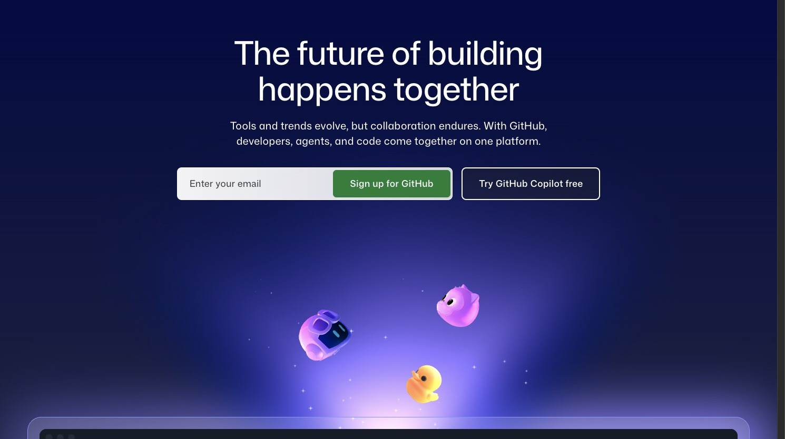

2\. Click "Sign in"


3\. Click the "Username or email address" field.

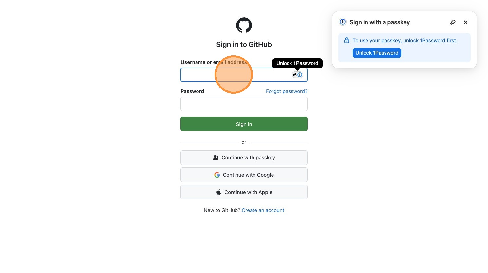

4\. Switch to http://github.com/nekrut/bmmb554_foo_bar

Paste the following URL to the browser address field:

```{.default code-copy="true"}
http://github.com/nekrut/bmmb554_foo_bar
```

5\. Click "Fork"

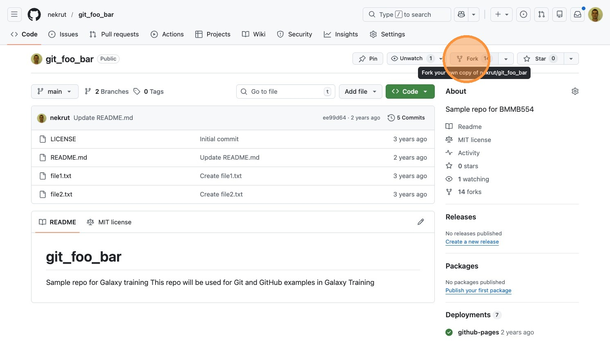

6\. Navigate to your newly created fork

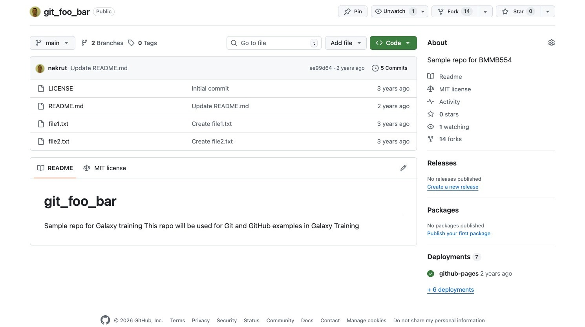

7\. Click "Code"

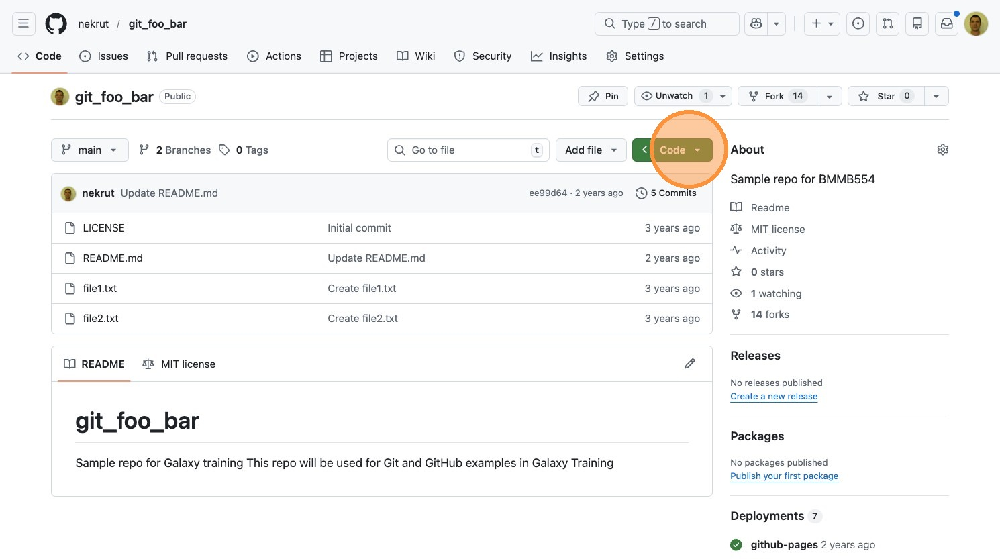

8\. Click "Codespaces"

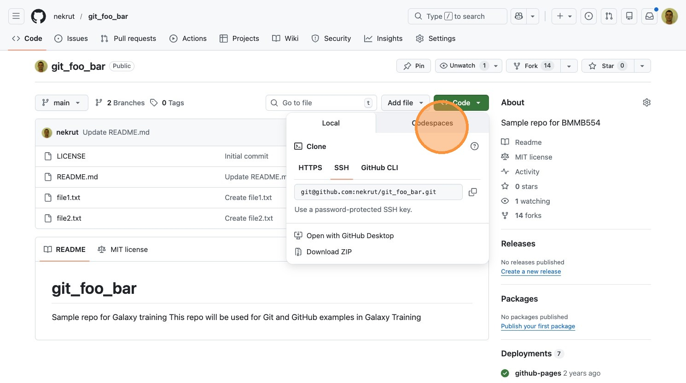

9\. Click "+".

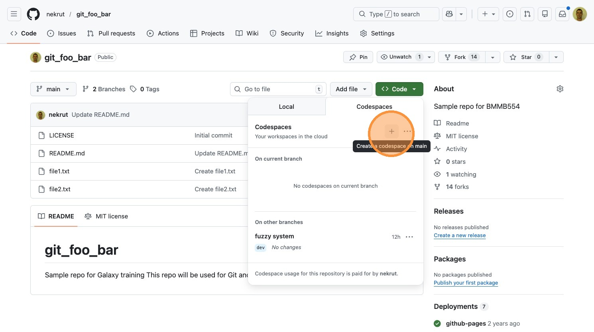

# Git versus GitHub

- Git - version control system
- GitHub - hosting service

# Git resources

- [The Git Book](https://git-scm.com/book/en/v2)
- Troubleshooting [](https://dangitgit.com/en) [](https://ohshitgit.com/)

# Version control

- Manages changes over time
- Enables collaboration
- Provides complete history

You already use version control—you just don't call it that:

- **Google Docs version history** — every edit is saved with a timestamp and author; you can view or restore any past version → *commit history & revert*
- **Suggesting mode in Google Docs** — proposed edits that a collaborator reviews and accepts or rejects → *pull requests & code review*
- **Track Changes in Word** — redline markup showing insertions and deletions → *`git diff`*
- **Saving a video game** — checkpoint your progress so you can reload if things go wrong → *commits as snapshots*
- **Wikipedia edit history** — every revision is logged; vandalism can be rolled back instantly → *audit trail & revert*

# History

## Git

Early version control systems like **CVS** (Concurrent Versions System) and **SVN** (Subversion) were *centralized*—all version history lived on a single server, and developers needed a network connection for most operations. This created bottlenecks and a single point of failure, especially for large projects with many contributors.

The word "git" is British slang for a stupid or unpleasant person. Torvalds joked about the name:

> "I'm an egotistical bastard, and I name all my projects after myself. First 'Linux', now 'git'."

The project's original README offered additional readings: "global information tracker" when things work, and "goddamn idiotic truckload of sh*t" when they don't.

Linus Torvalds created Git in April 2005 after a licensing dispute forced the Linux kernel project to stop using BitKeeper, a proprietary *distributed* version control system the project had relied on since 2002. Torvalds designed Git to be fast, fully distributed, and capable of handling massive non-linear development—thousands of parallel branches merging constantly. Development moved remarkably quickly: Git became self-hosting within a day of its announcement, and by June 2005 it managed the Linux kernel 2.6.12 release. Torvalds handed maintenance to Junio Hamano in July 2005, who shipped the 1.0 release that December and continues to maintain the project today.

Sources: [Git — Wikipedia](https://en.wikipedia.org/wiki/Git) | [A Short History of Git](https://git-scm.com/book/en/v2/Getting-Started-A-Short-History-of-Git) | [What does git stand for?](https://blogboard.io/blog/knowledge/what-does-git-stand-for/)

## GitHub

Tom Preston-Werner, Chris Wanstrath, and PJ Hyett began building GitHub in late 2007 and launched a public beta in April 2008. The platform provided a web-based interface for Git repositories along with features like pull requests, issue tracking, and user profiles—making collaboration far more accessible than raw Git alone. Growth was rapid: by 2009 GitHub had over 100,000 users, and by 2011 it surpassed SourceForge and Google Code to become the largest code hosting service. Microsoft acquired GitHub in June 2018 for $7.5 billion, and the platform now hosts over 200 million repositories.

Sources: [GitHub — Wikipedia](https://en.wikipedia.org/wiki/GitHub) | [How GitHub Democratized Coding and Found a New Home at Microsoft](https://nira.com/github-history/)

# Basic Concepts 

## Main commands
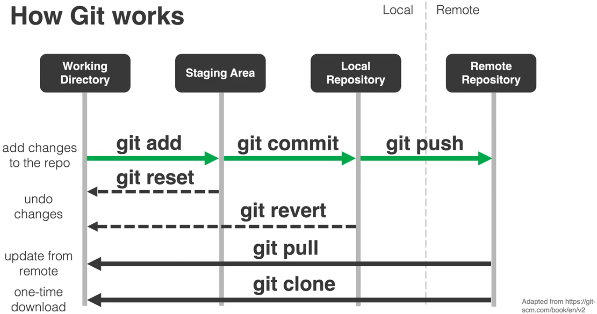
> From tutorials by [Kyle Bradbury](https://www.kylebradbury.org/index.html)

## Branch flow
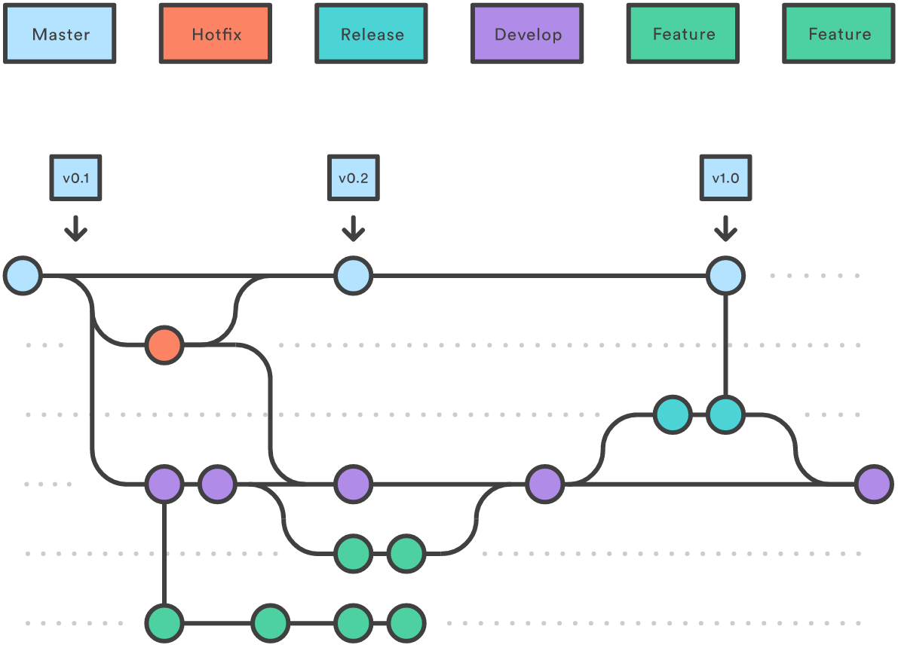

> From [GitBetter](https://gitbetter.substack.com/p/how-to-work-in-multiple-git-branches)

# Let's try

Switch to your GitHub code space that you started, and use examples below. 

## Check history of this repo using `git log`

```{.bash code-copy="true"}
git log
```

```
commit de89f51d8e124665713f6fd94cd46447d172033b (HEAD -> main, origin/main, origin/HEAD)
Author: Anton Nekrutenko <anekrut@gmail.com>
Date:   Tue Feb 21 08:02:50 2023 -0500

    Create file2.txt

commit bc3e5c4a9d54203739bb90f29d92e20082b9e5d4
Author: Anton Nekrutenko <anekrut@gmail.com>
Date:   Tue Feb 21 08:02:25 2023 -0500

    Create file1.txt

commit 99dd43783be37b08c1ca80cdc881eae537526396
Author: Anton Nekrutenko <anekrut@gmail.com>
Date:   Tue Feb 21 08:00:34 2023 -0500

    Updated readme

commit 18ebdabfe6f92f33ea626994ce6c9998cbe63522
Author: Anton Nekrutenko <anekrut@gmail.com>
Date:   Tue Feb 21 07:59:46 2023 -0500

    Initial commit
```

## Check status of the repo

```{.bash code-copy="true"}
git status
```

```
On branch main
Your branch is up to date with 'origin/main'.

nothing to commit, working tree clean
```

## Let's change and stage a file

Use editor to modify `file1.txt`. Once it is saved, we can see what is happening by using `git status` again:

```{.bash code-copy="true"}
git status
```

```
On branch main
Your branch is up to date with 'origin/main'.

Changes not staged for commit:
  (use "git add <file>..." to update what will be committed)
  (use "git checkout -- <file>..." to discard changes in working directory)

        modified:   file1.txt

no changes added to commit (use "git add" and/or "git commit -a")
```

You can see that the file is modified but *not staged*. To stage it for commit you need to explicitly add it to staging:

```{.bash code-copy="true"}
git add file1.txt
```

If you run `git status` now you will get:

```{.bash code-copy="true"}
git status
```

```
On branch main
Your branch is up to date with 'origin/main'.

Changes to be committed:
  (use "git reset HEAD <file>..." to unstage)

        modified:   file1.txt
```

## Oops: `git reset`

Running `git reset` will restore the *status quo* as it was prior to `git add`:

```{.bash code-copy="true"}
git reset
```

```
Unstaged changes after reset:
M       file1.txt
```

and `git status` will look as it did prior to `git add`:

```{.bash code-copy="true"}
git status
```

```
On branch main
Your branch is up to date with 'origin/main'.

Changes not staged for commit:
  (use "git add <file>..." to update what will be committed)
  (use "git checkout -- <file>..." to discard changes in working directory)

        modified:   file1.txt

no changes added to commit (use "git add" and/or "git commit -a")
```

## Let's stage and commit

If you are indeed ready to go ahead let's `add`:

```{.bash code-copy="true"}
git add file1.txt
```

and `commit`

```{.bash code-copy="true"}
git commit -m 'modified file1'
```

```
[main 476adb7] modified file1
 1 file changed, 1 insertion(+), 1 deletion(-)
```

If you run `git log` you will see this additional commit:

```{.bash code-copy="true"}
git log
```

```
commit 476adb7b64a9330199fea13ca2e7523f7fe90189 (HEAD -> main)
Author: nekrut <anekrut@gmail.com>
Date:   Tue Feb 21 13:23:24 2023 +0000

    modified file1
```

or alternatively you can use `--oneline` flag:

```{.bash code-copy="true"}
git log --oneline
```

```
476adb7 (HEAD -> main) modified file1
de89f51 (origin/main, origin/HEAD) Create file2.txt
bc3e5c4 Create file1.txt
99dd437 Updated readme
18ebdab Initial commit
```

## Oops: `git revert`

To roll everything back you can do this:

```{.bash code-copy="true"}
git revert 476adb7
```

```
[main 1f13d5f] Revert "modified file1"
 1 file changed, 1 insertion(+), 1 deletion(-)
```

In Codespaces, this opens a `COMMIT_EDITMSG` tab in VS Code with a pre-filled revert message. Edit the message if needed, save (<kbd>Ctrl</kbd>+<kbd>S</kbd>), and close the tab to complete the commit.

Now, let's look at the log (showing just two last commits):

```{.bash code-copy="true"}
git log
```

```
commit 1f13d5fcf38057db9a90066b99aa475a6eeb1bae (HEAD -> main)
Author: nekrut <anekrut@gmail.com>
Date:   Tue Feb 21 13:31:24 2023 +0000

    Revert "modified file1"

    This reverts commit 476adb7b64a9330199fea13ca2e7523f7fe90189.

commit 476adb7b64a9330199fea13ca2e7523f7fe90189
Author: nekrut <anekrut@gmail.com>
Date:   Tue Feb 21 13:23:24 2023 +0000

    modified file1
```

## Let's actually make changes and highlight them with diff

First, let's modify, say, `file2.txt` by adding a line. In this example I modified it from:

```
This
is
another
file
I've
made
```

to

```
This
is
file2
I've
made
```

Now `add` and `commit`:

```{.bash code-copy="true"}
git status
```

```
On branch main
Your branch is ahead of 'origin/main' by 2 commits.
  (use "git push" to publish your local commits)

Changes not staged for commit:
  (use "git add <file>..." to update what will be committed)
  (use "git checkout -- <file>..." to discard changes in working directory)

        modified:   file2.txt

no changes added to commit (use "git add" and/or "git commit -a")
```

```{.bash code-copy="true"}
git add file2.txt
git commit -m 'changed file2'
```

```
[main a947686] changed file2
 1 file changed, 1 insertion(+), 2 deletions(-)
```

Let's now compare the changes between two commits:

```{.bash code-copy="true"}
git diff a947686 1f13d5f
```

```
diff --git a/file2.txt b/file2.txt
index 1f383ac..e13e461 100644
--- a/file2.txt
+++ b/file2.txt
@@ -1,5 +1,6 @@
 This
 is
-file2
+another
+file
 I've
 made
```

 here:

 - `a` and `b` = tags of files being compared
 - `---` and `+++` marked to indicate differences between `a` and `b`
 - `@@ -1,5 +1,6 @@` file chunk header which has the following format:
     - `@@ [file a range][file b range] @@`
     - File ranges are: `<start line><number of lines>`

## Branches


> From [GitBetter](https://gitbetter.substack.com/p/how-to-work-in-multiple-git-branches)

To enable collaborations and to give the ability to develop major features without disrupting production (`master` or `main`) branch Git allows creation of multiple branches.

### Create a new branch and switch to it

Let's create branch dev:

```{.bash code-copy="true"}
git branch dev
```

to see existing branches:

```{.bash code-copy="true"}
git branch
```

```
  dev
* main
```

The `main` branch is active (tagged with `*`). To actually switch branches:

```{.bash code-copy="true"}
git checkout dev
```

```
Switched to branch 'dev'
```

### Make changes

Let's make some changes, say, to `file1.txt` from this:

```
This
is
a
file
```

to this:

```
This
is
a
file1
```

and then get `status`, `add`, and `commit`:

```{.bash code-copy="true"}
git status
```

```
On branch dev
Changes not staged for commit:
  (use "git add <file>..." to update what will be committed)
  (use "git checkout -- <file>..." to discard changes in working directory)

        modified:   file1.txt

no changes added to commit (use "git add" and/or "git commit -a")
```

```{.bash code-copy="true"}
git add file1.txt
git commit -m 'changes to file1.txt'
```

```
[dev 05ce64d] changes to file1.txt
 1 file changed, 1 insertion(+), 1 deletion(-)
```

### Switch to another branch and look at the modified file

If we switch back to `main` and look at the content of `file1.txt` we will see the "old" content:

```
This
is
a
file
```

### Merge branches

To incorporate changes from `dev` into `main` we need to do a merge:

```{.bash code-copy="true"}
git merge dev main
```

```
Updating a947686..05ce64d
Fast-forward
 file1.txt | 2 +-
 1 file changed, 1 insertion(+), 1 deletion(-)
```

and if we look at `file1.txt` again we will see the change:

$ more file1.txt
This
is
a
file1

We can now delete the branch:

```{.bash code-copy="true"}
git branch -d dev
```

```
Deleted branch dev (was 05ce64d).
```

### Merging with conflicts

To simulate a merging conflict we need to make different changes to the same line of a file in different branches.

#### Modify `file1.txt` in `main`

First, let's checkout `main` and make the following change to `file1.txt`, say, from

```
This
is
a
file1
```

to

```
This
is
a
file1 - the first file we created
```

now we add and commit:

```{.bash code-copy="true"}
git add file1.txt
git commit -m 'main changes to file1'
```

```
[main dfd0598] main changes to file1
 1 file changed, 1 insertion(+), 1 deletion(-)
```

:::{.callout-note}

You can use `git diff` to see the differences between branches such as, for example:

```{.bash code-copy="true"}
git diff main dev
```

```
diff --git a/file1.txt b/file1.txt
index f8e8191..e82ee85 100644
--- a/file1.txt
+++ b/file1.txt
@@ -1,4 +1,4 @@
 This
 is
 a
-file1 - the first file we created
+file1
```
:::

#### Modify `file1.txt` in `dev`

Checkout `dev`:

```{.bash code-copy="true"}
git checkout dev
```

```
Switched to branch 'dev'
```

Change `file1.txt`, say, from:

```
This
is
a
file1
```

to

```
This
is
a
file1 - the first file
```

now we add and commit:

```{.bash code-copy="true"}
git add file1.txt
git commit -m 'dev changes to file1'
```

```
[dev b2b8b9e] dev changes to file1
 1 file changed, 1 insertion(+), 1 deletion(-)
```

#### Checkout `main` and try to `merge`

```{.bash code-copy="true"}
git merge main dev
```

```
Auto-merging file1.txt
CONFLICT (content): Merge conflict in file1.txt
Automatic merge failed; fix conflicts and then commit the result.
```

If you then look at the content of the file, you will see this:

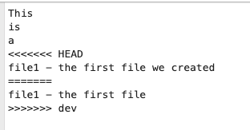


so here you need to decide which version you will keep and edit the file correspondingly. For example, I edited it to this form and saved:

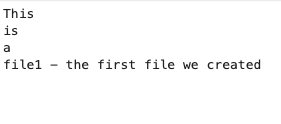

Now I need to `add` and `commit`:

```{.bash code-copy="true"}
git add file1.txt
git commit -m 'merged dev into main'
```

# A typical GitHub workflow

Now that we know the basics, let's put it all together into the standard fork-based contribution workflow used in open-source projects.

## The steps

**1. Fork the repo on GitHub**

Click the "Fork" button on the original (upstream) repository page. This creates your own copy under your GitHub account.

**2. Clone your fork locally**

```{.bash code-copy="true"}
git clone https://github.com/YOUR_USERNAME/repo_name.git
cd repo_name
```

**3. Create a new branch**

Never work directly on `main`. Create a descriptive branch for your changes:

```{.bash code-copy="true"}
git checkout -b my-new-feature
```

**4. Make your changes**

Edit files, add new ones—do whatever your contribution requires.

**5. Stage and commit**

```{.bash code-copy="true"}
git add changed_file.txt
git commit -m 'add new feature'
```

**6. Push the branch to your fork**

```{.bash code-copy="true"}
git push origin my-new-feature
```

**7. Open a Pull Request on GitHub**

Go to the original repo on GitHub. You'll see a prompt to open a Pull Request from your recently pushed branch. Click it, write a description of your changes, and submit.

## High-level flow

```{mermaid}
flowchart LR
  A[Fork] --> B[Clone]
  B --> C[Branch]
  C --> D[Edit]
  D --> E[Add/Commit]
  E --> F[Push]
  F --> G[Pull Request]
```

## Where things live

```{mermaid}
flowchart TB
  A["Upstream repo<br>(GitHub)"]
  B["Your fork<br>(GitHub)"]
  C["Local clone<br>(your machine)"]

  A -- "fork" --> B
  B -- "clone" --> C
  C -- "push" --> B
  B -- "pull request" --> A
```

# Summary

Here is what we covered in this lecture:

- **Git vs GitHub** — Git is a local version control system; GitHub is a cloud platform for hosting Git repos and collaborating
- **Core commands** — `status`, `add`, `commit`, `log`, `diff`, `reset`, `revert`
- **Branching** — `branch`, `checkout`, `merge` let you work on features in isolation and combine them later
- **Merge conflicts** — happen when two branches edit the same line; you resolve them manually, then `add` and `commit`
- **The fork → branch → PR workflow** — the standard way to contribute to projects on GitHub

# For Thursday!

Create your CV as a markdown document!


